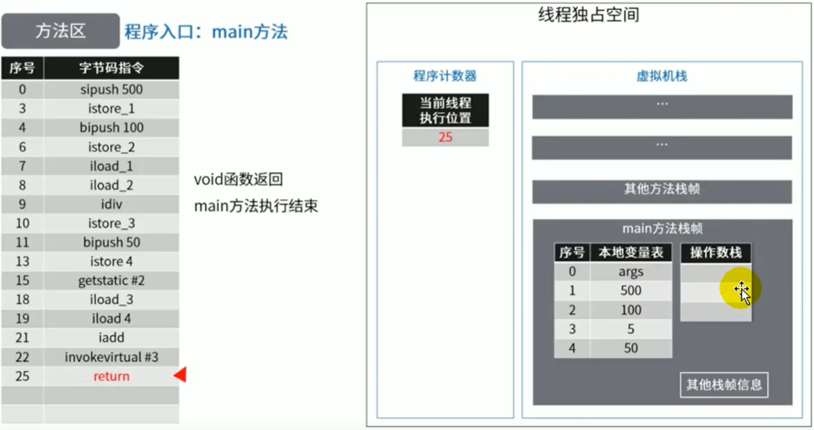
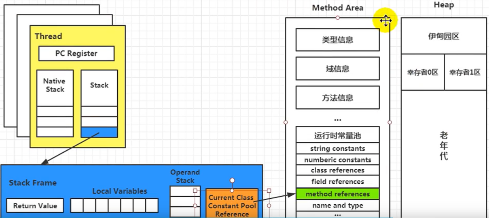
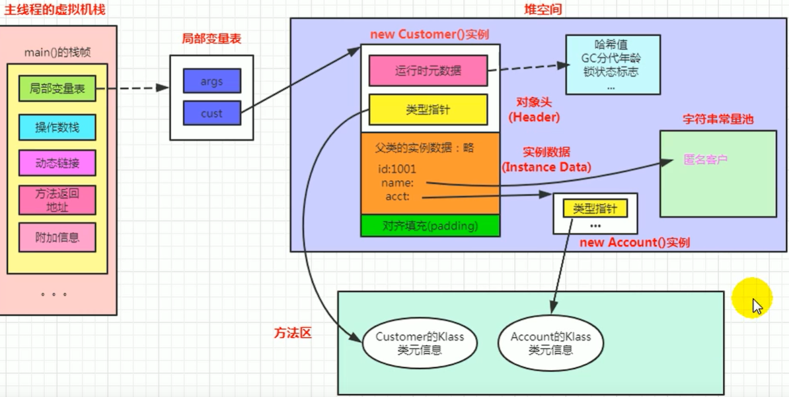
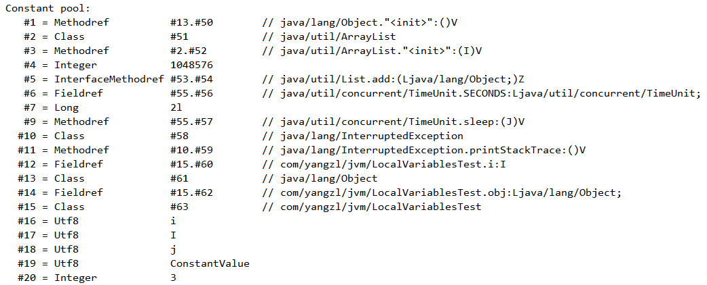
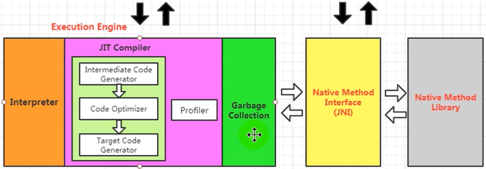

2020 JVM

+ 类加载子系统

+ 运行时数据区

+ 执行引擎

> 字节码文件（由不同语言提供）具有跨平台性
>
> JVM指令集，跨语言的平台。mixed mode（半解释，半编译）
>
> 架构模型：JVM基于栈的指令集架构

| 基于寄存器的指令集架构             | 基于栈的指令集架构                                           |
| ---------------------------------- | ------------------------------------------------------------ |
| x86指令集                          |                                                              |
| 依赖于硬件                         | 不需要硬件支持                                               |
| 性能更高，指令更少                 | 性能低，指令多                                               |
| 一地址指令，二地址指令，三地址指令 | 多为零地址指令，执行依赖于操作数栈（只操作栈顶）             |
| 2 + 3 基于寄存器的指令             | 2  + 3基于栈的指令（字面量会被常量折叠）                     |
| mov eax, 2;<br />add eax, 3        | iconst_2; istore_1; iconst_3; istore_2; iload_1; iload_2; iadd; istore_3 |

``` java
System.halt(-1);
System.exit(-1);

// 前端编译器编译生成字节码文件
// 生成类初始化方法<clinit>（没有静态变量和静态块不会生成）
// 生成实例初始化方法<init>
// <init>，为实例变量分配内存空间，初始化零值，根据源码顺序执行赋初值或代码块
```


### 1 类加载子系统


> Prepare： 为静态变量分配内存，并初始化0值；对**final的静态字面量**显式赋值，如果不是字面值静态常量，那么会赋初始化0值（与静态变量一样）
>
> Initialization：执行\<clinit\>()
>
> Extension ClassLoader：主要识别jre/lib/ext目录
>
> 对Java核心源码进行保护，称为沙箱安全机制


### 2 运行时数据区


Ali架构


​                     Thread1【VMS，NMS，PC】

堆  <---->      Thread2【VMS，NMS，PC】   < --->  方法区

​            		 Thread3【VMS，NMS，PC】


#### JVM后台线程

+ 虚拟机线程：执行偏向锁撤销，线程挂起，需要JVM到达安全点（堆区不会变化）

+ 周期任务线程
+ 编译线程：将字节码编译为机器码
+ 信号调度线程
+ GC线程


#### 2.1 虚拟机栈

+ Local Variable

> 基本单位是Slot。long和double占2个slot，其它类型占1个slot

+ Oprend Stack（操作数栈）

> 数组 / 链表（物理结构）
>
> **根据字节码指令，往操作数栈中压入 / 弹出数据**
>
> int i = 2; int j = 3; int k = i + j;
>
> 指令： iconst_2(pop) -> istore_1 -> iconst_3 -> istore_2 -> iload_1(pop) -> iload_2 -> iadd -> istore_3




**栈顶缓存技术**（TOS，top of stack caching）

将栈顶元素全部缓存到CPU的寄存器中（间接使用寄存器），减少内存的访问次数

``` java
static void foo(Object o) {
    Object tmp = o;
}
// 对应指令为：
aload_1;
astore_2;
// 类似于这样的Java代码
stack.push(localVariables[0]);
localVariables[1] = stack.pop();
// 栈在内存中
一次访问localVariables[0]，一次写入operand stack
一次弹出operand stack，一次写入localVariables[1]
// 仅仅是访问栈顶元素， 需付出2次内存读，2次内存写
    
// 使用TOS，类似于如下代码
tosElement = locals[0];
locals[1] = tosElemnt;
// 对应一次内存读，一次内存写，一次寄存器读，一次寄存器写
```


+ Dynamic Linking

**栈与方法区之间的联系**




**方法调用**

> 绑定：字段 / 方法 / 类在符号引用被替换为直接引用（方法区地址）的过程，只发生一次
>
> 静态绑定（前绑定）：
>
> ​	编译期确定，例如final，private（隐式final），静态方法，构造器（隐式static），父类方法
>
> 动态绑定（后绑定）：方法重写 -> 虚方法（virtual）
>
> ​	**在方法区建立虚方法表（在链接的解析阶段创建，符号引用转换为直接引用），表中存放各虚方法的实际入口地址**


+ Return Address（正常返回，异常返回）

> 存放该方法PC寄存器的值
>
> 异常返回地址，由异常表确定返回地址


#### 2.2 堆

``` properties
# 参数
-Xms
-Xmx
-Xmn
-XX:NewRatio=2
-XX:SurvivorRatio=6

-XX:+PrintFlagsInitial
-XX:+PrintFlagsFinal

```

**新生代 + 老年代 + 方法区（逻辑上属于堆，物理上不是）**

永久代移除，改为元空间（String Table 和 静态域 有变化）


#### 对象



> 对象创建字节码指令：
>
> new
>
> dup
>
> invokespecial
>
> astore_1

创建：

+ JVM层面：
    + 在堆区分配本类和父类所有实例变量内存（指针碰撞，空闲列表）【CAS，TLAB】
    + 初始化0值
    + 设置对象头。
+ Java层面（执行\<init\>）
    + 执行父类\<init\>执行本类\<init\>（合并显示赋值，构造块，构造方法）
+ 将堆区对象地址赋值給引用（例如：Sub s = new Sub();）


**按回收区域，一种是部分收集（Partial GC），一种是整堆收集（Full GC）**

+ 部分收集

    YGC / Minor GC

    ​	Eden区域满，触发YGC

​		Major GC

​			收集老年代，比Minor GC慢10倍以上，STW时间也更长

​		Mixed GC

+ Full GC（收集整个堆和方法区），**Full GC频繁，将Metaspace设置一个较大值**

> 在Minor GC之前，虚拟机 **检查老年代剩余最大连续空间是否大于新生代所有对象总空间**
>
> ​	如果大于，那么此次Minor GC安全
>
> ​	如果小于，那么查看 **历次晋升的平均大小**
>
> ​		老年代剩余最大连续空间如果大于：尝试Minor GC，但有可能失败
>
> ​		如果小于：进行Full GC


**内存回收策略（对象提升（Promotion）规则）**

> 优先分配到Eden
>
> 大对象直接分配到老年代
>
> 长期存活对象分配到老年代（默认15）
>
> 动态对象年龄判断
>
> ​	survivor中相同年龄所有对象大小总和大于surivor一半，那年龄大于 | 等于该年龄的对象进入老年代
>
> 分配担保机制
>
> ​	-XX:HandlePromotionFailure


**TLAB**

> 每个线程在Eden区域有TLAB私有区域，快速分配，占Eden1%


#### 逃逸分析

> + 栈上分配
> + 锁消除
> + 标量替换


#### 逃逸

> + 返回值
> + 为成员变量赋值
> + 引用成员变量的值


#### 2.3 PC

字节码指令地址指示器；分支，循环，跳转，异常处理，线程恢复都依赖PC


#### 2.4 方法区




> 规范：
>
> ​	类型信息（类，接口，枚举，注解）的域信息，方法信息；
>
> ​	**运行时常量池：字节码文件常量池被类加载器（加载，链接，初始化）合并到运行时数据区中**
>
> ​	静态变量；
>
> ​	即时编译后的代码缓存
>
> **1.7之后字符串常量和静态变量移到堆中存放（JSHDB工具）：在堆中便于GC（方法区中GC频率低）**
>
> 常量池回收：只要常量没有被任何地方引用，就可以被回收


### 3 执行引擎



解释执行字节码指令

JIT 编译字节码指令为本地机器指令（X86，ARM架构），并缓存在方法区


#### 3.1 Interpreter（解释器）


#### 3.2 JIT Complier（即时编译器（后端编译器））

C1编译器-->client模式：简单可靠优化耗时短

**C2编译器 -->server模式：耗时较长优化，（栈上分配，标量替换，同步消除）**

即时编译比解释执行速度快一个数量级

​	JDK10编译器Graal


**AOT**（Ahead of time compiler）

jaotc工具


#### 3.3 Garbage Collection（垃圾收集器）


### 4 String Table

是一个固定大小的Hashtable，1.7默认长度为60013

**字符串拼接，如果出现变量，那么结果就是new String()，保存在堆中**

**new String("z").intern() 等价于字面量定义方式"z"**


总结来说：**intern()在JDK6会在常量池新建"ab"串并返回引用，在7以后常量池中只是一个引用，指向堆的new String("ab")**


### 5 垃圾回收

