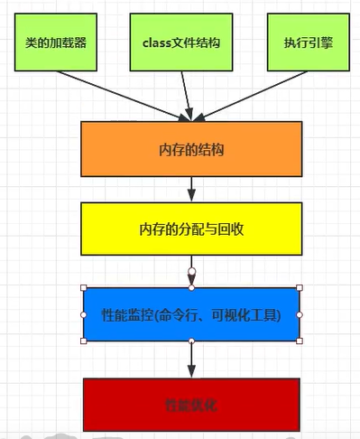
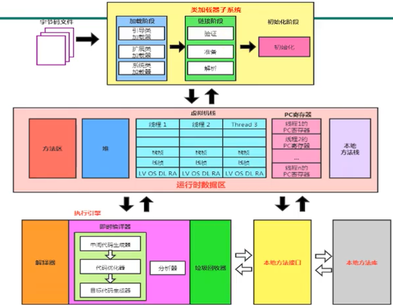
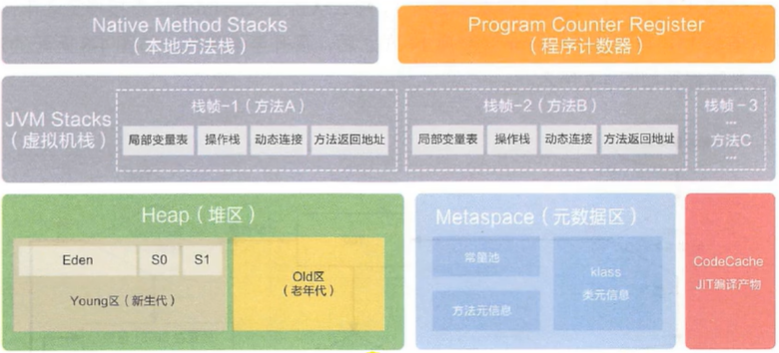
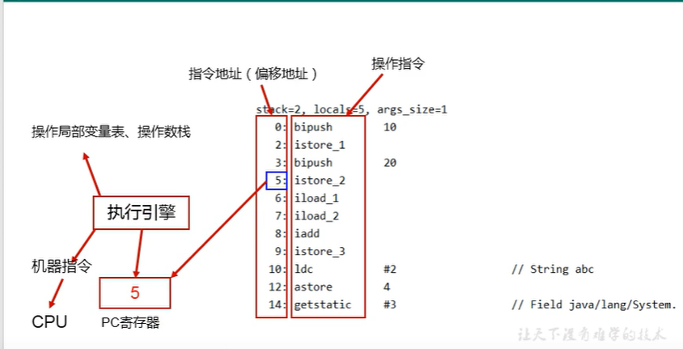
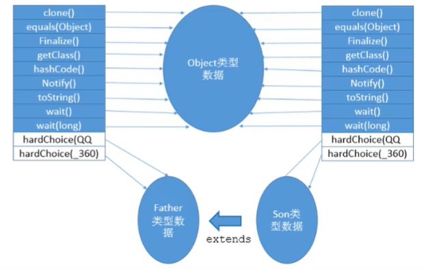
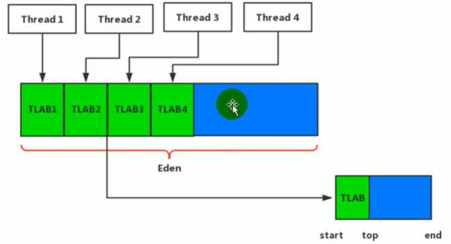
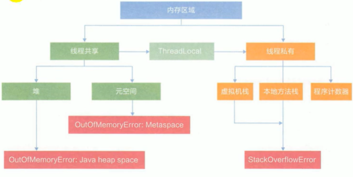
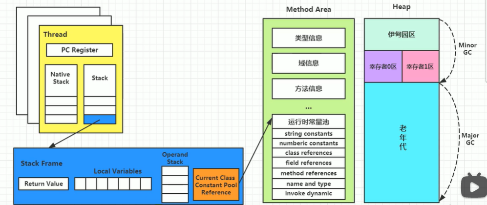
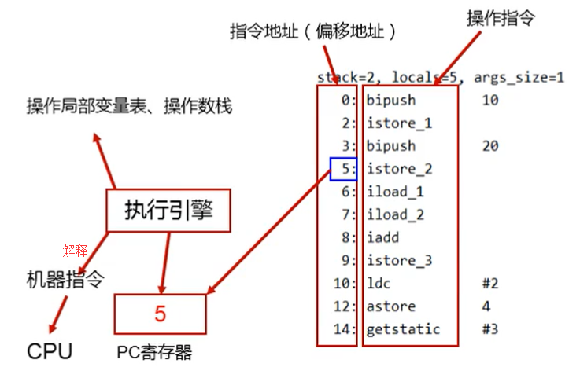

## 一 日常记录


### A. 常用诊断工具

``` shell

-XX:+PrintGCDetails
-XX:+PrintStringTableStatistics
-XX:+UnlockDiagnosticVMOptions
-XX:+PrintNMTStatistics

############################
############################

# jcmd
jcmd pid help
jcmd pid VM.flags
# jcmd pid VM.info
jcmd pid Thread.print
jcmd pid PerfCounter.print
jcmd pid VM.system_properties
jcmd pid GC.run
jcmd pid GC.heap_info
jcmd pid GC.heap_dump ./dump.hprof
jcmd pid VM.uptime

jcmd pid VM.native_memory summary


# jps


# jinfo
# JDK8 StringTable 默认大小 60013
jinfo -flag StringTableSize pid
jinfo -flag PrintStringTableStatistics


# jmap


# jstat


# jstack


# jconsole


# jvisualvm


# javap


# javac（前端编译器）


# jar


```


##  二 JVM 

课程全貌：



> 字节码文件（可以由不同语言提供，scala，jython, groovy 等）具有跨平台性
>
> JVM 是一个跨语言的平台
>
> 架构模型：JVM 是基于栈的指令集架构

JVM 整体由3个部分组成：

+ **类加载子系统**
+ **运行时数据区**
+ **执行引擎**

> 执行引擎是 Java 虚拟机最核心的组成部分之一。「虚拟机」是相对于「物理机」的概念，这两种机器都有代码执行的能力，区别是物理机的执行引擎是直接建立在处理器、硬件、指令集和操作系统层面上的，而虚拟机执行引擎是由自己实现的，因此可以自行制定指令集与执行引擎的结构体系，并且能够执行那些不被硬件直接支持的指令集格式。
>
> 在 Java 虚拟机规范中制定了虚拟机字节码执行引擎的概念模型，这个概念模型成为各种虚拟机执行引擎的统一外观（Facade）。在不同的虚拟机实现里，**执行引擎在执行 Java 代码的时候可能会有解释执行（通过解释器执行）和编译执行（通过即时编译器产生本地代码执行）两种方式**，也可能两者都有，甚至还可能会包含几个不同级别的编译器执行引擎。但从外观上来看，所有 Java 虚拟机的执行引擎是一致的：输入的是字节码文件，处理过程是字节码解析的等效过程，输出的是执行结果



| 基于寄存器的指令集架构（物理机）   | 基于栈的指令集架构                                           |
| ---------------------------------- | ------------------------------------------------------------ |
| x86指令集                          |                                                              |
| 依赖于硬件                         | 不需要硬件支持，跨平台                                       |
| 性能更高，指令更少                 | 性能低，指令多                                               |
| 一地址指令，二地址指令，三地址指令 | 多为零地址指令，执行依赖于操作数栈（只操作栈顶）             |
| 2 + 3 指令示例：                   | 2  + 3基于栈指令示例（字面量在编译时被常量折叠）             |
| mov eax, 2; add eax, 3             | iconst_2; istore_1; iconst_3; istore_2; iload_1; iload_2; iadd; istore_3 |

``` java
// 退出 JVM
System.halt(-1);
System.exit(-1);
Shutdown.exit(-1);
```


### A. JVM 轨迹

> 1. Classic VM
> 2. Exact VM
> 3. **HotSpot VM「半解释半编译，mixed mod」**
> 4. JRockit
> 5. J9 / OpenJ9
> 6. **daivik「安卓 5.0 之前的默认虚拟机，执行dex文件由 class 文件转换，寄存器架构」**
> 7. ART 「安卓虚拟机，添加了 AOT（Ahead-of-time compilation）」
>
> 高性能 JVM：
>
> 1. Azul： 经HotSport改进得来，运行自己本公司专有硬件中 
>
> 
>
> Oracle 全栈语言虚拟机：
>
> **Graal**


### B. 运行流程

``` java
class A {
  main(String[] args) {
    new A();
  }
}
```

> 1. 前端编译器（javac）生成字节码文件
>
> 2. 加载，链接「验证，准备，解析」，初始化
>
>    1. 加载：main 所在类的字节码文件会被 Application ClassLoader（应用类加载器）读入，在此之前会先读入其父类字节码文件的二进制字节流
>
>    2. 链接「验证，准备，解析」
>
>       1. 验证是否符合 JVM 规范
>
>       2. 为静态变量分配空间并初始化值，为常量字面值显示赋值，否则赋0值「常量在编译时分配空间」
>
>          `static final A = new A()，这个赋初值`
>
>          `static final STR = "123，这个显示赋值"`
>
>       3. 解析符号引用为直接引用
>
>    3. 初始化：执行类初始化方法`<clinit>`（没有静态变量和静态块不会生成），生成实例初始化方法 `<init>`
>
> 3. new 关键字调用`<init>()` 为实例变量分配内存空间，初始化零值，
>
> 4. 根据源码定义顺序，执行显示赋值或构造块
>
> 5. 执行构造函数


### 1. 类加载子系统

类加载的 3 个阶段：

1. 加载
2. 链接（验证，准备，解析）
3. 初始化


> 类加载子系统只负责加载 Class 文件，至于它是否能运行取决于 `Execution Engine`
>
> 加载的类信息存放在方法区中「**方法区是规范，Permenent Space，Metaspace 是具体实现**」，方法区中还存放运行时常量池信息「**注：字符串常量池在 JDK7 已存储在堆区**」


#### 1.1 加载

**这个阶段会生成 java.lang.Class 对象**

1. 通过一个类的全限定名获取定义此类的二进制字节流
2. 将这个字节流所代表的静态存储结构「class 文件」转化为方法区的运行时数据结构
3. 生成代表这个类的 `java.lang.Class` 对象保存在方法区，作为这个类各种数据的访问入口

加载 .class 文件的方式：

+ fs
+ 通过网络获取「Web Applet」
+ 从 zip 压缩包中读取「jar，war 本质是一个 zip 包」
+ 运行时生成「动态代理技术：asm」
+ 由其它文件生成「JSP 应用」
+ 从加密文件中获取


#### 1.2 链接

+ 验证

**所有被 JVM 识别的字节码文件都以魔数「0xcafebabe」开头**

主要包含 4 种验证：文件格式、元数据、字节码、符号引用

+ 准备

**==Prepare： 为类变量分配内存，并初始化0值；对final的静态字面量显式赋值==**，如果不是字面值静态常量，那么初始化0值

类变量会分配在方法区

+ 解析

**Resolve：将一部分符号引用转换为直接引用「方法区的入口地址」**

前提是在编译时能确定的方法，这些方法的调用称为解析，Java中符合==编译可知，运行期不变的主要包括：静态方法、私有方法、实例构造器、父类方法==


#### 1.3 初始化

Initialization：执行 `<clinit>()`

**`clinit<>()` 方法是 javac 编译器收集类中所有类变量赋值和静态块合并而来的**

如果类中无类变量和静态块，那么 javac 不会生成 `clinit<>()`

若该类存在父类，那么 jvm 保证父类的 `clinit<>()` 会先执行

jvm 保证一个类的 `clinit<>()` 在多线程下被同步加锁，且只加载一次


#### 1.4 类加载器

+ **BootStrap ClassLoader**

主要识别 `JAVA_HOME/jre/lib/rt.jar`

+ **ExtClassLoader**

主要识别 `JAVA_HOME/jre/lib/ext/`  目录

+ **AppClassLoader**

用于加载用于自定义的类（`classpath` 下的类）


#### 1.5 自定义类加载器

什么情况下需要自定义类加载器？

+ 隔离加载类「**中间件和应用依赖了相同的库，防止应用 jar 和 中间件 jar 冲突**」
+ 修改类加载的方式「比如从加密文件获取」
+ 扩展加载源

如何自定义？

1. 继承抽象类 `java.lang.ClassLoader / java.lang.UrlClassLoader`
2. 重写 `findClass()`


#### 1.6 双亲委派

**`ClassLoader` 加载 class 文件时，首先委托父加载器去加载「这个过程是递归的」，当且仅当父加载器无法加载该 class 时再自己加载**

JVM 中标识同一个类的两个必要条件：

+ 类的全限定名相同
+ 加载该类的类加载器相同「方法区中会保存该类的类加载器的引用」


#### 1.7 类加载的触发

对类主动使用导致类初始化「`clinit<>()` 调用」：

+ 创建类的实例
+ 访问类 / 接口的静态变量（赋值也算访问）
+ 调用类的静态方法
+ 反射「如：`Class.forName("com.yangzl.Test")`」
+ 初始化类的子类
+ `main()` 所在的类


### 2. 运行时数据区

`Runtime Data Area`包括 5 部分：

线程共享：

+ 堆区
+ 方法区

线程私有：

+ 程序计数器
+ 虚拟机栈
+ 本地方法栈


Ali 架构



​                     Thread1【VMS「frame1，（LV, OS, DL, RA），...」，NMS，PC】

堆  <---->      Thread2【VMS「frame1，（LV, OS, DL, RA），...」，NMS，PC】   < --->  方法区

​            		 Thread3【VMS「frame1，（LV, OS, DL, RA），...」，NMS，PC】


#### 2.0 JVM 线程

**JVM 线程是 `KLT（内核级线程）`，与 OS 线程 1 : 1 对应** 

每个线程都有：程序计数器、虚拟机栈、本地方法栈三部分

线程间共享：堆区、方法区

+ **虚拟机线程：执行 `STW` 垃圾收集、偏向锁撤销、线程挂起等，需要各线程到达安全点（堆区不会变化）**

+ 周期任务线程
+ 编译线程：将字节码编译为机器码
+ 信号调度线程
+ GC线程


#### 2.1 程序计数器

**`Program Counter Register（程序计数寄存器）`，用来存储指向下一条指令的地址**

它是程序控制流的指示器，分支、循环、跳转、异常处理、线程恢复都依赖这个计数器完成

唯一没有规定 `OutOfMemoryError` 异常的区域




#### 2.2 虚拟机栈

``` shell
# 设置栈大小
-Xss1m
```


每个线程在创建时都会创建一个虚拟机栈（生命周期同线程），其内部保存一个个的栈帧

> 栈帧由 5 部分组成：
>
> + 局部变量表
> + 操作数栈
> + 动态链接「运行时常量池的引用」
> + 方法返回地址
> + 附加信息

可以将 JVM 栈设置为固定不变大小 `-Xss1m`，超过这个深度的方法调用将触发 `StackOverflowError`

**在一条活动的线程中，一个时间点只有一个活动的栈帧（当前栈帧）**

方法的正常返回和异常返回都会导致当前栈帧弹出


##### 2.2.1 局部变量表

> **idea jclasslib 插件**
>
> 局部变量表（LV）引用的对象是 `GC Roots`

==Local Variable==：基本单位 `slot`，`long / double` 占 2 个 `slot`，其它类型占 1 个 `slot`

即：32位以内的类型只占用 1 个 slot，`boolean, byte, short, char` 在存储之前被转换为 `int`

`slot` 是可以重复利用的

**局部变量表大小在编译期确定**

**如果帧是由构造方法 / 实例方法创建的，那么该对象的 this 引用会存放在局部变量表 index = 0 的 slot 处**

> new Object() 指令：
>
> 1. new
>2. dup
> 3. invokeSpecial
>4. astore


##### 2.2.2 操作数栈

==Operand Stack==：根据字节码指令，对操作数栈进行 `push / pop` 操作

> 栈可以由数组 / 链表（物理结构）实现
>
> **JVM 解释器「`intercepter`」是基于栈的执行引擎**
>
> 根据字节码指令，往操作数栈中压入 / 弹出数据
>
> 操作数栈的深度在编译期确定「`push / pop 操作过程中的最大值`」
>
> int i = 2; int j = 3; int k = i + j;
>
> 指令： iconst_2 -> istore_1 -> iconst_3 -> istore_2 -> iload_1 -> iload_2 -> iadd -> istore_3


##### 2.2.4 栈顶缓存

**基于栈指令架构的虚拟机所使用的是零地址指令，缺点是指令多，内存访问频繁**

==**栈顶缓存技术**==（TOS，Top-of-Stack caching）：虚拟机将栈顶元素全部缓存到 CPU 的寄存器中（间接使用寄存器），减少内存的访问次数

``` java
static void foo(Object o) {
    Object tmp = o;
}
// 对应指令为：
aload_1;
astore_2;
// 类似于这样的Java代码
stack.push(localVariables[0]);
localVariables[1] = stack.pop();
// 栈在内存中
一次访问localVariables[0]，一次写入operand stack
一次弹出operand stack，一次写入localVariables[1]
// 仅仅是访问栈顶元素， 需要2次内存读，2次内存写
    
// 使用TOS，类似于如下代码
tosElement = locals[0];
locals[1] = tosElemnt;
// 对应一次内存读，一次内存写，一次寄存器读，一次寄存器写
```


##### 2.2.4 动态链接

==Dynamic Linking==

**当前帧都有指向运行时常量池的引用「可以是：方法，引用，类信息等引用」**

引用的目的是支持当前方法实现动态链接，比如 `invokedynamic`  指令

> **动态链接：就是将 `class` 文件常量池在类加载期间无法解析「编译期无法确定，运行时才确定」的符号引用转换为直接引用**

栈与方法区之间的联系


##### 2.2.5 方法调用：解析与分派

> **绑定：字段 / 方法 / 类在符号引用被替换为直接引用（方法区地址）的过程，只发生一次**
>
> 静态绑定（前绑定）：
>
> ​	编译期确定，例如final，private（隐式final），静态方法，构造器（隐式static），父类方法
>
> 动态绑定（后绑定）：方法重写 -> 虚方法（virtual）
>


##### 2.2.6 方法调用指令

Java 提供 5 种方法调用字节码指令

+ `invokestatic`：静态方法调用

+ `invokespecial`：构造器，私有方法，父类方法调用（super）

+ `invokevirtual`：虚方法调用

+ `invokeinterface`：接口方法调用，在运行时再确定一个实现该接口的对象

+ `invokedynamic`：在运行时动态解析出调用点全限定符所引用的方法，然后执行该方法（lambda）

**被invokestatic和invokespecial指令调用的方法，都可以在解析阶段确定唯一的调用版本**

符合这个条件的有静态方法、私有方法、final、实例构造器（隐式static）、父类方法，它们在加载的时候就会把符号引用解析为直接引用（编译期确定），除此之外 final 也被规定为非虚方法，但它可以被 `invokevirtual` 指令调用，其他方法被称为虚方法


##### 2.2.7 InvokeDynamic

> Java7 添加一条 JVM 指令 `invokeDynamic`，是为了提供对 『动态类型语言』支持而做的改进
>
> + 静态类型语言：在编译期检查变量的类型
>
> + 动态类型语言：在运行期检查变量的类型
>
> 动态语言变量的值才会有类型信息

`lambda` 表达式只有在运行时通过值来确定是什么类型

例如：`Function f = a -> true`，在运行时根据 `a -> true`确定 f 的类型


##### 2.2.8 虚方法表

**==在方法区建立虚方法表（链接的解析阶段创建，符号引用转换为直接引用）==**

虚方法表中存放该类各虚方法的实际入口地址

`IllegalAccessError` 错误排查，可能是将包内的 jar 放在了其他地方




##### 2.2.9 方法返回地址

==Return Address==（正常返回，异常返回）

> 存放该方法PC寄存器的值
>
> 异常返回地址，由异常表确定返回地址
>
> 异常返回不会给调用者返回值

栈帧中还可能存在一些附加信息：用于调试的相关信息


##### 2.2.10 面试题

1. 什么时候导致栈溢出？
2. 如何调整栈大小？栈分配越打越好吗？是否能确定不会发生栈溢出？
3. 栈区是否存在 `GC`
4. 方法中定义的局部变量是否线程安全？

``` JAVA
// sb 不是线程安全的
void unsafe1(StringBuilder sb);
static void main(String[] args) {
  s = new StringBuilder();
  new Thread(() -> unsafe1(s));
  new Thread(() -> unsafe1(s));
}


// sb 线程不安全
StringBuilder unsafe2() {
  s = new StringBuilder();
  return s;
}
void testUnsafe(String[] args) {
  StringBuilder[] sbs = new StringBuilder[1];
  // new 多个 thread
		new Thread(() -> {
			sbs[0] = unsafe2();
			sbs[0].append("2");
		}, "T A").start();
}
```


#### 2.3 堆

**Heap**：由新生代（eden + survivor「survivor 0 + survivor 1」），老年代组成

**Java8 永久代移除，改为元空间（String Table 和静态域存储在堆）**

所有线程共享堆，但每个线程可以划分私有的**对象分配缓冲区（Thread Local Allocation Buffer）**，避免对象分配时同步的开销，==TLAB 默认是 eden 区大小的 1%==

``` properties
# ms：memroy start，mx：memory max
-Xms
-Xmx
-Xmn
-XX:NewRatio=2
-XX:SurvivorRatio=6

-XX:+PrintFlagsInitial
-XX:+PrintFlagsFinal

# 基本使用
jstat -gc jpid
```

栗子：

``` java
/*
 * 	-Xms1000m
 * 	-Xmx1000m
 * 	-Xmn400m
 * 虚拟机会采用自适应策略，如果强制 8:1:1则需要显示设置
 * -XX:SurvivorRatio=8
 */
main(String[] args) {
  // initial = max = 950m
  final Runtime runtime = Runtime.getRuntime();
	long initital = runtime.totalMemory() / 1024 / 1024;
	long max = runtime.maxMemory() / 1024 / 1024;
	System.out.println("初始内存 = " + inital + " m");
	System.out.println("最大内存 = " + max + " m");
}
```


##### 2.3.1 新生代与老年代

> 默认 `-XX:NewRatio=2`，标识新生代占 1/3，老年代占 2/3
>
> `-XX:SurvivorRatio=8`，表示 `eden:s0:s1 = 8:1:1`，虚拟机会采用自适应策略，在 Java8 下感觉默认是像是 6
>
> 修改对象晋升年龄：`-XX:MaxTenuringThreshold=8`


##### 2.3.2 堆对象分配过程

1. 对象分配在 `eden`
2. ==当 `eden` 放不下新分配对象时，会触发 `YGC / Minor GC`（STW）==
3. 将存活对象复制到 `s0`，此时 s0 中所有对象年龄为 1
4. 当 `eden` 再次无法容纳对象分配时，触发 `YGC / Minor GC`
5. 将存活的对象与 s0 对象，复制到 s1 区
   1. s1 区能存放，所有对象各自年龄 + 1
   2. s1 区存放不下，由分配担保机制将存活对象直接复制到到老年代
6. 当对象年龄达到 15 时，晋升（Promotion）至老年代


##### 2.3.3 对象晋升至老年代的几种情况

1. s0 / s1 容纳不下 eden + s1 / s0 区域 `YGC` 后存活的对象
2. 对象年龄到达阈值
3. 动态年龄判断（survivor 区中年龄相同所有对象总和大于 survivor 空间的 1/2，大于等于这个年龄的对象直接进入老年代）

4. eden 在 GC 后仍放不下的对象直接分配在老年代


##### 2.3.4 Minor GC, Major GC, Full GC

首先需要明确的是：方法区在逻辑上属于堆，物理上不属于堆

**GC 收集的区域分 3 个部分：新生代，老年代，方法区**

`HotSpot` 垃圾收集按回收区域分：

+ 部分收集「Partial GC，不收集方法区」
  + **==Minor GC / Young GC：新生代 GC（Eden + s0 / s1），会导致 STW==**
  + Major GC：老年代收集（目前只有 CMS 单独收集老年代）
  + Mixed GC：收集整个新生代及部分老年代（目前只有 G1 会有这种行为）
+ 整堆收集（新生代 + 老年代 + 方法区）
  + Full GC

> Minor GC：当新生代空间不足时（eden），触发 Minor GC，它会导致 STW
>
> Major GC：Major GC 通常伴随至少一次 Minor GC（非绝对），速度比 Minor GC 慢 10 倍以上, STW 时间更长，如果 Major GC 后内存不足，则 OOM
>
> Full GC：触发机制：
>
> 1. `System.gc()` 建议 JVM 执行 Full GC，但不是必须执行
> 2. 老年代空间不足
> 3. 方法区空间不足
> 4. 通过 Minor GC 后进入老年代平均大小大于老年代可用内存
> 5. 从新生代晋升对象大小大于老年代可用内存
>
> **Full GC 整堆收集包括方法区，是尽量要避免的**


##### 2.3.5 内存分配策略

1. 对象优先分配到 eden
2. 大对象直接分配到老年代（eden 放不下）
3. 长期存活的对象分配到老年代（年龄达到阈值的对象）
4. 对象动态年龄判断（survivor 区中年龄相同所有对象总和大于 survivor 空间的 1/2，大于等于这个年龄的对象直接进入老年代，无需达到 MaxTenuringTreshold）
5. 分配担保机制（`-XX:+HandlePromotionFailure`，默认）


##### 2.3.6 TLAB

线程分配缓冲：Thread Local Allocation Buffer，JVM 默认开启

并发环境下从 eden 中分配空间影响效率，TLAB 是每个线程私有的分配区域

当 TLAB 分配失败时，JVM 尝试加锁，在 eden 中分配内存



``` shell
-XX:+useTLAB
```


##### 2.3.7 逃逸分析，代码优化

一个对象在方法内声明，如果只在方法内部使用，则未发生逃逸

逃逸分析是 JIT 优化的一个十分重要的技术，逃逸分析也会有性能消耗

如何分析是否发生逃逸分析？对象是否有可能在方法外被访问

```shell
-XX:+DoEscapeAnalysis，默认值
```

使用逃逸分析，编译器可做如下优化：

1. 栈上分配（若对象不发生逃逸，则对象可能是栈分配的，**目前 HotSpot 的 JIT 不支持栈上分配）**
2. 同步省略（锁消除）
3. 标量替换（如果对象不发生逃逸，JIT 可能将该对象分解为它的属性分配在栈上）

**结论：对象都是在堆上分配**


#### 2.4 方法区

回顾运行时数据区



> 方法区存放哪些数据：
>
> 1. 类型信息（类，接口，枚举，注解）的域信息
> 2. 方法信息；
> 3. **运行时常量池：字节码文件常量池被类加载器（加载，链接，初始化）合并到运行时数据区中**
> 4. 即时编译后的代码缓存
>
> ==**1.7 之后字符串常量和静态变量移到堆中存放：在堆中便于GC（方法区中GC频率低）**==


##### 2.4.1 堆，栈，方法区联系

`Object obj = new Object()`

Object.class 存储在在方法区

obj 局部变量存储在栈

Object 对象存储在堆


##### 2.4.2 方法区内部结构


##### 2.4.3 运行时常量池

**运行时常量池类似于传统编程语言的符号表「symbol table」**

常量池表：


> 将常量池表加载到 JVM 之后被称为运行时常量池
>
> 常量池内有什么内容？
>
> 1. 常量字面量（字符串字面量，数值字面量）
> 2. 方法引用
> 3. 类引用
> 4. 字段引用
>
> **转换为运行时常量池之后，这些引用从符号引用变为直接引用（入口内存地址）**


##### 2.4.4 方法区 GC

> 类型卸载条件相当苛刻
>
> 1. 该类及子类所有实例被回收
> 2. 加载该类的加载器被回收
> 3. 该类对应的 java.lang.Class 对象没有在任何地方被引用
>
> 常量（字面量和符号引用）不被任何变量引用就可以被 GC


#### 2.5 运行时数据区小结




#### 2.6 对象


> 对象创建字节码指令：
>
> new（虚拟机层面）
>
> dup
>
> invokespecial
>
> astore_1

==对象创建==：

+ JVM层面：
    + 在堆区分配本类和父类所有实例变量内存（指针碰撞，空闲列表）【CAS，TLAB】
    + 初始化0值
    + 设置对象头。
+ Java层面（执行\<init\>()）
    + 执行父类\<init\>执行本类\<init\>（合并显示赋值，构造块，构造方法）
+ 将堆区对象地址赋值給引用（例如：Sub s = new Sub();）


**按回收区域，一种是部分收集（Partial GC），一种是整堆收集（Full GC）**

+ 部分收集

    YGC / Minor GC

    ​	Eden区域满，触发YGC

​		Major GC

​			收集老年代，比Minor GC慢10倍以上，STW时间也更长

​		Mixed GC

+ Full GC（收集整个堆和方法区），**Full GC频繁，将Metaspace设置一个较大值**

> 在Minor GC之前，虚拟机 **检查老年代剩余最大连续空间是否大于新生代所有对象总空间**
>
> ​	如果大于，那么此次Minor GC安全
>
> ​	如果小于，那么查看 **历次晋升的平均大小**
>
> ​		老年代剩余最大连续空间如果大于：尝试Minor GC，但有可能失败
>
> ​		如果小于：进行Full GC


**内存回收策略（对象提升（Promotion）规则）**

> 优先分配到Eden
>
> 大对象直接分配到老年代
>
> 长期存活对象分配到老年代（默认15）
>
> 动态对象年龄判断
>
> ​	survivor中相同年龄所有对象大小总和大于surivor一半，那年龄大于 | 等于该年龄的对象进入老年代
>
> 分配担保机制
>
> ​	-XX:HandlePromotionFailure


**TLAB**

> 每个线程在Eden区域有TLAB私有区域，快速分配，占Eden1%


#### 逃逸分析

> + 栈上分配
> + 锁消除
> + 标量替换


#### 逃逸

> + 返回值
> + 为成员变量赋值
> + 引用成员变量的值


#### 2.3 PC

字节码指令地址指示器；分支，循环，跳转，异常处理，线程恢复都依赖PC




### 3. 执行引擎


解释执行字节码指令

**==JIT 编译字节码指令为本地机器指令（X86，ARM架构），并缓存在方法区==**


#### 3.1 Interpreter（解释器）


#### 3.2 JIT Complier（即时编译器（后端编译器））

> C1编译器-->client模式：简单可靠优化耗时短
>
> **C2编译器 -->server模式：耗时较长优化，（栈上分配，标量替换，同步消除）**

即时编译比解释执行速度快一个数量级


##### 	JDK10编译器Graal


##### **AOT**（Ahead of time compiler）

> 提前编译

jaotc工具


#### 3.3 Garbage Collection（垃圾收集器）


### 4. String Table

是一个固定大小的Hashtable，1.7默认长度为60013


``` java
String s = new String("a") + new String("b");	// 常量池中无ab

// JDK6及以前会在常量池创建"ab"并返回引用，7之后只是在常量池中引用堆中"ab"的引用
String intern = s.intern();

// JDK6是false，7以后是true
intern == "ab"

```


==intern()在JDK6会在常量池新建"ab"串并返回引用，在7以后常量池中只是一个引用，指向堆的new String("ab")==


### 5. 垃圾回收

