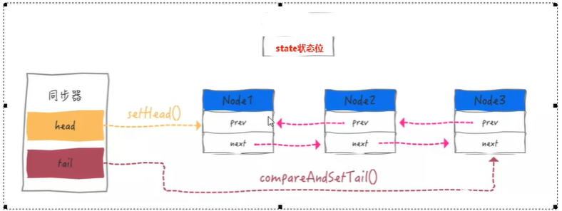
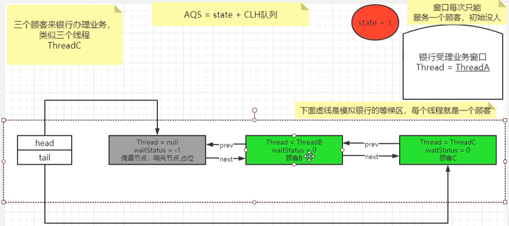
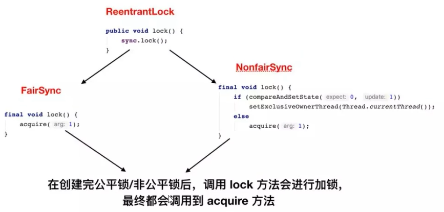

## JUC - 2020

### JUC - 原理

> JUC并发包的基石 - AQS（AbstractQueuedSynchronizer）
>
> **==AQS = state + CLH双向队列==**
>
> **state状态位，0表示锁未被获取（当前线程可直接获取），大于0根据不同子类定义有不同的表示**


#### AQS核心API



``` java
void acquire(int);

// 落地实现必须由子类实现，请找对应的子类
boolean tryAcquire(int);

Node addWaiter(Node.EXECLUSIVE);

boolean acquireQueued(addWaiter(Node.EXECLUSIVE), arg);
```


#### ==AQS - acuqire()==

> 假设ABC三个线程，A先获取锁（令A在整个流程期间都未释放锁），BC依次执行，那么流程代码如下，流程图如下
>
> tryAcquire需要子类提供实现，这里选择ReentrantLock的非公平锁实现



``` java
abstract class AbstractQueuedSynchronizer {
  
  // 首尾节点
  volatile Node head, tail;
  
  // 状态位，0表示锁未被获取，大于0根据不同子类实现有不同的表示
  volatile int state;
  
  
  // 调用lock会调用到acquire()，非公平锁会尝试获取一次如果获取到就不会到acuqire，见下文
  public final void acquire(int arg) {
    if (!tryAcquire(arg) &&
        acquireQueued(addWaiter(Node.EXCLUSIVE), arg))
      selfInterrupt();
  }
  
  // 经典的模板设计模式，抽象相同的逻辑，不同的逻辑必须让子类提供实现
  protected boolean tryAcquire(int arg) {
    throw new UnsupportedOperationException();
  }

  final boolean nonfairTryAcquire(int acquires) {
    final Thread current = Thread.currentThread();
    int c = getState();
    if (c == 0) {
      if (compareAndSetState(0, acquires)) {
        setExclusiveOwnerThread(current);
        return true;
      }
    }
    else if (current == getExclusiveOwnerThread()) {
      int nextc = c + acquires;
      if (nextc < 0) // overflow
        throw new Error("Maximum lock count exceeded");
      setState(nextc);
      return true;
    }
    return false;
  }
  
  /**
   * 只有第一个节点进来的时候才会进入 enq
   * 后面进来排队的节点只需要执行 if (pred != null) 的逻辑即可
   */
  private Node addWaiter(Node mode) {
    Node node = new Node(Thread.currentThread(), mode);
    // Try the fast path of enq; backup to full enq on failure
    Node pred = tail;
    if (pred != null) {
      node.prev = pred;
      if (compareAndSetTail(pred, node)) {
        pred.next = node;
        return node;
      }
    }
    // 只有第一个排队的节点才进入enq
    enq(node);
    return node;
    }
  
  // 入队
  private Node enq(final Node node) {
    for (;;) {
      Node t = tail;
      if (t == null) { // Must initialize
        if (compareAndSetHead(new Node()))
          tail = head;
      } else {
        node.prev = t;
        if (compareAndSetTail(t, node)) {
          t.next = node;
          return t;
        }
      }
    }
  }
  
  
  final boolean acquireQueued(final Node node, int arg) {
    boolean failed = true;
    try {
      boolean interrupted = false;
      for (;;) {
        // 前驱节点，B线程的前驱就是辅助头节点（不存储任何信息的哑元 / 哨兵节点）
        final Node p = node.predecessor();
        
        // 这里tryAcquire再次尝试CAS设置state值
        if (p == head && tryAcquire(arg)) {
          
          /**
           * 当A线程释放锁之后，if中的tryAcquire就可以成功
           * setHead将B节点设置为head，并释放调B的前驱节点与线程（help GC）
           * 此时 B 就变成了新的哨兵节点
           */
          setHead(node);
          p.next = null; // help GC
          failed = false;
          return interrupted;
        }
        // 如果锁还是被其它线程占用（上面的tryAcquire失败了）
        if (shouldParkAfterFailedAcquire(p, node) &&
            parkAndCheckInterrupt())
          interrupted = true;
      }
    } finally {
      if (failed)
        cancelAcquire(node);
    }
  }
  
  private void setHead(Node node) {
    head = node;
    node.thread = null;
    node.prev = null;
  }
  
  /**
   * 尝试获取锁失败之后是否应该park（阻塞）
   * 线程A占用锁，线程B,C的waitStatus的值都是默认值 0
   * 线程B首次进入该方法会改变B的waitStatus为 -1 并且返回false
   * 然后因为父帧是自旋for死循环，所以再次tryAcquire失败（假设A还占用锁），再次进入该方法
   * 此时， ws = -1的（上一次循环改为了-1），这时候会返回true
   * 返回true，那么父帧的if会继续执行parkAndCheckInterrupt()
   */
  private static boolean shouldParkAfterFailedAcquire(Node pred, Node node) {
    int ws = pred.waitStatus;
    // Node.SINGAL = -1
    if (ws == Node.SIGNAL)
      /*
       * This node has already set status asking a release
       * to signal it, so it can safely park.
       */
      return true;
    if (ws > 0) {
      /*
       * Predecessor was cancelled. Skip over predecessors and
       * indicate retry.
       */
      do {
        node.prev = pred = pred.prev;
      } while (pred.waitStatus > 0);
      pred.next = node;
    } else {
      /*
       * waitStatus must be 0 or PROPAGATE.  Indicate that we
       * need a signal, but don't park yet.  Caller will need to
       * retry to make sure it cannot acquire before parking.
       */
      compareAndSetWaitStatus(pred, ws, Node.SIGNAL);
    }
    return false;
  }

  /**
   * 只有执行到这里，B线程才算是入队阻塞了。
   * 此时，父帧acquireQueued，一直卡在if判断的parkAndCheckInterrupt函数
   * BC线程依次都会执行到这里，一直等待其它线程LockSupport.unpark()
   * 直到唤醒了（见release）BC线程，函数返回当前线程是否被中断，并重置中断位
   */
  private final boolean parkAndCheckInterrupt() {
    LockSupport.park(this);
    return Thread.interrupted();
  }
  
  /**
   * 节点类 Node
   *
   */
  static class Node {
    
    // 节点封装的线程
    volatile Thread thread;
    
    // 节点的等待状态
    volatile int waitStatus;
    
    // 节点的前后指针
    volatile Node prev, next;
  }
}
```


#### ==AQS - release()==

> ABC线程，此时A线程调用unlock（unlock会调用AQS的release）
>
> tryRelease()需要子类提供实现，这里选择ReentrantLock的实现

``` java
public final boolean release(int arg) {
  if (tryRelease(arg)) {
    // 此时这个head指向的是哨兵节点
    Node h = head;
    if (h != null && h.waitStatus != 0)
      // 唤醒后继节点
      unparkSuccessor(h);
    return true;
  }
  return false;
}

protected boolean tryRelease(int arg) {
  throw new UnsupportedOperationException();
}

protected final boolean tryRelease(int releases) {
  int c = getState() - releases;
  if (Thread.currentThread() != getExclusiveOwnerThread())
    throw new IllegalMonitorStateException();
  boolean free = false;
  if (c == 0) {
    free = true;
    setExclusiveOwnerThread(null);
  }
  setState(c);
  return free;
}

/**
 * 哨兵节点的watiStatus 已经被修改为了 -1
 * 此时会进入 if (ws < 0) 并设置ws = 0
 * node.next 则指向了第一个排队的节点B，此时B != null 所以会执行 unpark
 * 执行完unpark(B)之后，卡在parkAndCheckInterrupt()的B线程继续执行
 */
private void unparkSuccessor(Node node) {
  /*
   * If status is negative (i.e., possibly needing signal) try
   * to clear in anticipation of signalling.  It is OK if this
   * fails or if status is changed by waiting thread.
   */
  int ws = node.waitStatus;
  if (ws < 0)
    compareAndSetWaitStatus(node, ws, 0);

  /*
   * Thread to unpark is held in successor, which is normally
   * just the next node.  But if cancelled or apparently null,
   * traverse backwards from tail to find the actual
   * non-cancelled successor.
   */
  Node s = node.next;
  if (s == null || s.waitStatus > 0) {
    s = null;
    for (Node t = tail; t != null && t != node; t = t.prev)
      if (t.waitStatus <= 0)
        s = t;
  }
  if (s != null)
    LockSupport.unpark(s.thread);
}

```


#### ReentrantLock来解析AQS

> 理念必有实现，ReentrantLock就是AQS框架理论的一个具体实现
>
> ReentrantLock默认非公平锁
>
> public ReentrantLock(boolean fair) {
>
> ​	sync = fair ? new FairSync() : new NonFairSync();
>
> }
>
> 
>
> **==ReentrantLock锁获取流程==**
>
> 我们可以看到，非公平在获取锁的时候先尝试获取锁，如果此次尝试获取锁那么直接获取成功，无需acquire，公平锁不尝试直接去acquire
>
> 而acquire的代码，对于公平锁来说是调用`tryAcquire()`，需要判断当前队列是否有节点在排队，如果有节点排队，那么公平锁的节点直接去CLH队列排队，否则CAS修改state变量的值去获取锁
>
> 而对于非公平锁来说是调用`nonfairTryAcquire()`，进入方法会尝试获取锁（CAS修改state变量的值），获取不到才进入CLH队列排队。非公平锁不需要判断CLH队列是否有人在排队，我直接尝试获取




### JUC - API

> 高内聚下线程操作资源类（实例变量 + 实例方法）
>
> 判断（是否该自己执行）执行（执行逻辑）通知（执行完毕唤醒其它线程）
>
> 防止虚假唤醒（always be uesd in a loop）


#### JUC包

+ `java.util.concurrent`

各种并发队列（ConcurrentHashMap，CopyOnWriteArraySet），执行器（ExecutorService），调度器（SecheduledExecutorService）

+ `java.util.concurrent.atomic`

各种原子类型，如AtomicInteger，LongAdder

+ `java.util.concurrent.locks`

AQS及其子类实现等（AbstractQueuedSynchronizer，ReentrantLock，LockSupport工具类）


####  Synchronized & Lock

Synchronized三种使用方式

``` java
// 资源类，高内聚提供sale()
private int number = 30;
private Object obj = new Object();
// 对象锁，this的所有同步方法
1.1 private synchronized void sale() { }
// 对象锁，obj的所有同步方法
1.2 private void sale() {
 synchronized(obj) { }
}
// 全局锁,Test.class字节码对应在JRE运行时中的Class<Test>
3. synchronized static void test() { }
```

Lock基本使用

``` java
lock.lock();
try {
    ...;
} finally {
    lock.unlock();
}
```


其它对比

| synchronized块内 | Condition c = lock.newCondition() |
| :--------------: | :-------------------------------: |
|      wait()      |              await()              |
|     notify()     |             signal()              |
|   notifyAll()    |            signalAll()            |


#### Callable

`new Thread(Runnable target, String name)`

既然能传Runnable接口，那么就能传入Runnable接口的子接口 RunnableFuture<V>

RunnableFuture接口的实现类： FutureTask，那么也就是Runnable接口的实现类

再看FutureTask的构造方法

+ `FutureTask(Callable<V> callable)`
+ `FutureTask(Runnable)`

==FutureTask同时适配Runnable，Callable==

`new Thread(futureTask, "T1").start()`


+ 对于同一对象的同一方法提交给Callable，只会执行一次
+ get()；阻塞，请放在方法最后调用


#### BlockingQueue

| 方法 |   异常    |  特殊值  |    阻塞    |         超时阻塞         |
| :--: | :-------: | :------: | :--------: | :----------------------: |
| 插入 |  add(E)   | offer(E) | ==put(E)== | offer(E, long, TimeUnit) |
| 删除 | remove()  |  poll()  | ==take()== |   poll(long, TimeUnit)   |
| 查看 | element() |  peek()  |    null    |           null           |


阻塞队列的实现类

+ `ArrayBlockingQueue`数组实现的有界阻塞队列
+ `LinkedBlockingQueue`链表实现的有界（默认为Integer.MAX_VALUE）阻塞队列
+ `PriorityBlockingQueue`支持优先级排序的无界阻塞队列
+ `DelayQueue`支持延时获取元素的无界阻塞队列，内部以PriorityQueue实现
+ `SynchronousQueue`单个元素的有界阻塞队列（==容量为0，每个插入必须等待另一个线程删除，反之亦然==）
+ `LinkedBlockingDeque`链表实现的双端阻塞队列（容量默认Integer.MAX_VALUE）


`TransferQueue extends BlockingQueue`

==生产者会一直阻塞直到所添加到队列的元素被某一个消费者所消费（不仅仅是添加到队列里就完事）==

+ `LinkedTranferQueue`是LinkedBlockingQueue & SynchronousQueue的组合

put()线程，首先查看head是否是take()，如果是直接交出数据，否则追加到队列，立刻返回

take()线程，首先查看head是否是put()，如果是直接拿走数据，如果不是追加到tail，并阻塞


**LinkedTranferQueue**

是SynchronousQueue，ConcurrentLinkedQueue，LinkedBlockingQueue的超集，且提供了无锁CAS实现

``` java
/**
 * E： 如果put类型就是实际的值，反之null
 * boolean：是否包含数据，put() 为true， 反之false
 * int：执行类型，立即返回NOW，异步ASYNC，阻塞SYNC，超时TIMED
 * long：超时数值，只在TIMED有作用
 */
private E xfer(E e, boolean haveData, int how, long nanos) {
    if (haveData && (e == null))
        throw new NullPointerException();
    Node s = null;                        // the node to append, if needed
    retry:
    for (;;) {                            // restart on append race
        // 从  head 开始
        for (Node h = head, p = h; p != null;) { // find & match first node
            // head 的类型。
            boolean isData = p.isData;
            // head 的数据
            Object item = p.item;
            // item != null 有 2 种情况,一是 put 操作, 二是 take 的 item 被修改了(匹配成功)
            // (itme != null) == isData 要么表示 p 是一个 put 操作, 要么表示 p 是一个还没匹配成功的 take
            if (item != p && (item != null) == isData) { 
                // 如果当前操作和 head 操作相同，就没有匹配上，结束循环，进入下面的 if 块。
                if (isData == haveData)   // can't match
                    break;
                // 如果操作不同,匹配成功, 尝试替换 item 成功,
                if (p.casItem(item, e)) { // match
                    // 更新 head
                    for (Node q = p; q != h;) {
                        Node n = q.next;  // update by 2 unless singleton
                        if (head == h && casHead(h, n == null ? q : n)) {
                            h.forgetNext();
                            break;
                        }                 // advance and retry
                        if ((h = head)   == null ||
                            (q = h.next) == null || !q.isMatched())
                            break;        // unless slack < 2
                    }
                    // 唤醒原 head 线程.
                    LockSupport.unpark(p.waiter);
                    return LinkedTransferQueue.<E>cast(item);
                }
            }
            // 找下一个
            Node n = p.next;
            p = (p != n) ? n : (h = head); // Use head if p offlist
        }
        // 如果这个操作不是立刻就返回的类型    
        if (how != NOW) {                 // No matches available
            // 且是第一次进入这里
            if (s == null)
                // 创建一个 node
                s = new Node(e, haveData);
            // 尝试将 node 追加对队列尾部，并返回他的上一个节点。
            Node pred = tryAppend(s, haveData);
            // 如果返回的是 null, 表示不能追加到 tail 节点,因为 tail 节点的模式和当前模式相反.
            if (pred == null)
                // 重来
                continue retry;           // lost race vs opposite mode
            // 如果不是异步操作(即立刻返回结果)
            if (how != ASYNC)
                // 阻塞等待匹配值
                return awaitMatch(s, pred, e, (how == TIMED), nanos);
        }
        return e; // not waiting
    }
}
```


#### Executor

==Executor提供对Runnable支持==

==ExecutroService同时提供Runnable，Callable支持==


继承结构：

Interface Executor

+ Interface ExecutorService
    + class AbstractExecutorService
        + **class ThreadPoolExecutor**
    + Interface ScheduledExecutorService
        + SecheduledThreadPoolExecutor


#### ThreadPoolExecutor

``` java
public ThreadPoolExecutor(int corePoolSize,
                          int maximumPoolSize,
                          long keepAliveTime,
                          TimeUnit unit,
                          // 工作队列，被提交但未被执行的任务
                          BlockingQueue<Runnable>() workQueue,
                          // 线程工厂，默认即可
                          ThreadFactory threadFactory,
                          // 拒绝策略，工作队列满且工作线程 >= maximumPoolSize
                          RejectedExecutionHandler handler);
```


##### 拒绝策略

当任务数达到maximum + workQueue.size()时触发拒绝策略

+ 默认抛出RejectedExecutionException -> new ThreadExecutor.AbortPolicy();
+ 将某些任务回退给调用者（main） -> **CallerRunsPolicy**
+ 丢弃 -> **discardPolicy**
+ 丢弃等待最长的任务 -> **discardOldestPolicy**


##### Executors工具类

``` java
// 比较恐怖，任务队列为无界
static ExexutorService newFixedThreadPool(int nThreads) {
    return new ThreadPoolExecutor(nThreads, nThreads, 0L, TimeUnit.MILLISECONDS,
                                  // 无参构造，容量为Integer.MAX_VALUE
                                 new LinkedBlockingQueue<Runnable>());
}
```


#### Fork/Join

+ ForkJoinPool extends AbstractExecutorService
+ ForkJoinTask implements Future
    + `RecursiveTask<V> extends ForkJoinTask`
    + `RecursiveAction extends ForkJoinTask`


#### CompletableFuture

可组合式异步回调

``` java
// 无返回值异步
CompletableFuture<Void> voidFuture = CompletableFuture.runAsync(() -> sout("异步执行"));
// 有返回值
CompletableFutre<Integer> future = CompletableFuture.supplyAsync(
    sout("异步执行");
    return 200;
).whenComplete((result, throwable) -> {
    ...;
}).exceptionally(throwable -> {
    throwable.printStackTrace();
    return 404;
});
future.get() / future.join()
```


###  5 泛型

``` java
/**
 * 						Food
 *					  /      \
 * 				   Fruit	  Meat
 * 				   /   \      /   \
 *				Apple Banana Pork Beef
 *             /   \
 * 			Green  Red
 * 上界通配符 => 协变	
 * 此时ArrayList<? extends Fruit>能获取Fruit在内的左下角所有类型（都以Fruit接收）
 * 		是ArrayList<Fruit, Apple, Banana, GreenApple, RedApple>的父类
 * 		即可以new这些子类，new ArrayList<GreenApple>
 * 此通配符限制add|set，因为编译器不知道是哪种子类被添加（避免运行时CCE）null可以
 * get是有效的，我们都以Fruit接收（LSP引用基类的地方可透明引用子类）
 */
ArrayList<? extends Fruit> lowerBound = new ArrayList<GreenApple>();
lowerBound.add(null);
Fruit fruit = lowerBound.get(0);
/**
 * 下界通配符 => 逆变
 * <ArrayList ? super Fruit>能添加Fruit在内的左下角所有
 * 		是ArrayList<Fruit, Food, Object>的父类
 * 		即可以new这些，new ArrayList<Food>
 * 此通配符限制get，编译器不知道哪种父类被get，所以只能以Object获取
 * add|set是有效的，因为我们都当作Fruit去add|set（LSP引用基类的地方可透明引用子类）
 */
ArrayList<? super Fruit> upperBound = new ArrayList<Food>();
upperBound.add(new Fruit());
upperBound.add(new Apple());
upperBound.add(new Banana());
upperBound.add(new GreenApple());
// 只能以Object获取
Object o = upperBound.get(0);

/**
 * PECS
 * Collections.copy()例程
		 * public static <T> void copy(List<? super T> dest, List<? extends T> src) {
				int srcSize = src.size();
				if (srcSize < COPY_THRESHOLD ||
					(src instanceof RandomAccess && dest instanceof RandomAccess)) {
					for (int i=0; i<srcSize; i++)
						dest.set(i, src.get(i));
				} else {
					ListIterator<? super T> di=dest.listIterator();
					ListIterator<? extends T> si=src.listIterator();
					for (int i=0; i<srcSize; i++) {
						di.next();
						di.set(si.next());
					}
				}
			}
		 */

/**
 * <?>无界通配符，用于读取，持有一种未知类型
 * List<Object>，可以持有任何类型
 */
ArrayList<Object> objs = new ArrayList<>();
ArrayList<?> general = new ArrayList<>();
Object o2 = general.get(1);

/**
 * 不能new一个确切的泛型数组（泛型无法使用运行时相关操作，比如new，instanceOf），考虑以下例程
 *  List<String>[] lsa = new List<String>[10];
			Object o = lsa;
			Object[] oa = (Object[]) o;
			List<Integer> li = new ArrayList<Integer>();
			li.add(new Integer(3));
			// Unsound, but passes run time store check
			oa[1] = li;
			String s = lsa[1].get(0); //ClassCastException
 * 所以编译器不允许这样创建
 * 可以通过通配符创建，get时都以Object获取
 */
ArrayList<String>[] genericStringArray = new ArrayList[10];
ArrayList<?>[] genericArray = new ArrayList<?>[10];
```


### 6 JMM

> JMM需要保证可见性，原子性，有序性
>
> ==Java内存模型规定所有实例变量存储在，主内存（堆），线程需将变量从主内存复制到工作内存，执行操作后复制回主内存，线程的通信需通过主内存==

``` java
// 资源类
class Resource {
    int num = 10;
    void changeNum() { this.num = 20; }
    // A线程在2秒之后修改num，但主线程是不知道的，需要添加volatile关键字
    main() {
        Resource r = new Resource();
        new Thread(() -> {
            TimeUnit.SECONDS.sleep(2);
            r.changeNum();
        }, "A").start();
        while (r.num == 10) {  }
        sout("mission is over");
    }
}
```


