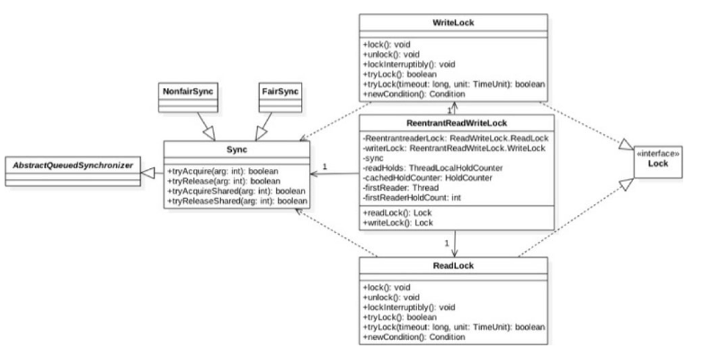

#### LockSupport


#### AQS

``` java
// AbstractQueuedSynchonizer
public class AbstractQueuedSynchronizer {
    
}
```


#### ReentrantLock



``` java
// ReentrantReadWriteLock

public class ReentrantReadWriteLock {
    private final ReadLock readLock;
    private final WriteLock writeLock;
    final Sync sync;
    
    public ReentrantReadWriteLock(boolean fair) {
        sync = fair ? new FairSync() : new NonfairSync();
        readLock = new ReadLock(this);
        writeLock = new WriteLock(this);
    }
    
    public static class ReadLock implements Lock {
        private final Sync sync;
        
        public ReadLock(ReentrantReadWriteLock lock) {sync = lock.sync;}
    }
    
    public static class WriteLock implements Lock {
        private final Sync sync;
        public WriteLock(ReentrantReadWriteLock lock) {sync = lock.sync;}
    }
    
    // 抽象嵌套类，由于存在共享和独占锁
    abstract static class Sync extends AbstractQueuedSynchronizer {
        
        @Override
        protected final boolean isHeldExclusively() {}
        
        @Override
        protected final boolean tryAcquire(int arg) {}
        
        @Override
        protected final boolean tryRelease(int arg) {}
        
        @Override
        protected final int tryAcquireShared(int arg) {}
        
        @Override
        protected final int tryReleaseShared(int arg) {}
        
        Condition newCondition() {
            return new ConditonObject();
        }
    }
    
    static final class FairSync extends Sync {
        
    }
    
    static final class NonfairSync extend Sync {
        
    }
}
```


#### StampedLock

不可重入锁

提供乐观读锁，悲观读锁，独占写锁，且可以向上转换


### 并发队列

+ 阻塞队列，采用锁实现
+ 非阻塞队列，采用CAS非阻塞算法


#### ConcurrentLinkedQueue

==CAS实现的无界阻塞队列，单链表，出队入队使用Unsafe类提供CAS操作volatile修饰的head，tail==

入队出队都是操作volatile修饰的tail，head节点，保证线程安全只需要保证这两个Node操作的可见性和原子性，volatile保证可见性，CAS保证对变量操作的原子性

``` java

```


#### LinkedBlockingQueue

独占锁实现的阻塞队列，单链表，putLock，takeLock两个独占锁，notEmpty，notFull条件变量构成==生产者消费者模型==

``` java
public class LinkedBlockingQueue<E> extends AbstractQueue<E>
		implements BlockingQueue<E>, java.io.serializable {
    
    // 队列容量Integer.MAX_VALUE
    public LinkedBlockingQueue() {this(Integer.MAX_VALUE);}
    public LinkedBlockingQueue(int capacity) {
        if (capacity <= 0) throw new IllegalArgumentException();
        this.capacity = capacity;
        head = tail = new Node<E>(null);
    }
    
    static class Node<E> {
        E item; 
        Node<E> next;
        Node(E x) {item = x;}
    }
    
    private transient volatile Node<E> head, last;
    
    // take, poll操作需要获取该锁，保证只有一个线程操作头节点
    private final ReentrantLock takeLock = new ReentrantLock();
    // 当队列为空时，执行take的线程进入该对象的条件队列进行等待
    private final Condition notEmpty = takeLock.newCondition();
    
    // put, offer需要获取该锁，保证只有一个线程操作尾节点
    private final ReentrantLock putLock = new ReentrantLock();
    // 当队列满，执行put的线程进入notFull对象的条件队列进行等待
    private final Condition notFull = putLock.newCondition();
    
    // 当前队列元素个数
    private final AtomicInteger count = new AtomicInteger(0);
}
```


#### ArrayBlockingQueue

有界数组方式实现阻塞队列，加锁保证锁块内内存可见性，独占锁lock保证入队出队操作的原子性，notEmpty，notFull条件变量构成生产者消费者模型，==这里使用一个独占锁而非两个类似于synchronized关键字，锁的粒度较大，限制同时只有一个线程执行入队 或者 出队操作==

``` java
// ****************

public class ArrayBlockingQueue<E> extends AbstractQueue<E>
		implements BlockingQueue<E>, java.io.serializable {
    public ArrayBlockingQueue(int capacity) {this(capactiry, false);}
    public ArrayBlockingQueue(int capacity, boolean fair) {
        if (capactiry <= 0) throw new IllegalArgumentException();
        this.items = new Object[capacity];
        lock = new ReentrantLock(fair);
        notEmpty = lock.newCondition();
        notFull = lock.newCondition();
    }
    
    final Object[] items;
    int takeIndex, putIndex, count;
    
    private final ReentrantLock lock;
    private Condition notEmpty, notFull;
    
    // offer 不阻塞
    public boolean offer(E e) {
        checkNotNull(e);
        
        // 为什么这里对lock单独声明一个常量？
        // 因为访问局部变量（load）比getField快，同理比getStatic也快
        final ReentrantLock lock = this.lock;
        lock.lock();
        try {
            
            // 这里体现不阻塞
            if (count == items.length)
                return false;
            /**
             * 如果是阻塞，比如put则调用notFull.await();
             * while(count == items.length) {
             *	 notFull.await();
             * }
             */
            else {
                enqueue(e);
                return ture;
            }
        } finally {
            lock.unlock();
        }
    }
    
    // 在lock块内操作putIndex和count，是保证可见性的，所以无须volatile
    // 加锁后共享变量的值都是从主存获取，而不是寄存器或高速缓存
    // 释放锁时将共享变量的值刷新回主存
    private void enqueue(E x) {
        final Object[] items = this.items;
        items[putIndex] = x;
        if (++putIndex == capacity) { putIndex = 0; }
        count ++;
        notEmpty.signal();
    }
}
```


#### PriorityBlockingQueue

带优先级的误解阻塞队列，每次出队返回优先级最高 | 最低的元素，使用二叉堆（完全二叉树）实现，直接遍历不保证元素有序，默认使用对象的compareTo()提供比较规则，自定义比较规则可传入Comparator构造PriorityQueue，allocationSpinLock自旋锁，使用CAS保证只有一个线程扩容队列，状态0 | 1。lock独占锁限制同时只能有一个线程执行入队，出队操作，notEmpty条件变量实现take阻塞模式，没有notFull是因为==无界队列所以put设计为非阻塞==

``` java

public class PriorityBlockingQueue<E> extends AbstranctQueue<E>
    	implements BlockingQueue<E>, java.io.serializable {
    // 默认 11
    public PriorityBlockingQueue() {this(DEFAULT_INITIAL_CAPACITY, null);}
    public PriorityBlockingQueue(int capacity, Comparator<? super E> cmp) {
        if (capacity <= 0) throw new I...
        this.comparator = cmp;
        this.lock = new ReentrantLock();
        this.notEmpty = lock.newCondition();
        this.queue = new Object[capacity];
    }
    
    private Comparator<E> comparator;
    
    privat final ReentrantLock lock;
    private Condition notEmpty;
    private transient volatile int allocationSpinLock;
    
    // 保存元素
    private PriorityQueue<E> q;
    
    
    /**
     * siftUpComparable(size, element, array);
     * 插入元素 siftUpComparable（上滤 percolate）
     * ... 复习一下构建二叉堆
     */
    private static<E> void siftUpComparable(int idx, E ele, Object[] array) {
        Comparable<? super E> key = (Comparable<? super E>)ele;
        while (idx > 0) {
            int half = (idx - 1) >>> 1;
            Object parent = array[half];
            // 插入的元素比父节点值大，符合最小堆，退出
            if (key.compareTo((E)parent) >= 0)
                break;
            array[idx] = parent;
            idx = half;
        }
        array[idx] = key;
    }
    
    /**
     * 下滤
     * siftDownComparable(0, array[n], array, n)
     * array[0] = array[n]
     * array[n] = null;
     * 这里要把需要的参数全都传递过来（读取成员变量？）
     */
    private static<E> void siftDownComparable(int hole, E element, Object[] array, int n) {
        Comparable<? super E> key = (Comparable<? super E>)element;
        // 第一个元素用最大值填充，然后下滤
        int half = n >>> 1;
        // 要搜索子节点，所以hole < half
        while(hole < half) {
        	int chlid = (hole << 1) + 1;
            Object c = array[chlid];
            int rt = chlid + 1;
            // 这里n是没有 - 1的值
            if (rt < n && (Comparable<? super E>)c.compareTo(array[rt]) > 0) {
                // 找到最小的子节点，这里把rt 赋值給了 lt，所以下面可以直接使用
                c = array[chlid = rt];
            }
            // 用子节点的值代替hole
            array[hole] = c;
            hole = chlid;
        }
        array[hole] = key;
    }
}
```


#### DelayQueue

无界阻塞延迟队列，队列中每个元素有过期时间，当获取元素时只有过期的元素才会出队，队头是将要过期的元素。