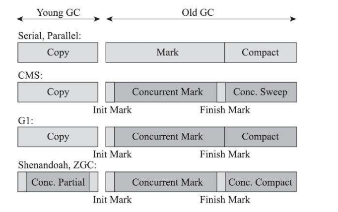
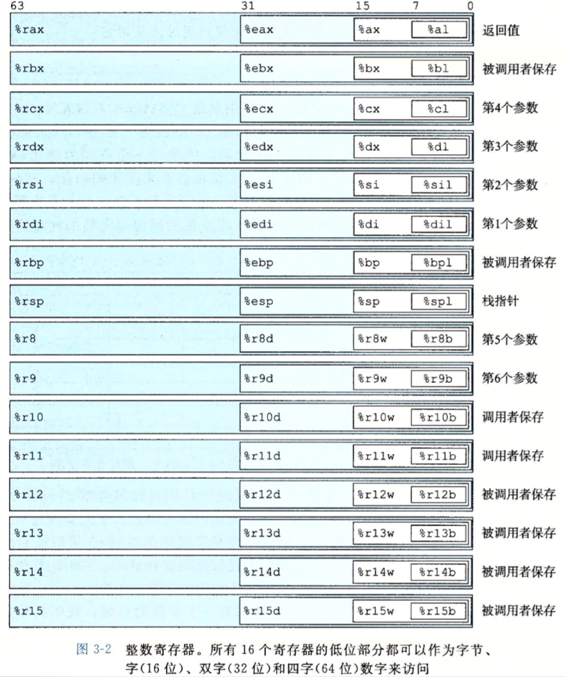
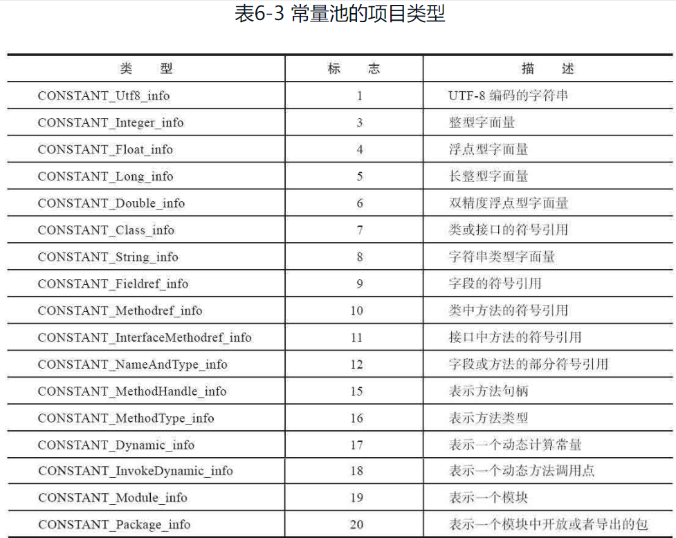
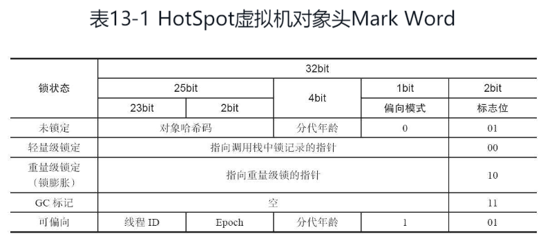
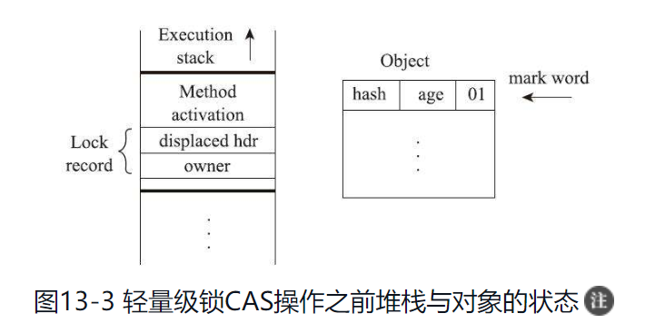
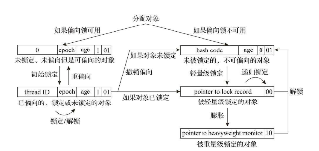

### JVM指令集

``` properties
指令码 助记符    说明  
0x00 nop      什么都不做  
0x01 aconst_null 将null推送至栈顶  
0x02 iconst_m1   将int型-1推送至栈顶  
0x03 iconst_0   将int型0推送至栈顶  
0x04 iconst_1   将int型1推送至栈顶  
0x05 iconst_2   将int型2推送至栈顶  
0x06 iconst_3   将int型3推送至栈顶  
0x07 iconst_4   将int型4推送至栈顶  
0x08 iconst_5   将int型5推送至栈顶  
0x09 lconst_0   将long型0推送至栈顶  
0x0a lconst_1   将long型1推送至栈顶  
0x0b fconst_0   将float型0推送至栈顶  
0x0c fconst_1   将float型1推送至栈顶  
0x0d fconst_2   将float型2推送至栈顶  
0x0e dconst_0   将double型0推送至栈顶  
0x0f dconst_1   将double型1推送至栈顶  
0x10 bipush    将单字节的常量值(-128~127)推送至栈顶  
0x11 sipush    将一个短整型常量值(-32768~32767)推送至栈顶  
0x12 ldc      将int, float或String型常量值从常量池中推送至栈顶  
0x13 ldc_w     将int, float或String型常量值从常量池中推送至栈顶（宽索引）  
0x14 ldc2_w    将long或double型常量值从常量池中推送至栈顶（宽索引）  
0x15 iload     将指定的int型本地变量推送至栈顶  
0x16 lload     将指定的long型本地变量推送至栈顶  
0x17 fload     将指定的float型本地变量推送至栈顶  
0x18 dload     将指定的double型本地变量推送至栈顶  
0x19 aload     将指定的引用类型本地变量推送至栈顶  
0x1a iload_0    将第一个int型本地变量推送至栈顶  
0x1b iload_1    将第二个int型本地变量推送至栈顶  
0x1c iload_2    将第三个int型本地变量推送至栈顶  
0x1d iload_3    将第四个int型本地变量推送至栈顶  
0x1e lload_0    将第一个long型本地变量推送至栈顶  
0x1f lload_1    将第二个long型本地变量推送至栈顶  
0x20 lload_2    将第三个long型本地变量推送至栈顶  
0x21 lload_3    将第四个long型本地变量推送至栈顶  
0x22 fload_0    将第一个float型本地变量推送至栈顶  
0x23 fload_1    将第二个float型本地变量推送至栈顶  
0x24 fload_2    将第三个float型本地变量推送至栈顶  
0x25 fload_3    将第四个float型本地变量推送至栈顶  
0x26 dload_0    将第一个double型本地变量推送至栈顶  
0x27 dload_1    将第二个double型本地变量推送至栈顶  
0x28 dload_2    将第三个double型本地变量推送至栈顶  
0x29 dload_3    将第四个double型本地变量推送至栈顶  
0x2a aload_0    将第一个引用类型本地变量推送至栈顶  
0x2b aload_1    将第二个引用类型本地变量推送至栈顶  
0x2c aload_2    将第三个引用类型本地变量推送至栈顶  
0x2d aload_3    将第四个引用类型本地变量推送至栈顶  
0x2e iaload    将int型数组指定索引的值推送至栈顶  
0x2f laload    将long型数组指定索引的值推送至栈顶  
0x30 faload    将float型数组指定索引的值推送至栈顶  
0x31 daload    将double型数组指定索引的值推送至栈顶  
0x32 aaload    将引用型数组指定索引的值推送至栈顶  
0x33 baload    将boolean或byte型数组指定索引的值推送至栈顶  
0x34 caload    将char型数组指定索引的值推送至栈顶  
0x35 saload    将short型数组指定索引的值推送至栈顶  
0x36 istore    将栈顶int型数值存入指定本地变量  
0x37 lstore    将栈顶long型数值存入指定本地变量  
0x38 fstore    将栈顶float型数值存入指定本地变量  
0x39 dstore    将栈顶double型数值存入指定本地变量  
0x3a astore    将栈顶引用型数值存入指定本地变量  
0x3b istore_0   将栈顶int型数值存入第一个本地变量  
0x3c istore_1   将栈顶int型数值存入第二个本地变量  
0x3d istore_2   将栈顶int型数值存入第三个本地变量  
0x3e istore_3   将栈顶int型数值存入第四个本地变量  
0x3f lstore_0   将栈顶long型数值存入第一个本地变量  
0x40 lstore_1   将栈顶long型数值存入第二个本地变量  
0x41 lstore_2   将栈顶long型数值存入第三个本地变量  
0x42 lstore_3   将栈顶long型数值存入第四个本地变量  
0x43 fstore_0   将栈顶float型数值存入第一个本地变量  
0x44 fstore_1   将栈顶float型数值存入第二个本地变量  
0x45 fstore_2   将栈顶float型数值存入第三个本地变量  
0x46 fstore_3   将栈顶float型数值存入第四个本地变量  
0x47 dstore_0   将栈顶double型数值存入第一个本地变量  
0x48 dstore_1   将栈顶double型数值存入第二个本地变量  
0x49 dstore_2   将栈顶double型数值存入第三个本地变量  
0x4a dstore_3   将栈顶double型数值存入第四个本地变量  
0x4b astore_0   将栈顶引用型数值存入第一个本地变量  
0x4c astore_1   将栈顶引用型数值存入第二个本地变量  
0x4d astore_2   将栈顶引用型数值存入第三个本地变量  
0x4e astore_3   将栈顶引用型数值存入第四个本地变量  
0x4f iastore    将栈顶int型数值存入指定数组的指定索引位置  
0x50 lastore    将栈顶long型数值存入指定数组的指定索引位置  
0x51 fastore    将栈顶float型数值存入指定数组的指定索引位置  
0x52 dastore    将栈顶double型数值存入指定数组的指定索引位置  
0x53 aastore    将栈顶引用型数值存入指定数组的指定索引位置  
0x54 bastore    将栈顶boolean或byte型数值存入指定数组的指定索引位置  
0x55 castore    将栈顶char型数值存入指定数组的指定索引位置  
0x56 sastore    将栈顶short型数值存入指定数组的指定索引位置  
0x57 pop      将栈顶数值弹出 (数值不能是long或double类型的)  
0x58 pop2     将栈顶的一个（long或double类型的)或两个数值弹出（其它）  
0x59 dup      复制栈顶数值并将复制值压入栈顶  
0x5a dup_x1    复制栈顶数值并将两个复制值压入栈顶  
0x5b dup_x2    复制栈顶数值并将三个（或两个）复制值压入栈顶  
0x5c dup2     复制栈顶一个（long或double类型的)或两个（其它）数值并将复制值压入栈顶  
0x5d dup2_x1    <待补充>  
0x5e dup2_x2    <待补充>  
0x5f swap     将栈最顶端的两个数值互换(数值不能是long或double类型的)  
0x60 iadd     将栈顶两int型数值相加并将结果压入栈顶  
0x61 ladd     将栈顶两long型数值相加并将结果压入栈顶  
0x62 fadd     将栈顶两float型数值相加并将结果压入栈顶  
0x63 dadd     将栈顶两double型数值相加并将结果压入栈顶  
0x64 isub     将栈顶两int型数值相减并将结果压入栈顶  
0x65 lsub     将栈顶两long型数值相减并将结果压入栈顶  
0x66 fsub     将栈顶两float型数值相减并将结果压入栈顶  
0x67 dsub     将栈顶两double型数值相减并将结果压入栈顶  
0x68 imul     将栈顶两int型数值相乘并将结果压入栈顶  
0x69 lmul     将栈顶两long型数值相乘并将结果压入栈顶  
0x6a fmul     将栈顶两float型数值相乘并将结果压入栈顶  
0x6b dmul     将栈顶两double型数值相乘并将结果压入栈顶  
0x6c idiv     将栈顶两int型数值相除并将结果压入栈顶  
0x6d ldiv     将栈顶两long型数值相除并将结果压入栈顶  
0x6e fdiv     将栈顶两float型数值相除并将结果压入栈顶  
0x6f ddiv     将栈顶两double型数值相除并将结果压入栈顶  
0x70 irem     将栈顶两int型数值作取模运算并将结果压入栈顶  
0x71 lrem     将栈顶两long型数值作取模运算并将结果压入栈顶  
0x72 frem     将栈顶两float型数值作取模运算并将结果压入栈顶  
0x73 drem     将栈顶两double型数值作取模运算并将结果压入栈顶  
0x74 ineg     将栈顶int型数值取负并将结果压入栈顶  
0x75 lneg     将栈顶long型数值取负并将结果压入栈顶  
0x76 fneg     将栈顶float型数值取负并将结果压入栈顶  
0x77 dneg     将栈顶double型数值取负并将结果压入栈顶  
0x78 ishl     将int型数值左移位指定位数并将结果压入栈顶  
0x79 lshl     将long型数值左移位指定位数并将结果压入栈顶  
0x7a ishr     将int型数值右（符号）移位指定位数并将结果压入栈顶  
0x7b lshr     将long型数值右（符号）移位指定位数并将结果压入栈顶  
0x7c iushr     将int型数值右（无符号）移位指定位数并将结果压入栈顶  
0x7d lushr     将long型数值右（无符号）移位指定位数并将结果压入栈顶  
0x7e iand     将栈顶两int型数值作“按位与”并将结果压入栈顶  
0x7f land     将栈顶两long型数值作“按位与”并将结果压入栈顶  
0x80 ior      将栈顶两int型数值作“按位或”并将结果压入栈顶  
0x81 lor      将栈顶两long型数值作“按位或”并将结果压入栈顶  
0x82 ixor     将栈顶两int型数值作“按位异或”并将结果压入栈顶  
0x83 lxor     将栈顶两long型数值作“按位异或”并将结果压入栈顶  
0x84 iinc     将指定int型变量增加指定值（i++, i--, i+=2）  
0x85 i2l      将栈顶int型数值强制转换成long型数值并将结果压入栈顶  
0x86 i2f      将栈顶int型数值强制转换成float型数值并将结果压入栈顶  
0x87 i2d      将栈顶int型数值强制转换成double型数值并将结果压入栈顶  
0x88 l2i      将栈顶long型数值强制转换成int型数值并将结果压入栈顶  
0x89 l2f      将栈顶long型数值强制转换成float型数值并将结果压入栈顶  
0x8a l2d      将栈顶long型数值强制转换成double型数值并将结果压入栈顶  
0x8b f2i      将栈顶float型数值强制转换成int型数值并将结果压入栈顶  
0x8c f2l      将栈顶float型数值强制转换成long型数值并将结果压入栈顶  
0x8d f2d      将栈顶float型数值强制转换成double型数值并将结果压入栈顶  
0x8e d2i      将栈顶double型数值强制转换成int型数值并将结果压入栈顶  
0x8f d2l      将栈顶double型数值强制转换成long型数值并将结果压入栈顶  
0x90 d2f      将栈顶double型数值强制转换成float型数值并将结果压入栈顶  
0x91 i2b      将栈顶int型数值强制转换成byte型数值并将结果压入栈顶  
0x92 i2c      将栈顶int型数值强制转换成char型数值并将结果压入栈顶  
0x93 i2s      将栈顶int型数值强制转换成short型数值并将结果压入栈顶  
0x94 lcmp     比较栈顶两long型数值大小，并将结果（1，0，-1）压入栈顶  
0x95 fcmpl     比较栈顶两float型数值大小，并将结果（1，0，-1）压入栈顶；当其中一个数值为NaN时，将-1压入栈顶  
0x96 fcmpg     比较栈顶两float型数值大小，并将结果（1，0，-1）压入栈顶；当其中一个数值为NaN时，将1压入栈顶  
0x97 dcmpl     比较栈顶两double型数值大小，并将结果（1，0，-1）压入栈顶；当其中一个数值为NaN时，将-1压入栈顶  
0x98 dcmpg     比较栈顶两double型数值大小，并将结果（1，0，-1）压入栈顶；当其中一个数值为NaN时，将1压入栈顶  
0x99 ifeq     当栈顶int型数值等于0时跳转  
0x9a ifne     当栈顶int型数值不等于0时跳转  
0x9b iflt     当栈顶int型数值小于0时跳转  
0x9c ifge     当栈顶int型数值大于等于0时跳转  
0x9d ifgt     当栈顶int型数值大于0时跳转  
0x9e ifle     当栈顶int型数值小于等于0时跳转  
0x9f if_icmpeq   比较栈顶两int型数值大小，当结果等于0时跳转  
0xa0 if_icmpne   比较栈顶两int型数值大小，当结果不等于0时跳转  
0xa1 if_icmplt   比较栈顶两int型数值大小，当结果小于0时跳转  
0xa2 if_icmpge   比较栈顶两int型数值大小，当结果大于等于0时跳转  
0xa3 if_icmpgt   比较栈顶两int型数值大小，当结果大于0时跳转  
0xa4 if_icmple   比较栈顶两int型数值大小，当结果小于等于0时跳转  
0xa5 if_acmpeq   比较栈顶两引用型数值，当结果相等时跳转  
0xa6 if_acmpne   比较栈顶两引用型数值，当结果不相等时跳转  
0xa7 goto     无条件跳转  
0xa8 jsr      跳转至指定16位offset位置，并将jsr下一条指令地址压入栈顶  
0xa9 ret      返回至本地变量指定的index的指令位置（一般与jsr, jsr_w联合使用）  
0xaa tableswitch    用于switch条件跳转，case值连续（可变长度指令）  
0xab lookupswitch   用于switch条件跳转，case值不连续（可变长度指令）  
0xac ireturn    从当前方法返回int  
0xad lreturn    从当前方法返回long  
0xae freturn    从当前方法返回float  
0xaf dreturn    从当前方法返回double  
0xb0 areturn    从当前方法返回对象引用  
0xb1 return    从当前方法返回void  
0xb2 getstatic   获取指定类的静态域，并将其值压入栈顶  
0xb3 putstatic   为指定的类的静态域赋值  
0xb4 getfield   获取指定类的实例域，并将其值压入栈顶  
0xb5 putfield   为指定的类的实例域赋值  
0xb6 invokevirtual   调用实例方法  
0xb7 invokespecial   调用超类构造方法，实例初始化方法，私有方法  
0xb8 invokestatic   调用静态方法  
0xb9 invokeinterface 调用接口方法  
0xba --  
0xbb new      创建一个对象，并将其引用值压入栈顶  
0xbc newarray   创建一个指定原始类型（如int, float, char…）的数组，并将其引用值压入栈顶  
0xbd anewarray   创建一个引用型（如类，接口，数组）的数组，并将其引用值压入栈顶  
0xbe arraylength 获得数组的长度值并压入栈顶  
0xbf athrow    将栈顶的异常抛出  
0xc0 checkcast   检验类型转换，检验未通过将抛出ClassCastException  
0xc1 instanceof 检验对象是否是指定的类的实例，如果是将1压入栈顶，否则将0压入栈顶  
0xc2 monitorenter   获得对象的锁，用于同步方法或同步块  
0xc3 monitorexit    释放对象的锁，用于同步方法或同步块  
0xc4 wide     <待补充>  
0xc5 multianewarray 创建指定类型和指定维度的多维数组（执行该指令时，操作栈中必须包含各维度的长度值），并将其引用值压入栈顶  
0xc6 ifnull    为null时跳转  
0xc7 ifnonnull   不为null时跳转  
0xc8 goto_w    无条件跳转（宽索引）  
0xc9 jsr_w     跳转至指定32位offset位置，并将jsr_w下一条指令地址压入栈顶 
```

> 按类别划分：
>
> 1. 操作数栈
>    变量到操作数栈：iload,iload\_,lload,lload\_,fload,fload\_,dload,dload\_,aload,aload_
>    操作数栈到变量：istore,istore\_,lstore,lstore\_,fstore,fstore_,dstore,dstore\_,astore,astore_
>    常数到操作数栈：bipush,sipush,ldc,ldc_w,ldc2_w,aconst_null,iconst_ml,iconst\_,lconst\_,fconst\_,dconst_
>    把数组装载到操作数栈：baload,caload,saload,iaload,laload,faload,daload,aaload
>    从操作数栈存存储到数组：bastore,castore,sastore,iastore,lastore,fastore,dastore,aastore
>    操作数栈管理：pop,pop2,dup,dup2,dup_xl,dup2_xl,dup_x2,dup2_x2,swap
>
> 2. 运算与转换
>    加：iadd,ladd,fadd,dadd
>    减：is ,ls ,fs ,ds 
>    乘：imul,lmul,fmul,dmul
>    除：idiv,ldiv,fdiv,ddiv
>    余数：irem,lrem,frem,drem
>    取负：ineg,lneg,fneg,dneg
>    移位：ishl,lshr,iushr,lshl,lshr,lushr
>    按位或：ior,lor
>    按位与：iand,land
>    按位异或：ixor,lxor
>    类型转换：i2l,i2f,i2d,l2f,l2d,f2d(放宽数值转换)
>        i2b,i2c,i2s,l2i,f2i,f2l,d2i,d2l,d2f(缩窄数值转换)
>
> 3. 条件转移
>    有条件转移：ifeq,iflt,ifle,ifne,ifgt,ifge,ifnull,ifnonnull,if_icmpeq,if_icmpene,
>       if_icmplt,if_icmpgt,if_icmple,if_icmpge,if_acmpeq,if_acmpne,lcmp,fcmpl,fcmpg,dcmpl,dcmpg
>    复合条件转移：tableswitch,lookupswitch
>    无条件转移：goto,goto_w,jsr,jsr_w,ret
> 4. 类与数组
>    创建类实便：new
>    创建新数组：newarray,anewarray,multianwarray
>    访问类的域和类实例域：getfield,putfield,getstatic,putstatic
>    获取数组长度：arraylength
>    检相类实例或数组属性：instanceof,checkcast
> 5. 方法调用与异常处理
>    调度对象的实例方法：invokevirtual
>    调用由接口实现的方法：invokeinterface
>    调用需要特殊处理的实例方法：invokespecial
>    调用命名类中的静态方法：invokestatic
>    方法返回：ireturn,lreturn,freturn,dreturn,areturn,return
>    异常：athrow
>    finally关键字的实现使用：jsr,jsr_w,ret


## 自动内存管理


### 1 运行时数据区


#### PC

字节码解释器工作时就是通过改变这个计数器的值来选取下一条需要执行的字节码指令，它是程序控制流的指示器，分支、循环、跳转、异常处理、线程恢复等基础功能都需要依赖这个计数器来完成。


#### JVM栈

Java Virtual Machine Stack线程私有，每个线程一个虚拟机栈，基本元素是栈帧（Stack Frame）

栈帧：局部变量表，操作数栈，动态链接，返回地址

局部变量表，操作数栈基本单位：Slot（4B，Long、Double 占用 2 个 slot）


#### 本地方法栈

HotSpot将虚拟机栈，本地方法栈合二为一


#### Java堆

被线程共享的内存区，存放对象实例。

堆：新生代（Eden，from survivor， to survivor），老年代

在 Eden 区划分 1% 线程私有分配缓冲区（Thread Local Allocation Buffer）

-Xms

-Xmx


#### 方法区

被线程共享，存储被类加载子系统加载的类型信息，常量，静态变量，即时编译后的代码等

==JDK7 的 HotSpot，将字符串常量池，静态变量移到堆中存储，并在 JDK8 更换为 Metaspace 实现==

+ 类型信息

类版本，字段，方法，接口等表述信息，常量池表

+ 运行时常量池

Runtime Constant Pool是方法区一部分，Class文件中常量池表存放编译期生产的字面量与符号引用，这部分内容在被类加载后存放到运行时常量池


#### 直接内存

NIO（New Input / Output），基于通道（Channel）和缓冲（Buffer）的 IO 抽象，使用Native函数库分配==堆外内存==，`ByteBuffer.allocateDirect(int capactity);`

``` java
private static final int _1MB = 1024 * 1024;

main(String[] args) {
    Field unsafeField = Unsafe.class.getDeclaredFields()[0];
  	Field unsafe = Unsafe.class.getDeclareFields("theUnsafe");
    unsafeField.setAccessable(true);
    // 获取哪个对象的字段，这里为null
    Unsafe unsafe = (Unsafe)unsafeField.get(null);
    while(true) { unsafe.allocateMemory(_1MB); }
}
```


### 2 对象

> 如何创建、如何布局以及如何访问


#### 2.1 对象创建

==new指令，在运行时常量池中找到类的符号引用，比如"com.demo.DemoClass"检查该符号引用代表的类是否被加载，如果没有需要执行类加载过程（加载，连接（验证，准备，解析），初始化），加载完成后由JVM分配内存（指针碰撞，空闲列表；采用何种方式由垃圾收集器决定），并将分配的内存初始化0值，设置对象头。至此JVM层面对象创建完成（new + dup），随后调用构造方法invokespecial（\<init>()：已经合并构造块与构造器中代码）==


虚拟机将为新生对象分配内存：

​	对象所需内存的大小在类加载完成后便可完全确定，为对象分配空间的任务实际上便等同于把一块确定大小的内存块从Java堆中划分出来

对象创建是很频繁的行为，仅是修改内存指针在并发下也不是线程安全的，可能出现正在给对象A分配内存，指针还没来得及修改，对象B又同时使用了原来的指针来分配内存的情况。

解决方式：

​	==TLAB：本地线程分配缓冲==

​	==CAS 更新内存指针==


#### 2.2 对象内存布局

> Object o = new Object();
>
> **开启指针压缩**，对象大小（16字节） = MarkWord（8字节）+ **KlassPointer（4字节）**+ 数组长度（0字节） + 实例数据（0字节）+ 对齐填充（4字节） 
>
> **关闭指针压缩**，对象大小（16字节）= MarkWord（8字节）+ **KlassPointer（8字节）**+ 数组长度（0字节）+ 实例数据（0字节） + 对齐填充（0字节）

在堆中对象存储分为3部分：==对象头，实例数据，对齐填充==


##### 对象头

+ Mark Word【动态数据结构】
  + 哈希码
  + GC年龄
  + 锁状态标志
  + 线程持有的锁
  + 偏向线程ID（23b）
  + 偏向时间戳
+ 类型指针：对象指向它的类型元数据的指针，JVM通过这个指针来确定该对象是哪个类的实例

>  对象访问定位句柄和直接指针，Java使用直接指针，所以需要每个对象存储Klass pointer
>
> 对象的访问非常频繁，句柄需先访问句柄池，然后定位到对象

+ 如果是数组，还会有【数组长度】


##### 实例数据

字段存储顺序会受到虚拟机分配策略参数（-XX：FieldsAllocationStyle参数）和字段在Java源码中定义顺序的影响。==HotSpot虚拟机默认的分配顺序为longs/doubles、ints、shorts/chars、bytes/booleans、oops（Ordinary Object Pointers，OOPs）==，从以上默认的分配策略中可以看到，相同宽度的字段总是被分配到一起存放，在满足这个前提条件的情况下，在父类中定义的变量会出现在子类之前。如果HotSpot虚拟机的+XX：CompactFields参数值为true（默认true），那子类之中较窄的变量也允许插入父类变量的空隙之中，以节省出一点点空间。


##### 对齐填充

自动内存管理系统要求对象起始地址必须是8字节的整数倍


##### 查看对象内存

1. jol

``` xml
<dependency>
    <groupId>org.openjdk.jol</groupId>
    <artifactId>jol-core</artifactId>
    <version>0.10</version>
</dependency>
```

``` java
ClassLaout.parseObject(new Object()).toPrintable();
```


2. HSDB

``` shell

```


#### 对象定位

+ 句柄

间接访问，堆中划分句柄池，句柄包含实例数据，类型数据的地址信息

+ 直接指针

直接访问，需考虑如何存放类型数据信息（存放在对象头）。对象移动后需要修改reference


#### 栈溢出

StackOverFlowError：

	1. 请求栈深度操作栈允许最大深度
 	2. 无论是由于栈帧太大还是虚拟机栈容量太小，当新的栈帧内存无法分配的时，都抛出StackOverFlowError

OutofMemoryError：

​	==32位Windows单个进程内存限制2GB，除去-Xmx，-XX:MaxMetaspace，由于PC很小忽略不计，排除直接内存，JVM进程本身消耗内存，剩下的内存由本地方法栈和虚拟机栈分配。每个线程分配栈内存越大能建立的线程越少==

Java的线程是映射到操作系统的内核线程上，无限制地创建线程会对操作系统带来很大压力，上述代码执行时有很高的风险，可能会由于创建线程数量过多而导致操作系统假死。


#### 常量池溢出

``` java
Set<String> set = new HashSet<>();
int i = 0;
while(true) {
  set.add(String.valueOf(i++).intern());
}
```

以上代码，JDK7以后由于存放在堆区，运行下去导致OutOfMemoryError: Java heap space

JDK6会导致方法区溢出OutOfMemoryError: PermGen space


#### String问题

``` java
// true
String str1 = new StringBuilder("计算机").append("软件").toString();
sout(str1.intern() == str1);

// false
String str2 = new StringBuilder("ja").append("va").toString();
sout(str2.intern() == str2);
```

以上代码，str1在堆创建“计算机软件”对象，str1.intern()返回也是堆中该对象的引用所以相等

但java，在启动时已存在，str2指向堆中对象，str2.intern()指向已存在对象，所以不相等


#### 字节码增强

+ Javaassist
+ ASM
+ CGLib


### 3 垃圾收集与内存分配策略

> 哪些内存需要回收，什么时候回收，如何回收


#### 对象已死？

确定堆中，哪些对象“存活”，哪些对象“已死”

+ 引用计数法

+ 可达性分析


##### 可达性分析

=="GC Roots"==：

​	虚拟机栈（栈帧中本地变量表）中引用的对象

​	本地方法栈（栈帧中本地变量表）中引用的对象

​	**堆中静态属性引用的对象**

​	方法区中常量引用的对象 

​	基本类型对应的Class对象，常驻内存的异常对象（NPE，OOM），系统类加载器

​	synchronized关键字持有的对象

​	JMXBean，JVMTI等

除了这些固定的GC Roots，在垃圾收集时有其它对象“临时性”加入，共同构成完整GC Roots ，比如说Partial GC（局部 GC）跨代引用


#### 引用

+ 强引用（Strongly Reference）

GC不会回收被强引用的对象 => `Object obj = new Object()`

+ 软引用（Soft Reference）

当没有足够内存，GC会回收这些对象

+ 弱引用（Weak Reference）

当GC工作时，无论内存是否足够，弱引用的对象会被回收

+ 虚引用（Phantom Reference）

能在这个对象被收集器回收时收到一个系统通知

``` java
// 软引用
String strongStr = new String("abc");
SoftReference<String> softRef = new SoftReference<>(str);
// 与引用队列关联，弱引用对象被垃圾回收，JVM会把该软引用加入到关联的队列中
ReferenceQueue<String> queue = new ReferenceQueue<>();
softRef = new SoftReference(str, queue);

// 弱引用
WeakReference weakRef = new WeakReference<>(str);
// 与引用队列关联

// 虚引用
PhatomReference phatomRef = new PhantomReference<>(str);
```


#### 方法区回收

> 废弃的常量和不再使用的类型
>
> 在大量使用反射、动态代理、CGLib等字节码框架，动态生成JSP以及OSGi这类频繁自定义类加载器的场景中，通常都需要Java虚拟机具备类型卸载的能力，以保证不会对方法区造成过大的内存压力。

常量池中字面量回收的例子，假如一个字符串“java”曾经进入常量池中，但是当前系统又没有任何一个字符串对象的值是“java”，换句话说，已经没有任何字符串对象引用常量池中的“java”常量，且虚拟机中也没有其他地方引用这个字面量。如果在这时发生内存回收，而且垃圾收集器判断确有必要的话，这个“java”常量就将会被系统清理出常量池。常量池中其他类（接口）、方法、字段的符号引用也与此类似。


#### 分代收集理论

绝大多数对象朝生夕灭，熬过越多次垃圾收集对象越难以消亡。

部分收集（Partial GC）：指目标不是完整收集整个Java堆的垃圾收集。其中又分为：

+ 新生代收集（Minor GC/Young GC）：指目标只是新生代的垃圾收集。

+ 老年代收集（Major GC/Old GC）：指目标只是老年代的垃圾收集。目前只有CMS收集器会有单独收集老年代的行为。

另外请注意“Major GC”这个说法现在有点混淆，在不同资料上常有不同所指，读者需按上下文区分到底是指老年代的收集还是整堆收集。

混合收集（Mixed GC）：指目标是收集整个新生代以及部分老年代的垃圾收集。目前只有G1收集器会有这种行为。

==整堆收集（Full GC）：收集整个Java堆和方法区。==


+ 标记-清除

+ 标记-复制

当Survivor空间不足以容纳一次Minor GC之后存活的对象时，就需要依赖其他内存区域（实际上大多就是老年代）进行分配担保（Handle Promotion）。

+ 标记-整理


### 4 HotSpot算法细节


##### 根节点枚举

> 迄今为止，所有收集器在根节点枚举这一步骤时都是必须暂停用户线程的，因此毫无疑问根节点枚举与之前提及的整理内存碎片一样会面临相似的“Stop The World”的困扰。

==当用户线程停顿下来之后，其实并不需要一个不漏地检查完所有执行上下文和全局的引用位置，虚拟机应当是有办法直接得到哪些地方存放着对象引用的。在HotSpot的解决方案里，是使用一组称为OopMap的数据结构来达到这个目的；==一旦类加载动作完成的时候，HotSpot就会把对象内什么偏移量上是什么类型的数据计算出来，在即时编译过程中，也会在特定的位置记录下栈里和寄存器里哪些位置是引用。这样收集器在扫描时就可以直接得知这些信息了，并不需要真正一个不漏地从方法区等GC Roots开始查找。

在OopMap协助下，HotSpot可快速准确的完成GC Roots枚举


##### 安全点

导致OopMap内容变化的指令非常多，如果为每一条指令都生成对应的OopMap，那将会需要大量的额外存储空间。HotSpot只在“特定的位置”记录这些信息，这些位置被称为安全点（Safepoint）

用户线程强制要求必须执行到达安全点后才能够暂停。因此，安全点的选定既不能太少以至于让收集器等待时间过长，也不能太过频

==安全点位置的选取基本上是以“是否具有让程序长时间执行的特征”为标准进行选定的==

“长时间执行”最明显的特征就是指令序列的复用：例如方法调用，循环跳转，异常跳转；只有这些功能的指令才会产生安全点


如何在垃圾收集时停顿所有用户线程：

​	抢先中断式：

​		在垃圾收集发生时，系统首先把所有用户线程全部中断，如果发现有用户线程中断的地方不在安全点上，就恢复这条线程执行，让它一会再重新中断，直到跑到安全点上

​	主动中断式：

​		主动式中断的思想是当垃圾收集需要中断线程的时候，不直接对线程操作，仅仅简单地设置一个标志位，各个线程执行过程时会不停地主动去轮询这个标志，一旦发现中断标志为真时就自己在最近的安全点上主动中断挂起。==**轮询标志的地方和安全点是重合的，另外还要加上所有创建对象和其他需要在Java堆上分配内存的地方，这是为了检查是否即将要发生垃圾收集，避免没有足够内存分配新对象。**==


​	==轮询安全点在代码中会频繁出现，虚拟机将内存页设置为不可读产生缺页访问，trap in到内核态挂起线程==

test指令就是HotSpot生成的轮询指令


##### 安全区域

安全区域是指能够确保在某一段代码片段之中，引用关系不会发生变化，因此，在这个区域中任意地方开始垃圾收集都是安全的

典型的场景便是用户线程处于Sleep状态或者Blocked状态，这时候线程无法响应虚拟机的中断请求，不能再走到安全的地方去中断挂起自己，虚拟机也显然不可能持续等待线程重新被激活分配处理器时间。对于这种情况，就必须引入安全区域（SafeRegion）来解决。


##### 记忆集与卡表

讲解分代收集理论的时候，提到了为解决对象跨代引用所带来的问题，垃圾收集器在新生代中建立了名为记忆集（Remembered Set）的数据结构，用以避免把整个老年代加进GC Roots扫描范围。

==记忆集是一种用于记录从非收集区域指向收集区域的指针集合的抽象数据结构==

记忆集的记录精度：

+ 字长精度
+ 对象精度
+ 卡精度

用一种称为“卡表”（CardTable）的方式去实现记忆集，是目前最常用的一种记忆集实现形式，，它定义了记忆集的记录精度、与堆内存的映射关系等。记忆集之于卡表类似于Map之于HashMap


一个卡页的内存中通常包含不止一个对象，**只要卡页内有一个（或更多）对象的字段存在着跨代指针，那就将对应卡表的数组元素的值标识为1，称为这个元素变脏（Dirty），没有则标识为0**。在垃圾收集发生时，只要筛选出卡表中变脏的元素，就能轻易得出哪些卡页内存块中包含跨代指针，把它们加入GC Roots中一并扫描。


##### 写屏障

类似于AOP切面

如何在对象赋值的那一刻去更新维护卡表呢？假如是解释执行的字节码，那相对好处理，虚拟机负责每条字节码指令的执行，有充分的介入空间；但在编译执行的场景中呢？经过即时编译后的代码已经是纯粹的机器指令流了，这就必须找到一个在机器码层面的手段，**把维护卡表的动作放到每一个赋值操作之中**


在引用对象赋值时会产生一个环形（Around）通知，供程序执行额外的动作，也就是说赋值的前后都在写屏障的覆盖范畴内。在赋值前的部分的写屏障叫作写前屏障（Pre-Write Barrier），在赋值后的则叫作写后屏障（Post-Write Barrier）。HotSpot虚拟机的许多收集器中都有使用到写屏障，但直至G1收集器出现之前，其他收集器都只用到了写后屏障

> 就是每个 =「赋值号」时维护卡表

``` c++
void oop_field_store(oop* field, oop new_value) {
    *field = new_value;
    // 写后屏障
    post_write_barrier(field, new_value);
}
```


##### *伪共享

False Sharing

伪共享是处理并发底层细节时一种经常需要考虑的问题，**现代 CPU 的缓存系统中是以缓存行（CacheLine，64B）为单位存储的**，当多线程修改互相独立的变量时，如果这些变量恰好共享同一个缓存行，就会彼此影响（写回、无效化或者同步）

==JDK8通过@sun.misc.Contented注解填充补白解决伪共享==


#### 并发可达性分析

可达性分析算法理论上要求全过程都基于一个能保障一致性的快照中才能够进行分析，这意味着必须全程冻结用户线程的运行。在根节点枚举这个步骤中，由于GC Roots相比起整个Java堆中全部的对象毕竟还算是极少数，且在各种优化技巧（如OopMap）的加持下，它带来的停顿已经是非常短暂且相对固定（不随堆容量而增长）

> **可达性分析与用户线程并发，导致扫描后的引用又变动**
>
> 1. 浮动垃圾
> 2. “对象消失”

##### 三色标记

+ 白色：表示对象尚未被垃圾收集器访问过。若在分析结束的阶段，仍然是白色的对象，即代表不可达。

+ 黑色：表示对象已经被垃圾收集器访问过，且这个对象的所有引用（**属性的引用，指向一个堆中的对象**）都已经扫描过。黑色的对象代表已经扫描过，它是安全存活的。**黑色对象不可能直接（不经过灰色对象）指向某个白色对象。**

+ 灰色：表示对象已经被垃圾收集器访问过，但这个对象上至少存在一个引用还没有被扫描过

> **当且仅当以下两个条件同时满足时，会产生“对象消失”的问题（即原本应该是黑色的对象被误标为白色）：**
>
> 1. 赋值器插入了一条或多条从黑色对象到白色对象的新引用；
>
> 2. 赋值器删除了全部从灰色对象到该白色对象的直接或间接引用。
>
> 黑色
>
> :arrow_down:
>
> 灰色
>
> :arrow_down: 		（2. 删除从灰色到白色的直接或间接引用:negative_squared_cross_mark:）
>
> 白色
>
> 1. 是指黑色直接指向了白色引用（黑色 :arrow_right:白色）
>
> 2. 是指灰色删除了指向白色（灰色:negative_squared_cross_mark:白色）


对应两种解决方案：

+ 增量更新（Incremental Update）

增量更新要破坏的是第一个条件，当黑色对象插入新的指向白色对象的引用关系时，就将这个新插入的引用记录下来，等并发扫描结束之后，再将这些记录过的引用关系中的黑色对象为根，重新扫描一次。这可以简化理解为，黑色对象一旦新插入了指向白色对象的引用之后，它就变回灰色对象了。

+ 原始快照（Snapshot At The Beginning，SATB）

原始快照要破坏的是第二个条件，当灰色对象要删除指向白色对象的引用关系时，就将这个要删除的引用记录下来，在并发扫描结束之后，再将这些记录过的引用关系中的灰色对象为根，重新扫描一次。这也可以简化理解为，无论引用关系删除与否，都会按照刚刚开始扫描那一刻的对象图快照来进行搜索


无论是对引用关系记录的插入还是删除，虚拟机的记录操作都是通过写屏障实现的。在HotSpot虚拟机中，增量更新和原始快照这两种解决方案都有实际应用，譬如，==CMS是基于增量更新来做并发标记的，G1、Shenandoah则是用原始快照来实现。==


### 5 经典垃圾收集器

**分代收集：**

​	Serial + Serial Old

​	ParNew + CMS

​	Parallel Scavenge + Serial Old

​	Parallel Scavenge + Parallel Old

**整堆收集：**

​	G1

​	ZGC


#### Serial

在它进行垃圾收集时，必须暂停其他所有工作线程，直到它收集结束

CPU 0	--用户线程T1-->																--T1-->	

CPU 1	--	T2	-->		Safepoint	---->	T<sub>GC</sub>（新生代复制）--T2-->	Safepoint	----> T<sub>GC</sub>（老年代标整）

CPU 2	--	T3	-->																		--T3-->	

Serial Old，Serial收集器的老年代版本，使用标记-整理算法。


#### ParNew

Serial收集器的多线程版，包括Serial收集器可用的所有控制参数（例如：-XX：SurvivorRatio、-XX：PretenureSizeThreshold、-XX：HandlePromotionFailure等）、收集算法、Stop The World、对象分配规则、回收策略等都与Serial收集器完全一致


#### Parallel Scavenge

==吞吐量优先收集器==

也是一款新生代收集器，它同样是基于标记-复制算法实现的收集器，也是能够并行收集的多线程收集器，Parallel Scavenge的诸多特性从表面上看和ParNew非常相似

Parallel Scavenge收集器的特点是它的关注点与其他收集器不同，目标则是达到一个可控制的吞吐量（Throughput）

吞吐量 = 用户代码运行时间 /  用户代码运行时间 + 垃圾收集运行时间

提供两个参数，精确控制吞吐量：

​	-XX: MaxGCPauseMillis=200

​	-XX: GCTimeRatio=19，即1 / 1 + 19 = 5%

​	-XX：+UseAdaptiveSizePolicy开启垃圾收集的自适应的调节策略


**Parallel Old**：Parallel Scavenge老年代版本。使用标记-整理算法


#### CMS

Concurrent Mark Sweep，基于标记-清除。

-XX：CMSFullGCsBefore-Compaction（此参数从JDK 9开始废弃）默认值为0，表示每次进入Full GC时都进行碎片整理

CMS收集器无法处理“浮动垃圾”（FloatingGarbage），有可能出现“Con-current Mode Failure”失败进而导致另一次完全“Stop The World”的Full GC的产生


1）初始标记（CMS initial mark）

2）并发标记（CMS concurrent mark）

3）重新标记（CMS remark）

4）并发清除（CMS concurrent sweep）

重新标记阶段则是为了修正并发标记期间，因用户程序继续运作而导致标记产生变动的那一部分对象的标记记录（扫描增量更新记录变动的引用）


#### G1

Garbage First

==规划JDK 10功能目标时，HotSpot虚拟机提出了“统一垃圾收集器接口，将内存回收的“行为”与“实现”进行分离==

G1不再坚持固定大小以及固定数量的分代区域划分，而是把连续的Java堆划分为多个大小相等的独立区域（Region），每一个Region都可以根据需要，扮演新生代的Eden空间、Survivor空间，或者老年代空间。收集器能够对扮演不同角色的Region采用不同的策略去处理，这样无论是新创建的对象还是已经存活了一段时间、熬过多次收集的旧对象都能获取很好的收集效果。

Region中还有一类特殊的Humongous区域，专门用来存储大对象。G1认为只要大小超过了一个Region容量一半的对象即可判定为大对象。每个Region的大小可以通过参数-XX：G1HeapRegionSize设定，取值范围为1MB～32MB，且应为2的N次幂

使用记忆集避免全堆作为GC Roots扫描，但在G1收集器上记忆集的应用其实要复杂很多，它的每个Region都维护有自己的记忆集，这些记忆集会记录下别的Region指向自己的指针，并标记这些指针分别在哪些卡页的范围之内。G1的记忆集在存储结构的本质上是一种哈希表，Key是别的Region的起始地址，Value是一个集合，里面存储的元素是卡表的索引号。这种“双向”的卡表结构（卡表是“我指向谁”，这种结构还记录了“谁指向我”）比原来的卡表实现起来更复杂

步骤：

+ 初始标记（标记GC Roots能直接关联到的对象）
+ 并发标记（从GC Root开始对堆中对象进行可达性分析，递归扫描整个堆里的对象图，找出要回收的对象）
+ 最终标记（处理并发标记阶段结束后遗留下来的SATB的引用变动记录）
+ 筛选回收

追求能够应付应用的内存分配速率（Allocation Rate），而不追求一次把整个Java堆全部清理干净


### 6 低延迟垃圾收集器

衡量垃圾收集器三项指标：内存占用（Footprint），吞吐量（Throughput），延迟（Latency）



==在任意可管理的（譬如现在ZGC只能管理4TB以内的堆）堆容量下，实现垃圾收集的停顿都不超过十毫秒这种以前听起来是天方夜谭、匪夷所思的目标==


#### Shenandoah


#### ZGC


### 7 HotSpot插件


##### HSDIS

即时编译代码的反汇编插件

``` java
public class Bar {
    int a = 1;
    static int b = 2;
    public int sum(int c) {
        return a + b + c;
    }
    main(String[] args) {
        new Bar().sum();
    }
}
```



``` assembly
1）mov%eax，-0x8000(%esp)：检查栈溢
2）push%ebp：保存上一栈帧基址。
3）sub$0x18，%esp：给新帧分配空间。
4）mov 0x8(%ecx)，%eax：取实例变量a，这里0x8(%ecx)就是ecx+0x8的意思，前面代码片段“[Constants]”中提示了“this：ecx='test/Bar'”，即ecx寄存器中放的就是this对象的地址。偏移0x8是越过this对象的对象头，之后就是实例变量a的内存位置。这次是访问Java堆中的数据。
5）mov$0x3d2fad8，%esi：取test.Bar在方法区的指针。
6）mov 0x68(%esi)，%esi：取类变量b，这次是访问方法区中的数据。
7）add%esi，%eax、add%edx，%eax：做2次加法，求a+b+c的值，前面的代码把a放在eax中，把b放在esi中，而c在[Constants]中提示了，“parm0：edx=int”，说明c在edx中。
8）add$0x18，%esp：撤销栈帧。
9）pop%ebp：恢复上一栈帧。
10）test%eax，0x2b0100：轮询方法返回处的SafePoint。
11）ret：方法返回。
```


JVM进程最大内存（受OS进程最大内存限制）

+ 直接内存：可通过-XX：MaxDirectMemorySize调整大小，内存不足时抛出OutOf-MemoryError或者OutOfMemoryError：Direct buffer memory。

+ 线程堆栈：可通过-Xss调整大小，内存不足时抛出StackOverflowError（如果线程请求的栈深度大于虚拟机所允许的深度）或者OutOfMemoryError（如果Java虚拟机栈容量可以动态扩展，当栈扩展时无法申请到足够的内存）。

+ Socket缓存区：每个Socket连接都Receive和Send两个缓存区，分别占大约37KB和25KB内存，连接多的话这块内存占用也比较可观。如果无法分配，可能会抛出IOException：Too many open files异常。

+ JNI代码：如果代码中使用了JNI调用本地库，那本地库使用的内存也不在堆中，而是占用Java虚拟机的本地方法栈和本地内存的。

+ 虚拟机和垃圾收集器：虚拟机、垃圾收集器的工作也是要消耗一定数量的内存的。


### 8 虚拟机执行子系统


#### class文件结构

==存放字面量和符号引用，只有两种数据类型：无符号数，表==

+ 无符号数：属于基本的数据类型，以u1、u2、u4、u8来分别代表1、2、4、8个字节的无符号数，无符号数可以用来描述数字、索引引用、数量值、或者按照UTF-8编码的字符串值。
+ 表：由多个无符号数或者其他表作为数据项构成的复合数据类型，所有表都习惯性的以“info”结尾。**Class文件本质上就是一张表**。

​	Class文件中不会保存各个方法、字段最终在内存中的布局信息。当虚拟机做类加载时，将会从常量池获得对应的符号引用，再在类创建时或运行时解析、翻译到具体的内存地址之中




``` java
public class AssemblyTest {

    private int m;
    public int inc() {
        return m + 1;
    }
}
```


``` properties
Classfile /F:/jetBrains/idea/2020.1/workspaces/initial/out/production/initial/singleton/AssemblyTest.class
  Last modified 2020-6-20; size 382 bytes
  MD5 checksum ca197e56a32fc273fcd92e70b153f195
  Compiled from "AssemblyTest.java"
public class singleton.AssemblyTest
  minor version: 0
  major version: 52
  flags: ACC_PUBLIC, ACC_SUPER
Constant pool:
   #1 = Methodref          #4.#18         // java/lang/Object."<init>":()V
   #2 = Fieldref           #3.#19         // singleton/AssemblyTest.m:I
   #3 = Class              #20            // singleton/AssemblyTest
   #4 = Class              #21            // java/lang/Object
   #5 = Utf8               m
   #6 = Utf8               I
   #7 = Utf8               <init>
   #8 = Utf8               ()V
   #9 = Utf8               Code
  #10 = Utf8               LineNumberTable
  #11 = Utf8               LocalVariableTable
  #12 = Utf8               this
  #13 = Utf8               Lsingleton/AssemblyTest;
  #14 = Utf8               inc
  #15 = Utf8               ()I
  #16 = Utf8               SourceFile
  #17 = Utf8               AssemblyTest.java
  #18 = NameAndType        #7:#8          // "<init>":()V
  #19 = NameAndType        #5:#6          // m:I
  #20 = Utf8               singleton/AssemblyTest
  #21 = Utf8               java/lang/Object
{
  public singleton.AssemblyTest();
    descriptor: ()V
    flags: ACC_PUBLIC
    Code:
      stack=1, locals=1, args_size=1
         0: aload_0
         1: invokespecial #1                  // Method java/lang/Object."<init>":()V
         4: return
      LineNumberTable:
        line 8: 0
      LocalVariableTable:
        Start  Length  Slot  Name   Signature
            0       5     0  this   Lsingleton/AssemblyTest;

  public int inc();
    descriptor: ()I
    flags: ACC_PUBLIC
    Code:
      stack=2, locals=1, args_size=1
         0: aload_0
         1: getfield      #2                  // Field m:I
         4: iconst_1
         5: iadd
         6: ireturn
      LineNumberTable:
        line 12: 0
      LocalVariableTable:
        Start  Length  Slot  Name   Signature
            0       7     0  this   Lsingleton/AssemblyTest;
}
SourceFile: "AssemblyTest.java"

```


+ 类索引，父类索引，接口索引集合

类索引（this_class）和父类索引（super_class）都是一个u2类型的数据，而接口索引集合（interfaces）是一组u2类型的数据的集合，Class文件中由这三项数据来确定该类型的继承关系


+ 字段表集合

> 字段表（field_info）用于描述接口或者类中声明的变量。Java语言中的“字段”（Field）包括类级变量以及实例级变量，但不包括在方法内部声明的局部变量。读者可以回忆一下在Java语言中描述一个字段可以包含哪些信息。字段可以包括的修饰符有字段的作用域（public、private、protected修饰符）、是实例变量还是类变量（static修饰符）、可变性（final）、并发可见性（volatile修饰符，是否强制从主内存读写）、可否被序列化（transient修饰符）、字段数据类型（基本类型、对象、数组）、字段名称。上述这些信息中，各个修饰符都是布尔值，要么有某个修饰符，要么没有，很适合使用标志位来表示。而字段叫做什么名字、字段被定义为什么数据类型，这些都是无法固定的，只能引用常量池中的常量来描述。表6-8中列出了字段表的最终格式。

​															描述符标识字符含义

| 标识符 | 含义           | 标识符 | 含义                                                         |
| ------ | -------------- | ------ | ------------------------------------------------------------ |
| B      | 基本类型byte   | J      | 基本类型long                                                 |
| C      | 基本类型char   | S      | 基本类型short                                                |
| D      | 基本类型double | Z      | 基本类型boolean                                              |
| F      | 基本类型float  | V      | 特殊类型void                                                 |
| I      | 基本类型int    | L      | 对象类型Ljava.lang.Object;==数组类型每一维使用一个前置“[”描述，如Java.lang.String\[ ][ ]被记录为"[[Ljava.lang.String;，int\[ ]被记录为"[I"== |


+ 方法表集合

有可能会出现由编译器自动添加的方法，最常见的便是类构造器“\<clinit>()”方法和实例构造器“\<init>()”方法

方法签名根据不同上下文区分

​	Java代码方法签名包括：方法名，参数列表（类型 & 顺序）

​	字节码签名还包括：返回值及受查异常表


+ 属性表集合


#### 字节码指令简介

Java虚拟机的指令由一个字节长度的、代表着某种特定操作含义的数字（称为操作码，Opcode）以及跟随其后的零至多个代表此操作所需的参数（称为操作数，Operand）构成。由于Java虚拟机采用面向操作数栈而不是面向寄存器的架构，所以大多数指令都不包含操作数【零地址指令】，只有一个操作码，指令参数都存放在操作数栈中。


#### 寄存器分配

==高级语言程序中使用的变量数量可以是几乎无限的，但CPU或GPU中的寄存器数量是有限的，寄存器分配器作为后端的一个模块要解决这对矛盾，控制寄存器的分配和使用。因此，寄存器分配是将程序中的数量无限的虚拟寄存器映射到数量有限的物理寄存器。不同的目标设备有不同数量的物理寄存器。如果物理寄存器的数量不足以满足虚拟寄存器的需求，有些虚拟寄存器显然就只能映射到内存。这些虚拟寄存器称为溢出（spill）虚拟寄存器==


## 高效并发


### 9 JMM与线程


#### Java内存模型

> 定义 JMM 来屏蔽各种硬件与 OS 的内存访问差异，实现各平台上的内存访问一致性。
>
> 在此之前，C & C++直接使用物理硬件和操作系统的内存模型

Java内存模型规定了所有的变量都存储在主内存（Main Memory）中（此处的主内存与介绍物理硬件时提到的主内存名字一样，两者也可以类比，但物理上它仅是虚拟机内存的一部分）。每条线程还有自己的工作内存（Working Memory，可与前面讲的处理器高速缓存类比（**线程工作内存是 Java 对寄存器，高速缓存的统一抽象**）），线程的工作内存中保存了被该线程使用的变量的主内存副本，线程对变量的所有操作（读取、赋值等）都必须在工作内存中进行，而不能直接读写主内存中的数据

==当线程访问10MB大小的对象时，只可能复制对象的引用，在某个线程中访问的字段==

​								线程，工作内存，主内存的交互关系

Java线程	<=>	工作内存

Java线程	<=>	工作内存	<=> Save & Load	<=>	主内存

Java线程	<=>	工作内存

==如果要勉强对应，从变量、主内存、工作内存的定义来看，主内存主要对应于Java堆中的对象实例数据部分，而工作内存则对应于虚拟机栈中的部分区域，而从更基础层次来说，主内存对应物理硬件的主存，**工作内存对应寄存器与高速缓存**。物理机与虚拟机具有高度可类比性==

​							Mark Word 8B：哈希码（计算过一致性hash之后无法偏向），GC标志，GC年龄，同步锁信息

​			对象头	Klass Point 4B

对象	实例数据

​			[对齐填充]

​			[数组长度]


**Java内存模型的操作简化为4种：**

+ ==read：read load use==
+ ==write: assign store write==
+ ==lock==
+ ==unlock==

这4种操作定义的等效判断 => happens before规则


##### happens before

对于操作A发生在操作B之前，操作A产生的影响是否能被操作B观察到

“影响”：修改共享变量的值，发送了消息，调用了方法


“天然的”happens before原则

+ **程序次序规则：**在一个线程内，按照控制流顺序表现为串行化语义

+ **管程锁定规则：**unlock先行发生与对同一个锁的lock
+ **volatile变量规则：**对volatile变量的写先行发生于后面对该变量的读
+ **线程启动规则：**Thread.start()先于此线程每一个动作
+ **线程终止规则：**线程所有操作先行发生与对此线程终止检测
+ **线程中断规则：**中断调用先行发生于中断检测调用，即Thead.interrupt() 先行发生于 Thread.interrupted()
+ **对象终结规则：**对象初始化完成先行发生于它的finalize()
+ **传递性：**A先行于B，B先行于C，那么A先行发生于C


``` java
private int value = 0;
public void setValue(int value) {
    this.value = value;
}
public int getValue() {
    return value;
}

// 线程A执行setValue(1)，线程B调用getValue()，且TA在时间上先于TB，那么TB收到的返回值是什么？
```

==对上述代码，两个操作分别由不同线程调用，所以程序规则不适用，没有同步块所以管程锁定规则不适用，没有volatile关键字所以volatile变量规则不适用，无关线程启动，终止，中断规则，无关对象终结规则，传递性。所以没有一个适用的happens before规则，所以尽管TA先于TB，但TB调用getValue值是不确定的，所以该操作线程不安全==


##### volatile

**保证可见性，禁止指令重排优化（有序性），不保证原子性**

可见性：使用volatile修饰的变量前，必须从主存获取新的值，修改volatile修饰的变量值必须立刻同步回主存

指令重排：对volatile修饰的变量赋值之后，会产生一个额外的操作==lock addl$0x0, (%esp)==，对esp「栈顶指针」寄存器的值加0，显然是一个空操作，因为IA32规定不允许lock配合nop使用。查询手册可知，这个操作将本处理器缓存的值同步回主存，根据缓存一致性协议会导致其他核无效化其当前值的缓存。当执行lock addl$0x0, (%esp)意味着所有之前的操作都已经执行完成，这样便形成了“指令重排序无法越过内存屏障”的效果。

使用场景：==结果不依赖变量当前值，或者只有单一线程修改变量值==

``` java
public static int race;

method() {
    race ++;
}

// race ++ 由4条指令构成
getstatic
iconst_1
iadd
putstatic
```


##### JMM 规范要求

+ 原子性

基本数据类型的访问读写都具备原子性

对于更大范围的原子性保障，JMM提供lock & unlock但并未对用户开放，但提供了更高层次的字节码指令==monitorenter & monitorexit==

+ 可见性

当一个线程修改共享变量的值，其它线程能立即得知这个修改。synchronized 和 final 可保证可见性

volatile变量保证修改立刻同步回主存，普通变量无法保证这一点

+ 有序性

==“线程内表现为串行语义”，在一个线程观察另一个线程所有操作都是无序的（指令重排，主存与工作内存同步延迟，访存需要上百周期，CPU 可能先执行后面的代码）==


##### 指令重排

> 令 a, b, x, y 初始值都为0
>
> 正常执行结果应该，x = y = 0
>
> 但可能经过如下重排：
>
> 这样x，y结果得出：x = 2, y = 1

| 线程A | 线程B |
| ----- | ----- |
| x = a | y = b |
| b = 1 | a = 2 |

各自线程重排（==可能执行很多次也不会出现重排==）

| 线程A | 线程B |
| ----- | ----- |
| b = 1 | a = 2 |
| x = a | y = b |


##### 内存屏障

> 禁止volatile操作前以及volatile操作后的字节码指令，重排序到volatile区域
>
> 如果是volatile写，还需要将数据刷回主存（涉及MESI缓存一致性协议和总线嗅探机制）

普通操作

​	⬇

————

memory barrier

————

​	⬇

volatile操作

​	⬇

————

memory barrier

————

​	⬇

​	...


#### 线程

线程三种实现方式：

+ **内核线程**（1：1）

由于基于内核线程实现的，所以各种线程操作，如创建、析构及同步，都需要进行系统调用。而系统调用的代价相对较高，需要在用户态（UserMode）和内核态（Kernel Mode）中来回切换。其次，每个轻量级进程都需要有一个内核线程的支持，因此轻量级进程要消耗一定的内核资源（如内核线程的栈空间），因此一个系统支持轻量级进程的数量是有限的。

+ **用户线程**（1：N）

> goroutine
>
> Java 纤程

狭义上的用户线程指的是完全建立在用户空间的线程库上，系统内核不能感知到用户线程的存在及如何实现的。==用户线程的建立、同步、销毁和调度完全在用户态中完成，不需要内核的帮助==。如果程序实现得当，这种线程不需要切换到内核态，因此操作可以是非常快速且低消耗的，也能够支持规模更大的线程数量，部分高性能数据库中的多线程就是由用户线程实现的

+ **混合线程实现**（N：M）

操作系统支持的轻量级进程则作为用户线程和内核线程之间的桥梁，这样可以使用内核提供的线程调度功能及处理器映射，并且用户线程的系统调用要通过轻量级进程来完成，这大大降低了整个进程被完全阻塞的风险


##### Java线程的实现

JDK1.3起，虚拟机线程模型基于OS原生线程模型实现，即采用1：1内核级线程

以HotSpot为例，每个Java线程直接映射到OS原生线程，且中间没有额外间接架构，所以线程调度完全由OS处理，例如：何时冻结唤醒，分配多少处理时间，把线程安排到哪个处理器核心去执行


##### Java线程调度

+ 协同式调度

线程执行时间由用户「库，而不是操作系统」控制，当线程把工作执行完毕主动通知系统切换到另一个线程

优点：实现简单，无同步问题

缺点：线程执行时间不可控

+ 抢占式调度

CPU以时间片的轮转的方式调度各线程

Java线程优先级与Windows线程优先级对应关系

| Java线程优先级              | Windows线程优先级        |
| --------------------------- | ------------------------ |
| **1[Thread.MIN_PRIORITY]**  | THREAD_PRIORITY_LOWEST   |
| 2                           | LOWEST                   |
| 3                           | BELOW_NORMAL             |
| 4                           | BELOW_NORMAL             |
| **5[Thread.NORM_PRIORITY]** | NORMAL                   |
| 6                           | ABOVE_NORMAL             |
| 7                           | ABOVE_NORMAL             |
| 8                           | HIGHEST                  |
| 9                           | HIGHEST                  |
| **10(Thread.MAX_PRIORITY)** | THREAD_PRIORITY_CRITICAL |


##### Java与协程

内核线程切换，调度成本高，系统能创建的线程数量也有限


==“上下文”以程序员角度来看，是方法调用过程中各种局部变量与资源，以线程角度来看是方法调用栈种存储的各类信息，而以OS和硬件的角度来看，则是在主存，高速缓存，寄存器中的值==

物理硬件寄存器被共享的，当切换时需保存线程A的上下文，然后把寄存器，内存分页恢复到线程B挂起时的状态，如果线程AB不属于同一进程，那么还会发生PCB内存置换

保护和恢复现场免不了一系列数据在各种寄存器，高速缓存中拷贝


==“用户线程”被设计为协同式调度，所以又被称为“协程”==

用户线程能省掉上下文保护的开销吗，答案是不能，但我们可以打开脑洞自己解决这一问题

+ 有栈协程：完整的做调用栈的保存，恢复（goroutine 有栈）
+ 无栈协程：==有限状态机，状态保存在闭包（感觉什么都需要用户自己开发）==

==64位Linux上HotSpot线程栈容量默认实1MB，此外内核数据结构额外消耗16KB，而一个协程的栈通常几百B到几KB之间==

**Java有栈协程的实现：纤程**


##### 纤程

一段使用纤程并发的代码分为两部分：执行过程和调度器


### 10 线程安全与锁优化

==当多个线程同时访问一个对象时，如果不用考虑这些线程在运行时环境下的调度和交替执行，也不需要进行额外的同步，或者在调用方进行任何其他的协调操作，调用这个对象的行为都可以获得正确的结果，那就称这个对象是线程安全的。==

在许多场景中，我们都会将这个定义弱化一些。如果把“调用这个对象的行为”限定为“单次调用”能够成立的话，那么就已经可以称它是线程安全了


操作共享的数据分为以下五类：

+ 不可变（不发生this引用逃逸，则线程安全）

==如果多线程共享的数据是一个基本数据类型，final保证不可变性，如果共享数据是一个对象，Java暂时还没有提供对象类型的支持，那就需要对象自行保证其行为不对其状态产生任何影响==

对象不可变（如String，Long，Double，枚举）：

​	1：API调用创建匿名对象返回

​	2：对象带状态的变量声明为final

+ 绝对线程安全

无

+ ==**相对线程安全【这是我们通常说的线程安全】**==

**对单次调用线程安全，对特定顺序的连续调用需要额外的同步措施，Vector，Hashtable，Collections的synchronizedCollection()包装的集合等**

+ 线程兼容

线程不安全的，HashMap，ArrayList

+ 线程对立

Thread.suspend() & Thread.resume()


#### 线程安全实现方法

+ 互斥同步
+ 非阻塞同步
+ 无同步方案

同步是指在多个线程并发访问共享数据时，保证共享数据在同一个时刻只被一条（或者是一些，当使用信号量的时候）线程使用


##### 互斥同步

互斥同步面临的主要问题是进行线程阻塞和唤醒所带来的性能开销，也被称为阻塞同步，属于悲观并发策略

互斥同步最常见的并发正确性保障手段：

+ 临界区（critical section）
+ 互斥量（mutex）
+ 信号量（semaphore）


##### Java中互斥同步

Java的线程是映射到操作系统的原生内核线程之上的，如果要阻塞或唤醒一条线程，则需要操作系统来帮忙完成，这就不可避免地陷入用户态到核心态的转换中，进行这种状态转换需要耗费很多的处理器时间


+ synchronized关键字，块结构的同步语法，经Javac编译之后形成monitorenter，monitorexit指令，这两个指令需要一个reference类型参数来指明要锁定和解锁的对象，如果没有指定，根据synchronized修饰（类方法，实例方法）决定取实例对象还是对应Class对象作为线程要持有的锁

+ java.util.concurrent.lock.Locks

==Locks API相对于synchronized：等待可中断，可实现公平锁，绑定多个条件队列并指定某个条件队列的线程唤醒==

JDK6以后synchronized与ReentrantLock性能基本持平


##### 非阻塞同步

==随着硬件指令集发展，我们有基于冲突检测的乐观并发策略，这种策略不挂起线程，称为非阻塞同步，无锁编程==

操作和冲突检测具备原子性，靠硬件实现。这类指令有：

+ 测试并设置（Test and Set）
+ 获取并增加（Fetch and Increment）

+ 交换（Swap）
+ 比较并交换（==Compare and Swap，CAS==）在x86架构指令为：cmpxchg

+ 加载链接/条件存储（Load Linked，LL / Store Condition，SC）

Java中最终暴露的API是CAS操作

==CAS操作数：内存位置（V），旧的预期值(A)，新值(B)==

​		==当且仅当，V符合A时，用B更新A。这是一个原子操作，硬件通过关中断实现==

如果一个变量V初次读取的时候是A值，并且在准备赋值的时候检查到它仍然为A值，那就能说明它的值没有被其他线程改变过了吗？这是不能的，因为如果在这段期间它的值曾经被改成B，后来又被改回为A

CAS操作的“ABA问题”。J.U.C包为了解决这个问题，提供了一个带有标记的原子引用类AtomicStampedReference，它可以通过控制变量值的版本来保证CAS的正确性。==不过目前来说这个类处于相当鸡肋的位置，大部分情况下ABA问题不会影响程序并发的正确性，如果需要解决ABA问题，改用传统的互斥同步可能会比原子类更为高效。==


##### 无同步方案

+ 可重入代码（纯代码，Scala）

不依赖全局变量，堆中数据，公用系统资源，用到的状态量都由参数传入，不调用非可重入方法；

如果一个方法返回值可预测，即输入相同输出相同那么就是可重入，当然线程安全（函数式编程）

+ 线程本地存储

**ThreadLocal**

经典web交互模型，一个请求对应一个服务器线程（Thread per Request）

java.lang.ThreadLocal类来实现线程本地存储的功能。

每一个线程的Thread对象中都有一个ThreadLocalMap对象，这个对象存储了一组以ThreadLocal.threadLocalHashCode为键，以本地线程变量为值的K-V值对，ThreadLocal对象就是当前线程的ThreadLocalMap的访问入口，每一个ThreadLocal对象都包含了一个独一无二的threadLocalHashCode值，使用这个值就可以在线程K-V值对中找回对应的本地线程变量。


#### 11 锁优化

适应性自旋（Adaptive Spinning），锁消除（Lock Elimination），锁膨胀（Lock Coarsening），轻量级锁（Lightweight Locking），偏向锁（Biased Locking）


##### 自旋锁

互斥同步对性能最大的影响是阻塞的实现，挂起线程和恢复线程的操作都需要转入内核态中完成，而许多应用上，共享数据的锁定状态只会持续很短的一段时间

物理机器有一个以上的处理器或者处理器核心，能让两个或以上的线程同时并行执行，我们就可以让后面请求锁的那个线程“稍等一会”，但不放弃处理器的执行时间，看看持有锁的线程是否很快就会释放锁。为了让线程等待，我们只须让线程执行一个忙循环（自旋），自旋次数默认10次，超过即挂起线程。

自适应的自旋：

​	自适应意味着自旋的时间不再是固定的了，而是由前一次在同一个锁上的自旋时间及锁的拥有者的状态来决定的。如果在同一个锁对象上，自旋等待刚刚成功获得过锁，并且持有锁的线程正在运行中，那么虚拟机就会认为这次自旋也很有可能再次成功，进而允许自旋等待持续相对更长的时间，比如持续100次忙循环


##### 锁消除

逃逸分析：方法逃逸，线程逃逸

``` java
public String concat(String s1, String s2) {
    return s1 + s2;
}
// JDK5及之前
Public String concat(String s1, String s2) {
	StringBuffer sb = new StringBuffer();
    sb.append(s1).append(s2);
    return sb.toString();
}
```

==解释执行时这里仍然会加锁，但在经过服务端编译器的即时编译之后，这段代码就会忽略所有的同步措施而直接执行==


##### 锁粗化

如果虚拟机探测到有这样一串零碎的操作都对同一个对象加锁，将会把加锁同步的范围扩展（粗化）到整个操作序列的外部

对上述代码，加锁会扩展到第一个append之前


##### 轻量级锁

"Mark Word"是实现偏向锁和轻量级锁的关键

偏向模式：1b，锁标识位：2b



由于对象头信息是与对象自身定义的数据无关的额外存储成本，考虑到Java虚拟机的空间使用效率，Mark Word被设计成一个非固定的动态数据结构，以便在极小的空间内存储尽量多的信息。它会根据对象的状态复用自己的存储空间

在代码即将进入同步块的时候，如果此同步对象没有被锁定（锁标志位为“01”状态），虚拟机首先将在当前线程的栈帧中建立一个名为锁记录（Lock Record）的空间，用于存储锁对象目前的Mark Word的拷贝（官方为这份拷贝加了一个Displaced前缀，即Displaced Mark Word）这时候线程堆栈与对象头的状态如图



如果这个更新操作失败了，那就意味着至少存在一条线程与当前线程竞争获取该对象的锁。虚拟机首先会检查对象的Mark Word是否指向当前线程的栈帧，如果是，说明当前线程已经拥有了这个对象的锁，那直接进入同步块继续执行就可以了，否则就说明这个锁对象已经被其他线程抢占了。如果出现两条以上的线程争用同一个锁的情况，那轻量级锁就不再有效，必须要膨胀为重量级锁，锁标志的状态值变为“10”，此时Mark Word中存储的就是指向重量级锁（互斥量）的指针，后面等待锁的线程也必须进入阻塞状态。


##### 偏向锁

目的是消除数据在无竞争情况下的同步原语，如果说轻量级锁是在无竞争的情况下使用CAS操作去消除同步使用的互斥量，那偏向锁就是在无竞争的情况下把整个同步都消除掉，连CAS操作都不去做了。

偏向锁原理：

​	当锁对象第一次被线程获取的时候，虚拟机将会把对象头中的标志位设置为“01”、把偏向模式设置为“1”，表示进入偏向模式。同时使用CAS操作把获取到这个锁的线程的ID记录在对象的Mark Word之中。如果CAS操作成功，持有偏向锁的线程以后每次进入这个锁相关的同步块时，虚拟机都可以不再进行任何同步操作（例如加锁、解锁及对Mark Word的更新操作等）。


##### 锁的转换



==一个对象已经计算过一致性哈希码（Object::hashCode() | System.identityHashCode(Object)，用户重写的hashCode不算）后，它就再也无法进入偏向锁状态了==；而当一个对象当前正处于偏向锁状态，又收到需要计算其一致性哈希码请求时，它的偏向状态会被立即撤销，并且锁会膨胀为重量级锁

在重量级锁的实现中，对象头指向了重量级锁的位置，ObjectMonitor类中可以存储Mark Word，当然也能存储原来的hashCode