### Spring

#### 什么是 BeanFactory

> 是一种 Spring 容器，顾名思义就是 bean 工厂，用来创建，获取 bean
>
> BeanFactory 利用 BeanDefinition 的一个属性 beanclass 通过反射创建对象实例


#### AOP

> 面向切面编程，是一种在无需修改业务代码前提下，对某个业务增加统一的功能，如日志，权限控制，事务等

##### Advice

> 通知 / 增强：也就是具体要添加的逻辑

##### JoinPoint

> 连接点：在哪些元素上添加通知，比如方法，类，字段。这些元素统称为连接点

##### PointCut

> 切点：具体增加逻辑的地方，比如方法调用前后增加逻辑，该方法即为切点

##### Weaving

> 织入，将 advice 嵌入到切点的过程叫织入
>
> 1. 动态织入（JDK「接口代理」，CGLIB「类代理」动态代理，在运行时织入）
> 2. 静态织入（Aspect，静态代理「字节码生成织入」）

##### Target

> 目标对象，代理对象一般会持有目标对象


#### AOP 工作原理

1. Spring 生成 bean 对象时，先实例化的是 target 都西昂
2. 对 target 对象进行属性填充
3. 判断 target 对象有没有对应的切面，如果有切面，当前 target 对象需要进行 AOP
4. 通过 CGlib 或 JDK 动态代理机制生成一个代理对象，作为最终的 bean 对象
5. 代理对象有一个 target 属性，指向实际对象（被代理对象）


#### ApplicationContext

> ApplicationContext 是比 BeanFactory 更强大的 Spring 容器，它在 BeanFactory 的基础上，添加了国际化，事件广播，资源获取，事务支持等高级功能。

ApplicationContext 所继承的接口有：

+ EnvironmentCapable（可以获取 OS 和 JVM 环境变量）
+ ListableBeanFactory
+ HierarchicalBeanFactory
+ MessageSource（国际化资源）
+ ApplicationEventPublisher（事件发布功能）
+ ResourcePatternResolver（资源加载功能）


#### BeanPostProcessor

> 后置处理器，是一个接口
>
> BeanPostProcessor#postProcessBeforeInitialization
>
> BeanPostProcessor#postProcessAfterInitialization


#### FactoryBean

> 一种创建 bean 的方式，可以通过实现  FactoryBean 接口的 getObject() 来返回一个对象，注入到 Spring IOC 容器。**==本身是一个 bean，工厂 bean，广泛用于第三方框架与 Spring 整合==**
>
> FactoryBean#getObject()
>
> FactoryBean#isSingleton()
>
> FactoryBean#getObjectType()，bean 的类型


#### @Value

> 与 @Autowired 类似，也是对属性进行依赖注入的，不过 @Value 是从 Properties「系统属性」 中查找（-D），并且可以解析 SpEL

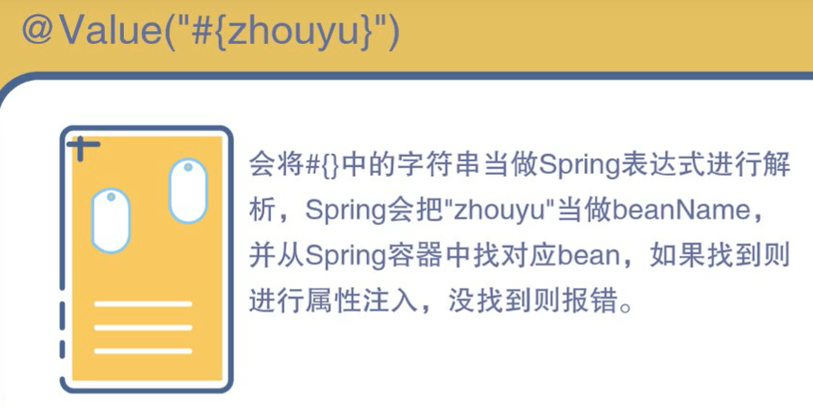


#### Cache

> 寄存器与主存之间有 SRAM 缓存（缓存单位为 cache line「缓存行」，64B）
>
> 主存与 I/O 之间有页缓存「page cache，4K」


## 1. 第一季


#### Spring MVC如何解决乱码问题？

> + post：配置CharacterEncodingFilter
> + get：Tomcat配置server.xml，HTTP协议Connector添加URIEncoding="UTF-8"


#### Spring常用事务隔离级别，事务传播属性

> 隔离级别：
>
> + READ_UNCOMMIT
>
>   脏读，不可重复读，幻读问题
>
> + READ_COMMITED
>
>   不可重复读，幻读问题
>
> + READ_REPEATABLE
>
>   幻读「MySQL多版本并发控制协议（MVCC）以行锁和间隙锁解决幻读」
>
> + SERIALIZATION
>
>   串行化，无并发性
>
> MySQL：支持4种隔离级别，默认RR
>
> ORACLE: 支持2种隔离级别：RC, SERIALIZATION，默认RC
>
>  
>
> 事务传播属性：
>
> + Propagation.REQUIRED
>
>   如果当前存在事务则加入，如果当前不存在事务则创建事务并在事务内运行
>
> + Propagation.REQUIRES_NEW
>
>   如果当前存在事务则挂起，创建新事务并在新事务中运行


#### Spring MVC 请求处理流程

> 1. 发起请求
> 2. DispactherServlet
> 3. HandleMapping 返回 HandlerExecutionChain「chain包含所有处理器」
> 4. HandlerAdapter
> 5. Handler「执行用户Controller逻辑」
> 6. ModelAndView「异常也返回ModelAndView」
> 7. ViewResolver「视图解析, JstlViewResolver」
> 8. 视图渲染（view.render）
> 9. 响应用户


#### CentOS服务类常用命令

``` shell
# centos7
# 服务常用操作
systemctl status network.service
		start
		restart
		stop
		reload
		
# 开机自启 / 禁用自启动
systemctl enable network
					disable

# 查看自启动列表
systemctl list-unit-files

# Linux 7种运行级别
0：系统停机状态
1：单用户工作状态，root
2：多用户状态，无 NFS
3：完全多用户状态
4：保留，暂未使用
5：X11控制台，图形化
6：系统正常关闭并重启
```


#### Git工作流与分支常用命令

> Git工作流：
>
> ​	创建分支：master，dev，bugfix
>
> ​	dev分支合并bugfix（git checkout dev; git merge bugfix）

``` shell
# 创建分支
git branch <分支名>
# 查看分支
git branch -v

# 创建分支
git checkout <分支名>
# 创建分支并切换到该分支
git checkout -b <分支名>

# 分支合并
git checkout master # 先切换到主分支
git merge <分支名> # 在主分支上合并分支

# 删除分支
git checkout master # 先切换到主分支
git branch -D <分支名>
```


#### Redis RDB AOF

> RDB：snapshot全量备份「fork子进程，写时复制」
>
> **`save / bgsvae` 手动触发，save 阻塞 Redis 服务器进程， bgsave 会 fork 子进程创建 RDB 文件**
>
> + 在一定间隔时间做备份，down机会丢失最后一次快照后的所有修改
>
>   
>
> AOF「AOF重写」：以日志形式记录每个写操作，只追加
>
> + 占用更多磁盘
> + 执行每条命令，恢复速度慢
> + down机丢失数据少

``` properties
# RDB
save 900 1
save 300 10
save 60 10000

# AOF
appendonly yes
appendfilename "appendonly.aof"
# appendfsync always
appedfsync everysec
# appendfsync no

# AOF 重写
```


#### Redis 使用场景

| 数据结构 | 使用场景                                 |
| -------- | ---------------------------------------- |
| String   | incrby                                   |
| Hash     | Hset(key, fiedl, val)                    |
| List     | 消息排行，任务列表，模拟消息队列         |
| Set      | 好友，点赞。（集合论：交集，并集，差集） |
| Zset     | 综合排序，价格排序                       |


#### ES Solr

`ES, Solr` 都是基于 `Lucene` 实现的搜索引擎

核心概念：

+ 分词
+ 倒排索引

| 维度     | ES                 | solr                                         |
| -------- | ------------------ | -------------------------------------------- |
| 开发语言 | Java               | Java                                         |
| 集群     | 自带分布式管理系统 | 依赖 Zookeeper 管理                          |
| 项目     | jar 项目           | solr本质是一个 web 项目，需部署到 web 服务器 |
| 数据结构 | 只支持 json        | xml, json, csv                               |


#### 单点登录流程

1. 认证中心判断 cookie 是否存在 token
   1. 如果无 token 则跳转登录
   2. 有 token
      1. 提交给认证中心判断 token 是否过期
2. 登录成功，带 token 返回原 web 系统
3. 访问业务系统，cookie 中有 token，则提交给认证中心判断 token 是否过期
   1. 未过期，访问业务系统
   2. 跳转登录


#### 购物车实现

1. 购物车与用户一对一

2. 购物车与哪些操作有关？

   1. 添加购物车

      1. 用户未登录，数据保存在何处？

         + Redis -- 京东

         + Cookie -- （用户禁用 cookie）

      2. 用户已登录

         + Redis（读写快，`hset(user:userid:cartid, field, val)`）
         + 数据库

   2. 展示购物车（Redis + Cookie）


#### MySQL 索引

> 1. 主键默认创建有索引
> 2. 关联字段创建索引
> 3. 组合索引优于单列索引
> 4. 排序，分组会使用到索引。排序字段创建索引


#### 消息队列

> Q：在分布式系统中如何处理高并发？
>
> A：消息队列
>
> Q：使用场景？
>
> A：支付场景
>
> 1. 支付宝回调通知给支付模块
> 2. 支付模块通知订单模块
> 3. 订单模块通知库存模块
>
> 在步骤 3 可以选择发送 MQ 

消息队列作用：

+ 异步
+ 解耦
+ 削峰


## 2. 第二季


####  Java 内存模型

> JMM「Java Memory Model」，用于屏蔽各种硬件与操作系统的内存访问差异，以实现 Java 程序在各平台下都能达到一致的并发效果。
>
> JMM 规范了 Java 虚拟机与计算机内存是如何协同工作的：规定了线程对程序中各种共享变量（实例字段、静态字段、数组对象）的访问方式

我们常说的JVM内存模型指的是JVM的内存分区；而Java内存模式是一种虚拟机规范。

原始的Java内存模型存在一些不足，因此Java内存模型在Java1.5时被重新修订。这个版本的Java内存模型在Java8中仍然在使用。

Java内存模型（不仅仅是JVM内存分区）：调用栈和本地变量存放在线程栈上，对象存放在堆上。

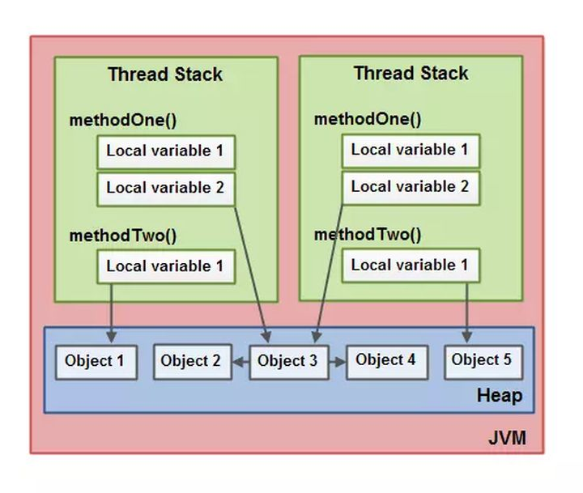


- 一个本地变量可能是原始类型，在这种情况下，它总是“呆在”线程栈上。
- 一个本地变量也可能是指向一个对象的一个引用。在这种情况下，引用（这个本地变量）存放在线程栈上，但是对象本身存放在堆上。
- 一个对象可能包含方法，这些方法可能包含本地变量。这些本地变量仍然存放在线程栈上，即使这些方法所属的对象存放在堆上。
- 一个对象的成员变量可能随着这个对象自身存放在堆上。不管这个成员变量是原始类型还是引用类型。
- 静态成员变量跟随着类定义一起也存放在堆上。
- 存放在堆上的对象可以被所有持有对这个对象引用的线程访问。当一个线程可以访问一个对象时，它也可以访问这个对象的成员变量。如果两个线程同时调用同一个对象上的同一个方法，它们将会都访问这个对象的成员变量，但是每一个线程都拥有这个成员变量的私有拷贝。


#### 硬件内存架构

现代硬件内存模型与Java内存模型有一些不同，理解内存模型架构以及Java内存模型如何与它协同工作也是非常重要的。

现代计算机硬件架构的简单图示：

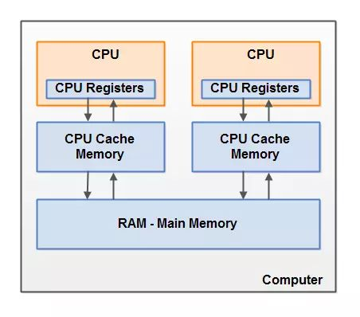

- **多CPU**：一个现代计算机通常由两个或者多个CPU。其中一些CPU还有多核。
- **CPU寄存器**：每个CPU都包含一系列的寄存器，它们是CPU内内存的基础。CPU在寄存器上执行操作的速度远大于在主存上执行的速度。这是因为CPU访问寄存器的速度远大于主存。
- **高速缓存cache**：由于计算机的存储设备与处理器的运算速度之间有着几个数量级的差距，所以现代计算机系统都不得不加入一层读写速度尽可能接近处理器运算速度的高速缓存（Cache）来作为内存与处理器之间的缓冲：将运算需要使用到的数据复制到缓存中，让运算能快速进行，当运算结束后再从缓存同步回内存之中，这样处理器就无须等待缓慢的内存读写了。CPU访问缓存层的速度快于访问主存的速度，但通常比访问内部寄存器的速度还要慢一点。每个CPU可能有一个CPU缓存层，一些CPU还有多层缓存。在某一时刻，一个或者多个缓存行（cache lines）可能被读到缓存，一个或者多个缓存行可能再被刷新回主存。
- **内存**：一个计算机还包含一个主存。所有的CPU都可以访问主存。主存通常比CPU中的缓存大得多。
- **运作原理**：通常情况下，当一个CPU需要读取主存时，它会将主存的部分读到CPU缓存中。它甚至可能将缓存中的部分内容读到它的内部寄存器中，然后在寄存器中执行操作。当CPU需要将结果写回到主存中去时，它会将内部寄存器的值刷新到缓存中，然后在某个时间点将值刷新回主存。

**一些问题：（多线程环境下尤其）**

- **缓存一致性问题**：在多处理器系统中，每个处理器都有自己的高速缓存，而它们又共享同一主内存（MainMemory）。基于高速缓存的存储交互很好地解决了处理器与内存的速度矛盾，但是也引入了新的问题：缓存一致性（CacheCoherence）。当多个处理器的运算任务都涉及同一块主内存区域时，将可能导致各自的缓存数据不一致的情况，如果真的发生这种情况，那同步回到主内存时以谁的缓存数据为准呢？为了解决一致性的问题，需要各个处理器访问缓存时都遵循一些协议，在读写时要根据协议来进行操作，这类协议有MSI、MESI（IllinoisProtocol）、MOSI、Synapse、Firefly及DragonProtocol，等等：

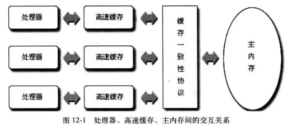

- **指令重排序问题**：为了使得处理器内部的运算单元能尽量被充分利用，处理器可能会对输入代码进行乱序执行（Out-Of-Order Execution）优化，处理器会在计算之后将乱序执行的结果重组，保证该结果与顺序执行的结果是一致的，但并不保证程序中各个语句计算的先后顺序与输入代码中的顺序一致。因此，如果存在一个计算任务依赖另一个计算任务的中间结果，那么其顺序性并不能靠代码的先后顺序来保证。与处理器的乱序执行优化类似，Java虚拟机的即时编译器中也有类似的指令重排序（Instruction Reorder）优化


#### Java内存模型和硬件内存架构之间的桥接

Java内存模型与硬件内存架构之间存在差异。硬件内存架构没有分线程栈和堆。对于硬件，所有的线程栈和堆都分布在主内存中。

部分线程栈和堆可能有时候会出现在CPU缓存中和CPU内部的寄存器中。如下图所示：


从抽象的角度来看，JMM定义了线程和主内存之间的抽象关系：

- 线程之间的共享变量存储在主内存（Main Memory）中
- 每个线程都有一个私有的本地内存（Local Memory），本地内存是JMM的一个抽象概念，并不真实存在，它涵盖了缓存、写缓冲区、寄存器以及其他的硬件和编译器优化。本地内存中存储了该线程以读/写共享变量的拷贝副本。
- 从更低的层次来说，主内存就是硬件的内存，而为了获取更好的运行速度，虚拟机及硬件系统可能会让工作内存优先存储于寄存器和高速缓存中。
- Java内存模型中的线程的工作内存（working memory）是cpu的寄存器和高速缓存的抽象描述。而JVM的静态内存储模型（JVM内存模型）只是一种对内存的物理划分而已，它只局限在内存，而且只局限在JVM的内存。

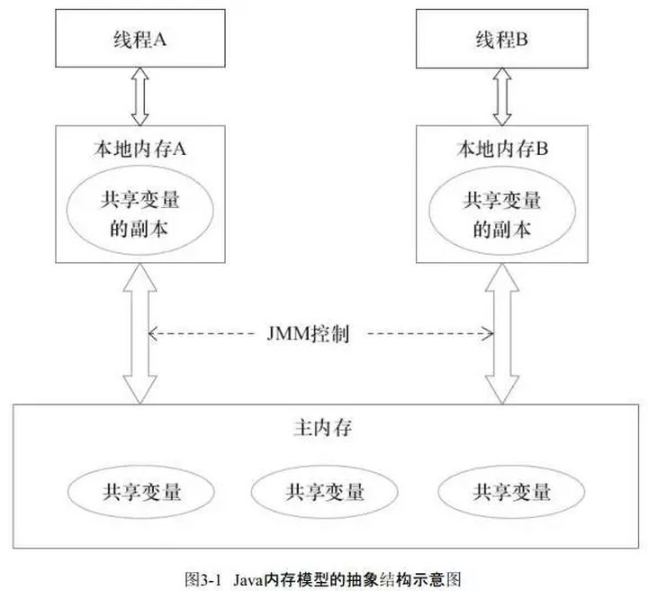


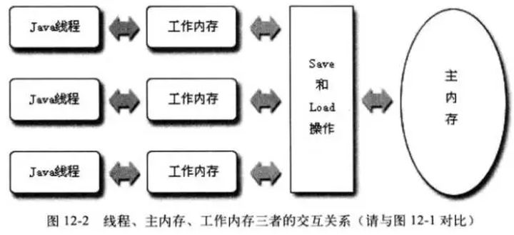


#### JMM模型下的线程间通信

线程间通信必须要经过主内存。

如下，如果线程A与线程B之间要通信的话，必须要经历下面2个步骤：

1）线程A把本地内存A中更新过的共享变量刷新到主内存中去。

2）线程B到主内存中去读取线程A之前已更新过的共享变量。

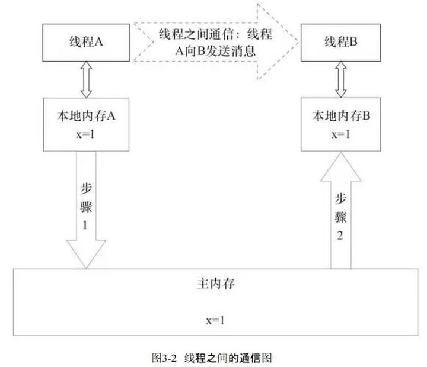

关于主内存与工作内存之间的具体交互协议，即一个变量如何从主内存拷贝到工作内存、如何从工作内存同步到主内存之间的实现细节，Java内存模型定义了以下八种操作来完成：

- **lock（锁定）**：作用于主内存的变量，把一个变量标识为一条线程独占状态。
- **unlock（解锁）**：作用于主内存变量，把一个处于锁定状态的变量释放出来，释放后的变量才可以被其他线程锁定。
- **read（读取）**：作用于主内存变量，把一个变量值从主内存传输到线程的工作内存中，以便随后的load动作使用
- **load（载入）**：作用于工作内存的变量，它把read操作从主内存中得到的变量值放入工作内存的变量副本中。
- **use（使用）**：作用于工作内存的变量，把工作内存中的一个变量值传递给执行引擎，每当虚拟机遇到一个需要使用变量的值的字节码指令时将会执行这个操作。
- **assign（赋值）**：作用于工作内存的变量，它把一个从执行引擎接收到的值赋值给工作内存的变量，每当虚拟机遇到一个给变量赋值的字节码指令时执行这个操作。
- **store（存储）**：作用于工作内存的变量，把工作内存中的一个变量的值传送到主内存中，以便随后的write的操作。
- **write（写入）**：作用于主内存的变量，它把store操作从工作内存中一个变量的值传送到主内存的变量中。

Java内存模型还规定了在执行上述八种基本操作时，必须满足如下规则：

- 如果要把一个变量从主内存中复制到工作内存，就需要按顺寻地执行read和load操作， 如果把变量从工作内存中同步回主内存中，就要按顺序地执行store和write操作。但Java内存模型只要求上述操作必须按顺序执行，而没有保证必须是连续执行。
- 不允许read和load、store和write操作之一单独出现
- 不允许一个线程丢弃它的最近assign的操作，即变量在工作内存中改变了之后必须同步到主内存中。
- 不允许一个线程无原因地（没有发生过任何assign操作）把数据从工作内存同步回主内存中。
- 一个新的变量只能在主内存中诞生，不允许在工作内存中直接使用一个未被初始化（load或assign）的变量。即就是对一个变量实施use和store操作之前，必须先执行过了assign和load操作。
- 一个变量在同一时刻只允许一条线程对其进行lock操作，但lock操作可以被同一条线程重复执行多次，多次执行lock后，只有执行相同次数的unlock操作，变量才会被解锁。lock和unlock必须成对出现
- 如果对一个变量执行lock操作，将会清空工作内存中此变量的值，在执行引擎使用这个变量前需要重新执行load或assign操作初始化变量的值
- 如果一个变量事先没有被lock操作锁定，则不允许对它执行unlock操作；也不允许去unlock一个被其他线程锁定的变量。
- 对一个变量执行unlock操作之前，必须先把此变量同步到主内存中（执行store和write操作）。


#### Java内存模型解决的问题

当对象和变量被存放在计算机中各种不同的内存区域中时，就可能会出现一些具体的问题。Java内存模型建立所围绕的问题：在多线程并发过程中，如何处理多线程读同步问题与可见性（多线程缓存与指令重排序）、多线程写同步问题与原子性（多线程竞争race condition）。

**1、多线程读同步与可见性**

**可见性（共享对象可见性）**：线程对共享变量修改的可见性。当一个线程修改了共享变量的值，其他线程能够立刻得知这个修改

**线程缓存导致的可见性问题：**

如果两个或者更多的线程在没有正确的使用volatile声明或者同步的情况下共享一个对象，一个线程更新这个共享对象可能对其它线程来说是不可见的：共享对象被初始化在主存中。跑在CPU上的一个线程将这个共享对象读到CPU缓存中，然后修改了这个对象。只要CPU缓存没有被刷新会主存，对象修改后的版本对跑在其它CPU上的线程都是不可见的。这种方式可能导致每个线程拥有这个共享对象的私有拷贝，每个拷贝停留在不同的CPU缓存中。

下图示意了这种情形。跑在左边CPU的线程拷贝这个共享对象到它的CPU缓存中，然后将count变量的值修改为2。这个修改对跑在右边CPU上的其它线程是不可见的，因为修改后的count的值还没有被刷新回主存中去。

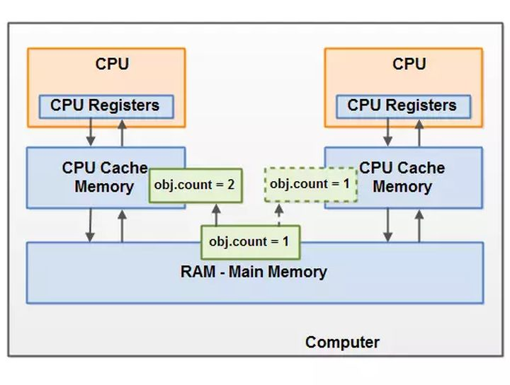

解决这个内存可见性问题你可以使用：

- Java中的volatile关键字：volatile关键字可以保证直接从主存中读取一个变量，如果这个变量被修改后，总是会被写回到主存中去。Java内存模型是通过在变量修改后将新值同步回主内存，在变量读取前从主内存刷新变量值这种依赖主内存作为传递媒介的方式来实现可见性的，无论是普通变量还是volatile变量都是如此，普通变量与volatile变量的区别是：volatile的特殊规则保证了新值能立即同步到主内存，以及每个线程在每次使用volatile变量前都立即从主内存刷新。因此我们可以说volatile保证了多线程操作时变量的可见性，而普通变量则不能保证这一点。
- Java中的synchronized关键字：同步快的可见性是由“如果对一个变量执行lock操作，将会清空工作内存中此变量的值，在执行引擎使用这个变量前需要重新执行load或assign操作初始化变量的值”、“对一个变量执行unlock操作之前，必须先把此变量同步回主内存中（执行store和write操作）”这两条规则获得的。
- Java中的final关键字：final关键字的可见性是指，被final修饰的字段在构造器中一旦被初始化完成，并且构造器没有把“this”的引用传递出去（this引用逃逸是一件很危险的事情，其他线程有可能通过这个引用访问到“初始化了一半”的对象），那么在其他线程就能看见final字段的值（无须同步）

**重排序导致的可见性问题：**

Java程序中天然的有序性可以总结为一句话：如果在本地线程内观察，所有操作都是有序的（“线程内表现为串行”(Within-Thread As-If-Serial Semantics)）；如果在一个线程中观察另一个线程，所有操作都是无序的（“指令重排序”现象和“线程工作内存与主内存同步延迟”现象）。

Java语言提供了volatile和synchronized两个关键字来保证线程之间操作的有序性：

- volatile关键字本身就包含了禁止指令重排序的语义
- synchronized则是由“一个变量在同一个时刻只允许一条线程对其进行lock操作”这条规则获得的，这个规则决定了持有同一个锁的两个同步块只能串行地进入

**指令序列的重排序：**

1）编译器优化的重排序。编译器在不改变单线程程序语义的前提下，可以重新安排语句的执行顺序。

2）指令级并行的重排序。现代处理器采用了指令级并行技术（Instruction-LevelParallelism，ILP）来将多条指令重叠执行。如果不存在数据依赖性，处理器可以改变语句对应机器指令的执行顺序。

3）内存系统的重排序。由于处理器使用缓存和读/写缓冲区，这使得加载和存储操作看上去可能是在乱序执行。


每个处理器上的写缓冲区，仅仅对它所在的处理器可见。这会导致处理器执行内存操作的顺序可能会与内存实际的操作执行顺序不一致。由于现代的处理器都会使用写缓冲区，因此现代的处理器都会允许对写-读操作进行重排序：


**数据依赖：**

编译器和处理器在重排序时，会遵守数据依赖性，编译器和处理器不会改变存在数据依赖关系的两个操作的执行顺序。（这里所说的数据依赖性仅针对单个处理器中执行的指令序列和单个线程中执行的操作，不同处理器之间和不同线程之间的数据依赖性不被编译器和处理器考虑）


**指令重排序对内存可见性的影响：**

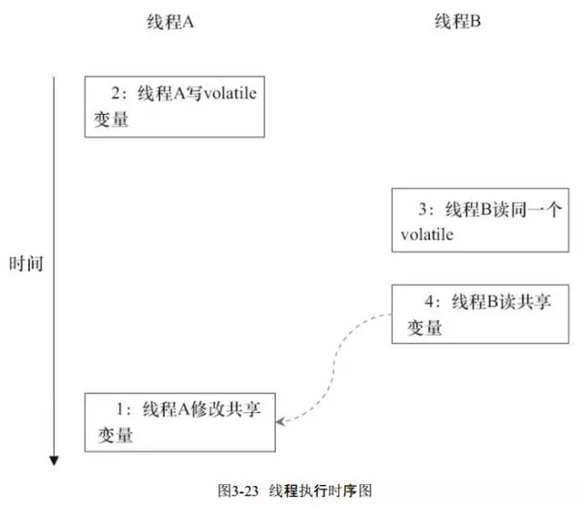

当1和2之间没有数据依赖关系时，1和2之间就可能被重排序（3和4类似）。这样的结果就是：读线程B执行4时，不一定能看到写线程A在执行1时对共享变量的修改。

**指令重排序改变多线程程序的执行结果例子：**

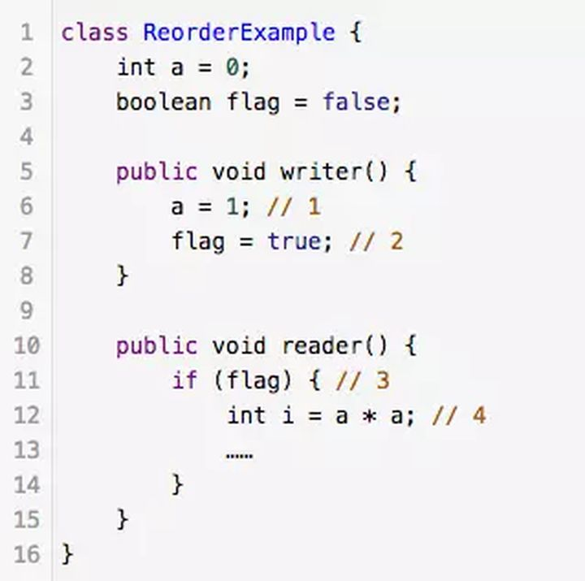

flag变量是个标记，用来标识变量a是否已被写入。这里假设有两个线程A和B，A首先执行writer()方法，随后B线程接着执行reader()方法。线程B在执行操作4时，能否看到线程A在操作1对共享变量a的写入呢？

答案是：不一定能看到。

由于操作1和操作2没有数据依赖关系，编译器和处理器可以对这两个操作重排序；同样，操作3和操作4没有数据依赖关系，编译器和处理器也可以对这两个操作重排序。

**as-if-serial语义：**

不管怎么重排序（编译器和处理器为了提高并行度），（单线程）程序的执行结果不能被改变。（编译器、runtime和处理器都必须遵守as-if-serial语义）

**happens before：**

从JDK 5开始，Java使用新的JSR-133内存模型，JSR-133使用happens-before的概念来阐述操作之间的内存可见性：在JMM中，如果一个操作执行的结果需要对另一个操作可见（两个操作既可以是在一个线程之内，也可以是在不同线程之间），那么这两个操作之间必须要存在happens-before关系：

- 程序顺序规则：一个线程中的每个操作，happens-before于该线程中的任意后续操作。
- 监视器锁规则：对一个锁的解锁，happens-before于随后对这个锁的加锁。
- volatile变量规则：对一个volatile域的写，happens-before于任意后续对这个volatile域的读。
- 传递性：如果A happens-before B，且B happens-before C，那么A happens-before C。

一个happens-before规则对应于一个或多个编译器和处理器重排序规则

**内存屏障禁止特定类型的处理器重排序：**

重排序可能会导致多线程程序出现内存可见性问题。对于处理器重排序，JMM的处理器重排序规则会要求Java编译器在生成指令序列时，插入特定类型的内存屏障（Memory Barriers，Intel称之为Memory Fence）指令，通过内存屏障指令来禁止特定类型的处理器重排序。通过禁止特定类型的编译器重排序和处理器重排序，为程序员提供一致的内存可见性保证。

为了保证内存可见性，Java编译器在生成指令序列的适当位置会插入内存屏障指令来禁止特定类型的处理器重排序。


StoreLoad Barriers是一个“全能型”的屏障，它同时具有其他3个屏障的效果。现代的多处理器大多支持该屏障（其他类型的屏障不一定被所有处理器支持）。执行该屏障开销会很昂贵，因为当前处理器通常要把写缓冲区中的数据全部刷新到内存中（Buffer Fully Flush）。

**2、多线程写同步与原子性**

**多线程竞争（Race Conditions）问题**：当读，写和检查共享变量时出现race conditions。

如果两个或者更多的线程共享一个对象，多个线程在这个共享对象上更新变量，就有可能发生race conditions。

想象一下，如果线程A读一个共享对象的变量count到它的CPU缓存中。再想象一下，线程B也做了同样的事情，但是往一个不同的CPU缓存中。现在线程A将count加1，线程B也做了同样的事情。现在count已经被增加了两次，每个CPU缓存中一次。如果这些增加操作被顺序的执行，变量count应该被增加两次，然后原值+2被写回到主存中去。然而，两次增加都是在没有适当的同步下并发执行的。无论是线程A还是线程B将count修改后的版本写回到主存中取，修改后的值仅会被原值大1，尽管增加了两次：

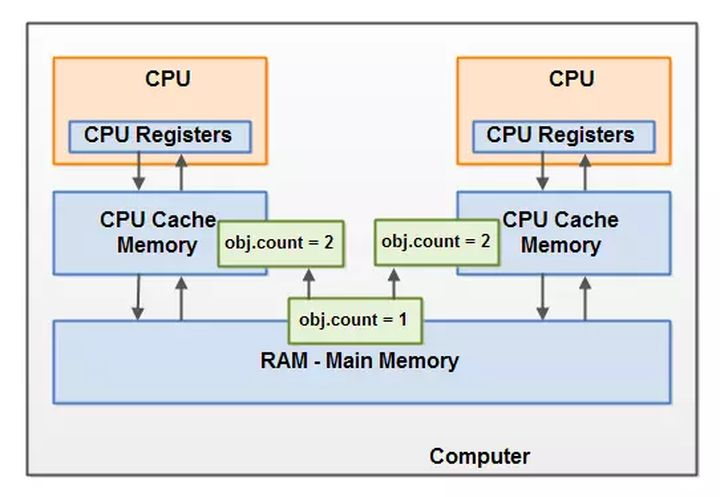

解决这个问题可以使用Java同步块。一个同步块可以保证在同一时刻仅有一个线程可以进入代码的临界区。同步块还可以保证代码块中所有被访问的变量将会从主存中读入，当线程退出同步代码块时，所有被更新的变量都会被刷新回主存中去，不管这个变量是否被声明为volatile。

**使用原子性保证多线程写同步问题：**

**原子性：**指一个操作是按原子的方式执行的。要么该操作不被执行；要么以原子方式执行，即执行过程中不会被其它线程中断。

- Reads and writes are atomic for reference variables and for most primitive variables (all types except long and double).
- Reads and writes are atomic for all variables declared **volatile** (including long and double variables).


**实现原子性：**

- 由Java内存模型来直接保证的原子性变量操作包括read、load、assign、use、store、write，我们大致可以认为基本数据类型变量、引用类型变量、声明为volatile的任何类型变量的访问读写是具备原子性的（long和double的非原子性协定：对于64位的数据，如long和double，Java内存模型规范允许虚拟机将没有被volatile修饰的64位数据的读写操作划分为两次32位的操作来进行，即允许虚拟机实现选择可以不保证64位数据类型的load、store、read和write这四个操作的原子性，即如果有多个线程共享一个并未声明为volatile的long或double类型的变量，并且同时对它们进行读取和修改操作，那么某些线程可能会读取到一个既非原值，也不是其他线程修改值的代表了“半个变量”的数值。但由于目前各种平台下的商用虚拟机几乎都选择把64位数据的读写操作作为原子操作来对待，因此在编写代码时一般也不需要将用到的long和double变量专门声明为volatile）。这些类型变量的读、写天然具有原子性，但类似于 “基本变量++” / “volatile++” 这种复合操作并没有原子性。
- 如果应用场景需要一个更大范围的原子性保证，需要使用同步块技术。Java内存模型提供了lock和unlock操作来满足这种需求。虚拟机提供了字节码指令monitorenter和monitorexist来隐式地使用这两个操作，这两个字节码指令反映到Java代码中就是同步快——synchronized关键字


#### volatile 关键字

> 是 JVM 提供的一种轻量级同步机制，适用于一写多读（共享变量）的场景
>
> 1. 保证可见性
> 2. 禁止指令重排
> 3. 不保证原子性

``` java
class VolatileD {
  int num;
  void incr() {
    num ++;
  }
  
  // 解决原子性
  AtomicInteger atomic = new AtomicInteger();
  void incrAtomic() {
    atomic.getAndIncrement();
  }
}
// num ++ 字节码
aload_0	// this 加载到操作数栈
dup			// dup this
getfield	// this.getfield 消耗一个 this
iconst_1
iadd
putfield
```

+ 禁止指令重排序

> 指令重排：
>
> 源代码 —> 编译器优化重排 —> 指令并行重排 —> 内存系统重排 —> 最终执行指令

**只在单线程保证程序执行结果与顺序执行结果一致**

``` java
void instrctionResort() {
  int x = 11;	// 1
  int y = 12;	// 2
  x = x + 5;	// 3
  y = x * x;	// 4
}
```

| 可能执行的指令顺序 |
| ------------------ |
| 1234               |
| 2134               |
| 1324               |

``` java
int a, b, x, y = 0
```

| Thread 1           | Thread 2     |
| ------------------ | ------------ |
| x =a               | y = b        |
| b = 1              | a = 2        |
| 结果：x = 0, y = 0 |              |
| 编译器指令重排：   |              |
| b = 1; x = a       | a = 2; y = b |
| 结果：x = 2, y = 1 |              |


### JVM 面试


#### 垃圾收集算法

**分代收集**

+ 复制

+ 标记-清除

+ 标记-清除-压缩


#### GC Roots

+ 栈帧中局部变量表引用对象
+ 静态变量引用对象
+ 常量引用对象
+ JNI 栈帧中局部变量表引用对象


#### JVM 参数

JVM 参数分为三类：

+ 标准参数「-version, -help」
+ X 参数「-Xint, -Xcomp, -Xmixed。解释执行，编译执行，解释编译混合」
+ XX 参数
  + Boolean 类型「-XX:+K, -XX:-K」
  + KV 类型「-XX:K=V」

``` shell
jinfo -flags jpid

# 查看具体参数
jinfo -flag PrintGCDetails jpid
jinfo -flag MaxTenuringThreshold jpid

-Xms === -XX:InitalHeapSize
-Xmx === -XX:MaxHeapSize
-Xss === -XX:ThreadStackSize

-XX:+PrintFlagsFinal
-XX:+PrintFlagsInitial -version
-XX:+PrintCommandLineFlags -version
```


#### 引用

+ Reference
+ SoftReference
+ WeakReference
+ PhantomReference
+ ReferenceQueue

``` java
@Test
public void testWeakReferenceQueue() {
  ReferenceQueue<String> q = new ReferenceQueue<>();
  WeakReference<String> ref = new WeakReference<>(new String("zzzz"), q);
  System.out.println(ref.get());
  System.out.println(q.poll());
  System.out.println("========== after gc =============");
  System.gc();
  // SoftRefLRUPolicyMSPerMB * Xmx 剩余空间
  try { TimeUnit.MILLISECONDS.sleep(100); } catch (InterruptedException e) { e.printStackTrace(); }
  System.out.println(ref.get());
  Reference<? extends String> refGabage = q.poll();
  System.out.println(refGabage);

  // TODO 在引用队列中拿到之后能做什么呢？
  System.out.println(refGabage.get());
}
```


#### OOM

+ java.lang.StackOverflowError

  递归

+ java.lang.OutOfMemoryError: Java heap space

  new 对象

+ java.lang.OutOfMemoryError: GC overhead limit exceeded

  花费 98% time 回收不到 2% 内存，产生此错误

  ``` java
  -Xms8m -Xmx8m -Xmn4m -XX:MaxDirectMemroy=4m
  
  list = new ArrayList<>();
  try {
    list.add(new String(i ++).intern());
  } catch (Throwable t) {
    sout(t.getMessage());
  }
  ```

+ java.lang.OutOfMemoryError: Direct buffer memory

  ` ByteBuffer.allocateDirect()`

+ java.lang.OutOfMemoryError: unable to create new native thread

+ java.lang.OutOfMemory: Metaspace


#### GC 收集器

JVM 源码如下：

``` c++
uint i = 0;
if (UseSerialGC) i++;
// 互相激活
if (UseConcMarkSweepGC || UseParNewGC) i++;
// 互相激活
if (UseParallelGC || UseParallelOldGC) i++;
if (UseG1GC) i++;
```


+ 串行收集器：单线程GC 时用户线程暂停「Serial + Serial Old」
+ 并行收集器：多线程并行GC 时用户线程暂停「Parallel Scavenge + Parallel Old」
+ 并发收集器：GC 线程与用户线程并发「交替执行，ParNew + CMS」
+ G1
+ ZGC

``` shell
-XX:+UseSerialGC
# -XX:+UseSerialOldGC 已被废弃
-XX:+UseParNewGC
-XX:+UseParallelGC
-XX:+UseParalleOldGC
-XX:+UserConcMarkSweepGC
-XX:+UseG1GC

# 查看当前应用垃圾收集器
java -XX:+PrintCommandLineFlags -version
```


Young：Serial，Parallel Scavenge，ParNew

------------------------------------------------------------------------ G1

Old：Serial Old，Parallel Old，CMS


#### CMS

1. 初始标记
2. 并发标记
3. 重新标记「最终标记」
4. 并发清除

> + 侧重于响应，互联网产品应该使用此收集器
>
> + Parallel Scavenge 侧重于吞吐量，可用于后台项目，如科学计算等
>
> + Serial Old 收集器作为 CMS GC 失败之后的后备方案，Java8 无法显示指定 `-XX:+UseSerialOldGC`
> + CMS 使用 标记清除算法，会产生内存碎片


#### 如何选择垃圾收集器

1. `-XX:+UseSerialGC`

   单CPU，小内存，微服务项目

2. `-XX:+UseParallelGC / -XX:UseParallelOldGC`

   多 CPU，侧重于吞吐量「程序运行时间与 GC 时间占比」的后台计算型应用

3. `-XX:+UseParNewGC / -XX:+UseConcMarkSweepGC`

   多 CPU，追求低停顿，如：需要快速响应的互联网应用


#### G1

**将整个堆默认分为 2048 个 region，每个区域必须是 2 的次幂（1 - 32M），所以 GC 最大支持 2048 x 32 = 64G**

``` shell
-XX:+UseG1GC
-XX:G1HeapRegionSize=2m
-XX:ConcGCThreads=2
-XX:MaxCGPasueMillis=200
```


#### SpringBoot 配置 JVM 参数

``` shell
java -Xms1024m -Xmx1024m -Xmn384m -XX:+UseG1GC springboot.war
```

UnderTow QPS 高于 Tomcat 1000 - 3000


### 服务器篇

#### Linux 服务器


``` shell
#########################
top
uptime

#########################
# CPU 信息
vmstat -n 2 3
# 查看所有 CPU 核的信息
mpstat -P ALL 2
# 每个进程使用 cpu 用量分解信息
pidstat -u 1 -p pid

#########################
# 内存
free -m
free -h
pidstat -p pid -r 采样间隔

#########################
# 硬盘
df -h

#########################
# 磁盘
iostat -xdk 2 3
pidstat -d 采样间隔 -p pid

#########################
# 网络
ifstat 2 3
```


#### CPU 占用高如何定位错误

``` shell
top
jps -lm / ps -ef | grep java
# 查找进程中的线程
ps -mp pid -o THREAD, tid, time

# tid 转换为 16进制
jstack jpid | grep tid -A60 # 打印前 60 行
```


#### GitHub 高级使用

+ `in, forks, stars`

  ``` shell
  seckill in:name,description,readme
  springboot stars:>=5000
  springcloud forks:>500
  
  springboot forks:200..500 stars:5000..20000
  ```

+ awesome

  ``` shell
  awesome redis
  ```

+ 高亮 github 代码

  ``` shell
  # 高亮 10 ~ 20行
  #L10..L20
  ```

+ 项目内搜索

  ``` shell
  t
  # github 快捷键
  ```

  

## 3. 第三季

**javaEE, Spring, Redis, Nginx, JVM, JUC**


### JUC

#### 可重入锁

一个线程可以多次获取已经获取过的锁

#### LockSupport

**用于创建锁和其它同步类的基本线程阻塞原语**

为每个线程关联一个许可证（同 `Semaphore` 信号量），但该 `permit` 最多一个（0..1）

> www 原则
>
> + what
>
> + why
>
> + how

| before                       | after                      |
| ---------------------------- | -------------------------- |
| synchronized / wait / notify | LockSupport.park()         |
| Lock / await / signal        | LockSupport.unpark(Thread) |


#### AbstrctQueuedSynchronizer

**AQS 面向锁的实现者（类库实现者）**

`ReentrantLock, Semaphore, CyclicBarrier, CountDownLatch` 都有一个静态内部类:

​	`abstract static class Sync extends AbstractQueuedSynchronizer {}`

AQS 管理多个线程争抢资源，将未获取到锁资源的线程入 CLH 队列排队等待


#####  AQS 核心: CLH + state

+ CLH 双向队列
+ `private volatile int state;`

> 1. CLH 队列每个节点是 `Node`
>
>    Node 封装线程及状态
>
>    ``` java
>    static final class Node {
>      
>      volatile Thread thread;
>    
>      Node prev;
>      Node next;
>      Node nextWaiter;
>      
>      // 共享模式
>      static final Node SHARED = new Node();
>      // 独占模式
>      static final Node EXCLUSIVE = null;
>      
>      // 状态
>      volatile int waitStatus;	// 初始 0 值
>      static final int CANCELLED = 1;	// 线程被取消
>      static final int SIGNAL = -1;		// 当前节点（线程）的后继节点（线程）需要被唤醒
>      static final int CONDITION = -2;	// 节点在等待状态，等待被唤醒
>      static final int PROPAGATE = -3;	// 当前节点处于 SHARED 模式，唤醒时共享会一直传播，直到 EXCLUSIVE 节点
>      
>      boolean isShared() {
>        return nextWaiter == SHARED;
>      }
>      // 构造器
>      Node(Thread thread, Node mode) {
>        this.thread = thread;
>        this.nextWaiter = mode
>      }
>    }
>    ```
>
>    
>
> 2. 子类必须根据自己的业务定义 state
>    1. ReentrantReadWriteLock 高16bit 代表读锁，低 16bit 代表写锁（exclusive）
>    2. Semaphore state 代表信号量的个数
>    3. CountDownLatch state 代表闭锁的数量


##### AQS 源码解析

+ lock()
+ acquire()
+ tryAcquire(int arg)
+ addWatier(Node.EXCLUSIVE)
+ acuqireQueued(addWatier(Node.EXCLUSIVE), arg)


#### CompletableFuture


### Spring


#### AOP


1. AOP 通知的顺序 在 Spring4 和 Spring5 的区别？


#### Spring 三级缓存

``` java
class DefaultSingletonBeanRegistry extends ..., implements ... {
  // 一级缓存
  private final ConcurrentHashMap<String, Object> singletonObjects = new ConcurrentHashMap<>(256);
  // 二级缓存
  private final HashMap<String, Object> earlySingletonObjects = new HashMap<>(16);
  // 三级缓存
  private final HashMap<String, ObjectFactory> singletonFactories = new HashMap<>(16);
}
```

``` java
// 三级缓存 v 为 lambda 表达式，可传入一个回调（当从缓存中获取不到时，回调传入的函数 doCreateBean）
@FunctionalInterface
public interface ObjectFactory<T> {
	T getObject() throws BeansException;
}
```


#### Spring bean 创建流程

1. 扫描类生成 BeanDefinition
2. **getSingleton（尝试从一级缓存获取 bean）**
3. **doCreateBean（创建 bean）**
4. **populateBean（填充属性）**
5. Aware，init
6. BeanPostProcessor（**在这个步骤进行 AOP 代理对象的生成**）
7. **addSingleton（添加到一级缓存）**


#### bean 生命周期

初始化、实例化是不同的概念

``` shell
# bean 生命周期相关的类

interface BeanFactory === 容器

interface BeanDefinition
	RootBeanDefinition

interface PostProcessor
	BeanPostProcessor
	BeanFactoryPostProcessor

```


bean 生命周期大概分为以下几个步骤：

1. 初始化
2. populateBean
3. 各种 Aware 接口
   1. MessageSourceAware#setMessageSource
   2. ApplicationContextAware#setApplicationContext
   3. ServletContextAware#setServeletContext

4. BeanPostProcessor#postProcessBeforeInitialnization（如果有关联的 BeanPostProcessor）
5. init-method
6. BeanPostProcessor#postProcessAfterInitialnization（如果有关联的 BeanPostProcessor）
7. destroy-method（DisposableBean#destroy）


#### 将对象交给 Spring 管理

1. @Bean

``` java
@Congiguration
class Config {
  @Bean
  A a() {
    return new A();
  }
}
```

2. BeanFactory

``` java

@Component
class MyBeanFactoryPostProcessor implements BeanFactoryPostProcessor {
  @Override
  void postProcessBeanFactory(ConfigurableListableBeanFactory) {
    beanFactory.registerSingleton("A", new A())
  }
}
```

3. FactoryBean

> xxxFactoryBean 本身是一个 bean，可以从容器中获取

``` java
@Component
class MyFactoryBean implements FactoryBean {
  
  @Override
  Object getObject() {
    return new A();
  }
  
  @Override
  Class<?> getObjectType() {
    return A.class;
  }
}
```


#### BeanFacotry 与 FactoryBean

1. BeanFactory 是一个 bean 工厂
2. FactoryBean 是一个 bean，


#### BeanDefinition

``` shell
public interface BeanDefinition extends AttributeAccessor, BeanMetadataElement {

	String SCOPE_SINGLETON = ConfigurableBeanFactory.SCOPE_SINGLETON;
	String SCOPE_PROTOTYPE = ConfigurableBeanFactory.SCOPE_PROTOTYPE;
	int ROLE_APPLICATION = 0;
	int ROLE_SUPPORT = 1;
	int ROLE_INFRASTRUCTURE = 2;

	// Modifiable attributes
	void setParentName(@Nullable String parentName);
	String getParentName();
	String getBeanClassName();
	void setScope(@Nullable String scope);
	String getScope();
	void setLazyInit(boolean lazyInit);
	boolean isLazyInit();
	void setDependsOn(@Nullable String... dependsOn);
	String[] getDependsOn();
	boolean isAutowireCandidate();
	void setPrimary(boolean primary);
	boolean isPrimary();
	void setFactoryBeanName(@Nullable String factoryBeanName);
	String getFactoryBeanName();
	void setFactoryMethodName(@Nullable String factoryMethodName);
	String getFactoryMethodName();
	ConstructorArgumentValues getConstructorArgumentValues();

	default boolean hasConstructorArgumentValues() {
		return !getConstructorArgumentValues().isEmpty();
	}

	MutablePropertyValues getPropertyValues();

	default boolean hasPropertyValues() {
		return !getPropertyValues().isEmpty();
	}

	// @PostConstruct / init-method
	void setInitMethodName(@Nullable String initMethodName);
	String getInitMethodName();
	void setDestroyMethodName(@Nullable String destroyMethodName);
	String getDestroyMethodName();
	void setRole(int role);
	int getRole();
	void setDescription(@Nullable String description);
	String getDescription();

	// Read-only attributes

	ResolvableType getResolvableType();
	boolean isSingleton();
	boolean isPrototype();
	boolean isAbstract();
	String getResourceDescription();
	BeanDefinition getOriginatingBeanDefinition();

}
```


### Redis

基于内存的键值对数据库

``` shell
info
info memory
info cpu
config get <k>
config set <k, v>

help @string
```


#### Redis 场景


#### 数据结构

##### string

###### sds

``` shell
set k v ex 10 px 1000
set k v nx
set k v xx
incr k
incrby k 5
```

###### 数值

``` shell
set k 1
incr k
decr k
incrby k 2
decrby k 3
```

###### bitmap

``` shell
# 位图第二位设置为 1
setbit bk 1 1
setbit ck 2 1

# 第 7 位设置为 1
setbit bk 7 1
strlen bk	# 1

# 第 9 bit 设置为 1
setbit bk 9 1
strlen bk	# 2 

bitcount bk	# 3

# and or
bitop and a_bk_ck bk ck
bitop or o_bk_ck bk ck

getbit a_bk_ck
getbit o_bk_ck
```


##### hash

> 作用：聚集数据
>
> 应用场景： **购物车，详情页**

``` shell
hash === Map<String, Map<Object, Object>>

hset k field v
hget k field
hmset k field1 v1 field2 v2
hmget k field1 field2
hlen k
hgetall k
hdel k field
hdel k

# 实际应用
hset shopcar:uid1001 pid 1
hset shopcar:uid1001 pid 1
hincrby shopcar:uid1001 pid 1
hlen shopcar:uid1001
hgetall shopcar:uid1001
```


##### list

``` shell
lpush k v1, v2
rpush k v1, v2
lpop k
rpop k
llen k
lrange k 0 -1
```


##### set

集合论（交集，并集，差集）

作用：随机事件

``` shell
sadd k v1, v2
srem k v1, v2
smemebers k
sismember k filed
srandmember k [数字]
spop k [数字]
scard k

sdiff k1, k2
sunion k1, k2
sinter k1, k2
```


##### zset

底层编码：

1. ziplist
2. skiplist

`OBJECT ENCODING fruit`


sorted_set，3 个维度很重要：

+ score
+ rank
+ 元素

``` shell
zadd fruit apple 12 orange 15 banana 8
zrange fruit 0 - 1 with scores
```


###### skiplist（跳跃表）


##### hyperloglogs

###### 了解 HyperLogLog 算法

``` shell
输入：一个集合
输出：集合的基数

算法：
	max = 0
	for 集合：
		hashCode = hash(元素)
		num = hashCode 二进制表示中最前面连续 0 的数量（前导0）
		if num > max:
			max = num
	return 2 的 (max + 1) 次幂
```

> 假设，抛掷硬币正反面序列为： 1110100110
>
> **前导 0 的数量：max = 00 为 2**
>
> **结果： 2<sup>max + 1</sup> = 8，大约抛掷硬币 8 次**
>
> 这个算法不太准确，经过优化之后得到比较高精度的 HyperLogLog 算法


###### LogLog 分桶

**分桶：就是将硬币的序列分成 m 个均等的部分，每个求平均再乘以 m，避免偶然性事件（比如：连续抛掷的多个反面）**

**==将数值前几位作为标识数据属于哪个桶==**

> 假设我们现在分 2 个桶，且序列元素如下：
>
> 元素 1：00110111
>
> 元素 2：10010001
>
> 元素 1 第一位为 0，所以在桶 0，元素 2 第一位为 1，所以在桶 1
>
> 基数估计：m x 2<sup>（桶0前导0 + 桶1前导0）/ 2</sup>
>
> 结果：2 x 2<sup>(2 + 3 ) / 2 </sup>


###### HyperLogLog 算法

很多细微调整，例如以下矫正：

```
if DV < (5 / 2) * M:
	DV = m * log(m / V)
```

> 其中：
>
> DV 代表估计的基数值，m 代表桶的数量， V 代表结果为 0 的桶的数目， log 标识自然对数


#### Redis 分布式锁


##### Redis 事务

`MULTI, EXEC, WATCH, DISCARD`

``` shell
# 标记事务开始
MULTI

# 提交事务
EXEC

# 监测一个 key
WATCH k1, k2, ...
UNWATCH

# 回滚事务
DISCARD
```


#### 缓存过期策略

+ noevication
+ volatile-lru
+ volatile-lfu
+ volatile-ttl
+ volatile-random
+ allkeys-lru
+ allkeys-lfu
+ allkeys-random


#### 缓存雪崩


#### 缓存穿透

> 要查询的数据不在 redis 中，也不在 DB 中，大量请求打在 DB，做无用功

解决：

1. bloom filter

``` shell
wget https://github.com/RedisBloom/RedisBloom.git
yum install unzip
unzip master.zip

make
cp redisbloom.so /usr/redis

# 1
redis-server --loadmoudle /use/redis/redisbloom.so /etc/redis/redis.conf
# 2 写入配置文件
loadmodule /path/redis/*.so

# 布隆过滤器
BF.ADD <K>
BF.EXISTS <K>
BF.DEL <K>

# 布谷鸟过滤器
CF.ADD <K>
CF.EXISTS <K>
CF.DEL <K>
```

> 一个大的 bitmap，bitmap 占用空间只与 hash 函数个数有关，比如 3 个 hash 函数，那么每个 key 最多 3b「与 key 大小无关」
>
> 1. 如果要查询的 key 经过所有 hash 在 bloom bitmap 中存在 1b 不为 1，那么查询的 key 一定不存在
> 2. 如果 key 三次hash 在 bitmap 位置上都为1，那么查询的 key 可能存在
> 3. bloomfilter 错误率在 3% 左右

2. 查询加锁，只让一个线程去 DB 查询数据

3. 即使是 null 值也做缓存，加一个较短的过期时间


#### Redis 与 DB 双写


#### 多线程 Redis


#### 持久化

**一般持久化的实现方式有两种：**

1. **日志**
2. **快照**


##### RDB

快照方式


##### AOF

日志方式


#### Pub/Sub

发布订阅

> publish ooxx hello
>
> subscribe ooxx
>
> publish ooxx pubsub


#### Redis 集群

分为 16384 个桶，2<sup>14</sup> 

一致性 hash 算法


### 总结


## NIO

`channel`

`buffer`

`selector`

``` java
// BIO
server = new ServerSocket();
server.bind(6666);
while (true) {
  Socket client = s.accept();
  if (client != null) {
    
  }
}

// NIO
server = new ServerSocketChannel();
server.bind(6666);
server.configuraBlocking(false);
while (true) {
  SocketChannel client = s.accept();
  if (client != null) {
    
  }
}

// Netty
boss = new NioEventLoopGroup(1);
worker = new NioEventLoopGroup(8);

boot = new ServerBootStrap();
boot.group(boss, worker)
  .channel(NioServerSocketChannel.class)
  .childHandler(ch -> {
    ChannelPipeline p = ch.pipeline();
    // 入站规则 implements ChannelInboundHanlder / extends ChannelInboundHandlerAdapter
    p.addLast(new MyInboundHandler());
  });
ChannelFuture future = boot.bind(6666).sync();
future.channel().closeFuture().sync();

ChannelFuture conn = boot.connect().sync();
SocketChannel client = conn.channel();
ByteBuf buf = Unpooled.copiedBuffer("hello netty".getBytes());
client.writeAndFlush(buf).sync();
```


### MultiPlexer

I/O 或 NIO 原生实现，需要用户线程自己去轮询是否有事件发生，这样每条路都去轮询内核，存在多次的系统调用（`system call`），耗费性能

**多路复用器：用户线程都注册到多路复用器，由 MultiPlexer 去轮询内核，每次只会一次系统调用**

4 种多路复用器，Java API 统一为 `selector.select()`

+ select

  > **每次将已注册的所有 fd 传递给内核，内核循环所有 fd ，返回有事件的 fd 集合（Set）**，用户再遍历 set，处理各种事件
  >
  > `Selector.open()`
  >
  > `server.register(selector, SelectionKey.ACCEPT)`
  >
  > `Set<SelectionKey> set = selector.select()`
  >
  > `for (Iterator<SelectionKey> iter = set.iterator(); iter.hasNext())`
  >
  > `if (iter.next().isReadable())`
  >
  > `if (iter.next().isWriteable())`
  >
  > `iter.remove()`
  >
  > 例如：while 判断每次都会传输所有已注册的 fd
  >
  > 数组结构，长度为 1024

+ poll

  > 同 select，但由链表实现，无长度限制（受限于操作系统进程打开 fd 数量）

+ epoll

  > 已注册的 fd，只需传递一次，由内核保存（需开辟内核空间，系统调用 `epoll_create(256)`），同时为每个 fd 注册回调事件
  >
  > 当事件达到时，内核通过回调告知用户

  + 水平触发
  + 边缘触发

  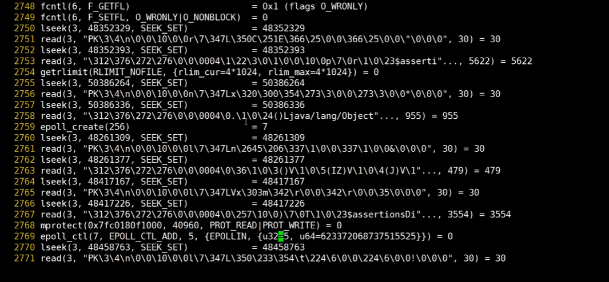

  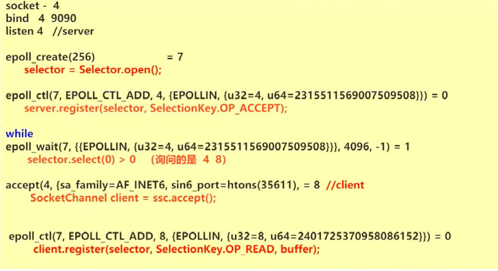

+ kqueue

> freebsd 平台的 epoll


### Netty

``` shell
Executor
	ExecutorService
		AbstractExecutorService
			ThreadPoolExecutor
				ScheduledThreadPoolExecutor
			ForkJoinPoolExecutor
		ScheduledExecutorService
			ScheduleThreadPoolExecutor
			
			EventExcutorGroup
  			AbstractEventExcutorGroup
  				MultiThreadEventExecutorGroup
  					EventLoopGroup
  		
  		EventExecutor
  			AbstractEventExecutor
  				AbstractScheduledEventExecutor
  			
  			OrderedEventExecutor
  				SingleThreadEventExecutor#execute()
  					EventLoop
  						SingleThreadEventLoop
  							NioEventLoop
```


+ NioEventLoopGroup（事件循环组，包含指定个 EventLoopGroup）

  `new NioEventLoopGroup(int)`

+ EventLoopGroup（一个单线程的事件循环）


## TCP/IP

| OSI 七层参考模型     | TCP / IP 4 / 5 层模型                 |
| -------------------- | ------------------------------------- |
| 应用层               | 应用层（HTTP，telnet，nc，SMTP，FTP） |
| 表示层               |                                       |
| 会话层               |                                       |
| 传输层（传输控制层） | 传输层（TCP）                         |
| 网络层               | 网络层（IP）                          |
| 链路层（数据链路层） | 链路层（arp，rarp）                   |
| 物理层               | 物理层（iee802）                      |


#### exec

``` shell
exec 8<> /yangzl/tcp/www.baidu.com/80

0：标准输入 fd
1：标准输出 fd
2：标准错误 fd
8：fd
<> 输入重定向 + 输出重定向

# HTTP 协议 GET 请求，并且重定向到 8 号 fd
echo -e "GET / HTTP/1.1\n" >& 8
# 读取 fd = 8 的内容
cat <& 8
```


#### nc

net connection

``` shell
nc www.baidu.com 80

nc localhost 6379
keys *
*1
$10
goods:1001
```


#### curl

``` shell
curl www.baidu.com
```


### TCP

传输控制层，TCP 协议（TCP，Transmission Control Protocol）


#### 三次握手

​				 ———— syn ————>

client	   <——— syn + ack ———	server

​				 ———— ack ————>

**为何需要三次握手？**

> 站在 server 角度，server 回复了 syn + ack，但并不能确定客户端已收到

完成三次握手建立连接，连接是什么？连接占用什么资源？

> **连接：socket 连接，socket 是对 ip + port 抽象**
>
> 占用资源：端口，fd


#### 四次挥手

​			  ———— FIN ————>

client	<————  ACK ————	server

​			  <———— FIN ————

​			  ———— ACK ————>

##### TIMED_WAIT

##### CLOSE_WAIT


#### tcpdump

``` shell
tcpdump -nn -i eth0 port 80
# -nn 以数值显示

tcpdump -nn -i eth0 port 80 or arp or icmp
```

> icmp（Internet Control Message Protocol，控制报文协议）是面向无连接的协议，是 TCP/IP 协议簇的子协议
>
> 包括：
>
> + ping
> + tracert


### IP

网络层 / 网际层，网络协议（IP，Internet Protocol）

**IP 地址：点分字节**

0.0.0.0：表示所有 ip 地址


#### route

``` shell
# linux
route -n

# windows
route print
```

| 序号 | 网络目标    | 网络掩码      | 网关        | 接口          | 跃点数 |
| ---- | ----------- | ------------- | ----------- | ------------- | ------ |
| 1    | 0.0.0.0     | 0.0.0.0       | 192.168.0.1 | 192.168.0.104 | 35     |
| 2    | 192.168.0.0 | 255.255.255.0 | 在链路上    | 192.168.0.104 | 291    |


##### 如何通过网关通信？

1. 网关 = 在链路上 / 0.0.0.0

> 网关（gateway）：
>
> + linux： 0.0.0.0
>
> + windows：在链路上
>
> **表示：无需通过网关，只需要 arp 表即可到达目的 ip**，上述路由表序号 2
>
> 即： 192.168.0.1 -> 192.168.0.4 只需查询 arp 表即可到达目的

2. 网关 gateway = 192.168.0.1

> 子网掩码：255.255.255.0，本机局域网 ip：192.168.0.104
>
> **ip & 子网掩码 = 网络号 = 192.168.0.0，可以表示 255 台主机**
>
> ==104 代表，网络号 0 的第 114 台主机==
>
> **如果子网掩码为：255.255.0.0，则可表示 255 x 255 台主机**


> 上述路由表序号 1
>
> 比如请求：172.221.4.17
>
> 1. 遍历路由表，目标 IP 与掩码做 & 运算
> 2. 结果符合目标地址（网络目标），则走当前路由的网关
> 3. 结果不符合目标地址，则继续遍历下一条
>
> 即 192.168.0.1 


#### arp

**地址解析协议（ip <==> mac 地址）**

``` sehll
arp -a

# 删除 arp 表
arp -d 192.168.0.1
```


​		1.目标：S + mac：G				2. 目标：S + mac：ISP					3. 目标：S + mac：S

Client			:arrow_up:			**G**ateway			:arrow_up:			**ISP**（网络服务提供商）	 	:arrow_up:				**S**erver

> 目标 Server ip地址始终不变
>
> mac 地址一直是下一条（next hop）的地址


#### UTF-8 编码

1个字节：0xxxxxxx

2个字节：110 xxxxx 10 xxxxxx

3个字节：1110 xxxx 10 xxxxxx 10 xxxxxx

4个字节：11110 xxx 10 xxxxxx 10 xxxxxx 10 xxxxxx


### 单机项目


单机项目一般存在两种问题：

1. 单点故障

   全量主从复制（主备集群方式）

2. 性能，压力问题

   扩容

   分片


以上两点问题解决方法为：

+ **主从复制**

+ **分片集群**


#### 单点故障


#### 单机性能压力


假设 redis2 主从复制 redis1，此时 client 向 redis1 写入数据

**强一致性**表现为：redis2 写入成功，向 redis1 返回后，redis1 返回给 client

**弱一致性**表现为：redis1 不必等待 redis2 主从同步成功，redis1 写入成功即刻返回给 client，保证 **最终一致性**

这里可引申到 **CAP 定理**

**redis 默认支持弱一致性**


### HashMap


#### JDK7, 8 差异？

> JDK7：
>
> 1. 数组 + 单链表
> 2. 扩容转移时采用头插法
>
> JDK8：
>
> 1. 数组 + 链表（单双链表都有） + 红黑树
> 2. 扩容转移时采用尾插，并且转移时是拆分为 2 条链表进行的（**即使 node 是树节点，但也是按照双向链表遍历拆分为 2 条链表的**）
> 3. 转移到新数组的位置只能是 curIndex 或 oldTab.length + curIndex
> 4. 当链表长度 > 8 && table.length >= 64 时会将链表树化
> 5. 当删除元素时，可能导致红黑树退化为链表
> 6. size()，计算 baseCount + 每个 CounterCell 相加的总和


### ConcurrentHashMap


#### JDK 7

嵌套数组，Segment数组，每个 Segment 数组元素是 HashEntry 数组

HashEntry 数组同 HashMap 的 Entry 数组

`Segment<K, V>[]`

`HashEntry<K, V>[]`

> **segment, initialCapacity 默认 16，每个 segment 一个 HashEntry[]，HashEntry[] 数组长度为 1**
>
> **其实每个 HashEntry[] 可看作一个 HashMap 的 Entry[]**
>
> **扩容是每个 HashEntry[] 自己扩容，与 segment 无关，segment 一旦初始化就不更改**

`[][][][][][][][][][][][][][][][][][]`

`[][][][][][][][][][][][][][][][][][]`

``` java
// initialCap: HashEntry 的个数（k，v 键值对个数）
// loadFactor：负载因子
// concurrency：segment 的个数，确定好之后不会改变，扩容只是扩容每个 setment 下的 HashEntry[]


public ConcurrentHashMap(int initialCap, float loadFactor, int concurrency) {
  boundCheck(initialCap, loadFactor, concurrency);
}

/**
 * segment 使用原型模式
 * 一开始先 new 一个空的 segment，计算好各种属性
 * 后续直接复制 这个 segment 的属性，无需重复计算
 */
static final class Segment<K, V> extends ReentrantLock {
  
}
```


#### JDK 8

**由 JDK7 的 segment extends ReentrantLock 替换为 Unsafe CAS + synchronized**

> 1. 在 put 时发现当前 ConcurrentHashMap 正在扩容，则当前线程会帮忙扩容
> 2. 扩容从数组末尾开始转移元素
> 3. 每个线程转移步长个桶（转移前计算步长）

``` java

class ConcurrentHashMap<K,V> extends AbstractMap<K,V> implements ConcurrentMap<K,V> {
  
  // 该常量表示当前 ConcurrentHashMap 正在扩容，当其他线程 putVal 时会帮忙扩容
  static final int MOVED = -1;
  
  
  /**
   * 多个线程对 table 初始化，未 cas 成功的线程 yield
   */
  private final Node<K, V> initTable() {
    Noe tab; int sc;
    while((tab = table) == null || tab.length == 0) {
      // 未 cas 成功的线程 yield
      if ((sc == sizeCtl) < 0)
        Thread.yield();
      else if (Unsafe.compareAndSwaptInt(this, SIZECTL, sc, -1)) {
        ...
      }
    }
  }
  
}
```


### MySQL

1. 索引第一页常驻内存，索引页地址不变（页分裂时复制，再将原页修改为目录页）


#### 聚集索引


#### 非聚集索引


### MyBatis

1. 数据源

   driver

   connection-pool

2. 执行语句

   select

   insert

   update

   delete

3. 操作

   Connection

   PrepareStatement

   ResultSet


#### ExecutorType

``` java
enum ExecutorType {
  SIMPLE, REUSE, BATCH
}
```


#### Executor 执行器


### Dubbo

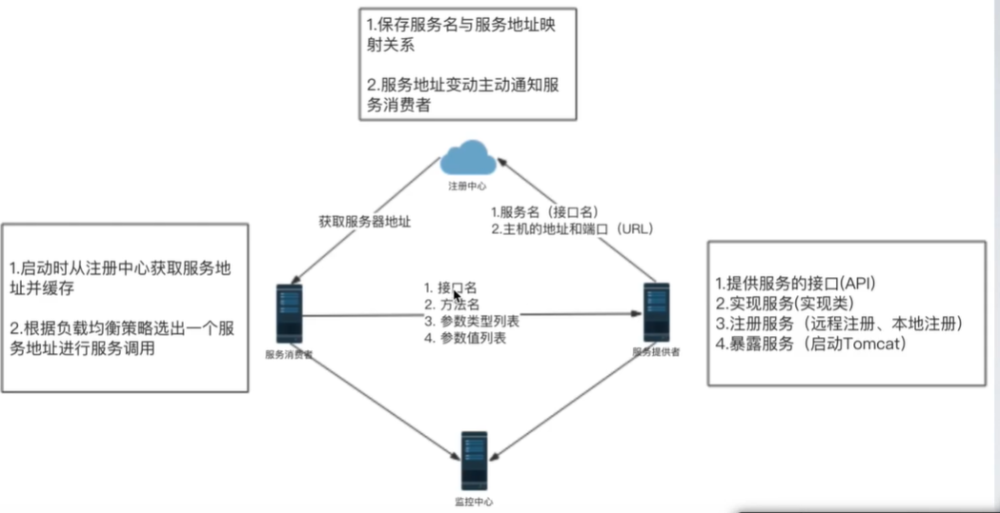

> 理解远程注册，本地注册
>
> 远程注册：接口注册
>
> 本地注册：接口实现类注册


#### 理解 RPC

TCP, HTTP, RMI, WEB SERVICE 都是 RPC 调用


#### Provider


#### Consumer


#### Register


#### Monitor


### Tomcat

``` xml
<server port="8005" shutdown="SHUTDOWN">
	<service name="Catlina">
    <Connector port="8080" protocol="HTTP/1.1" connectionTimeout="2000"
               redirectProt="8443" URIEncoding="UTF-8" />
    <Engine name="Catlina" defaultHost="localhost">
    	<Host name="localhost">
      	<Context path="", docBase="WORKDIR" reloadable="true" />
      </Host>
    </Engine>
  </service>
</server>
```


### 计算机网络


#### 不在同一网段，需要路由器连接

两台计算机传输必须直到对方 ip 和 mac 地址，如果不知道 mac 地址就先 arp 广播

发送数据都是发送到对方网卡，被网卡接收


#### 1.0 同轴电缆

连接同一个网段，半双工通信


#### 2.0 集线器

连接同一个网段，半双工通信

同轴电缆升级版，不缓存 arp 表


#### 3.0 网桥

连接同一个网段，半双工通信

两个 Hub，连接集线器

通过数据包的传输自学习每台计算机的 MAC

隔绝冲突域

**多台计算机..集线器 —— 网桥 —— 集线器...多台计算机**（左边和左边计算机通信时，网桥不会将数据发到右边，右边同理）


#### 4.0 交换机

Hub 口更多的网桥，组建局域网的最佳解决方案

全双工通信

**每个 Hub 口都能记忆连接的是哪台计算的 MAC 地址**


#### 5.0 路由器

**最主要的作用就是在不同网段传输数据**

**全双工通信**

缓存 arp 表


局域网段192.168.2.x <——> 交换机 <——> 路由器 <——> 交换机 < ——> 局域网段 192.168.3.x

**路由器需要配置各局域网段的网关，这样不同局域网段才能通信**


##### 5.0.1 不同网段通信

**在同一个网段才能互相广播（广播域）**，广播 mac 地址为 0XFF:FF:FF:FF

192.168.1.10 ——> 192.168.2.10步骤：

1. 1.10 发送 arp 广播协议获取当前网段（192.168.1.x）网关 mac 地址
2. 1.10 发送 icmp（ping）到网段 1 网关（路由器，192.168.1.1）
4. 路由器发送 arp 广播获取 192.168.2.10 MAC 地址
6. 192.168.2.1（路由器 / 网关）发送 icmp 到 192.168.2.10


#### ICMP


#### ARP 广播协议

arp -a

// 删除

arp -d 192.168.1.x

// 添加一条

arp -s 192.168.1.2 ffffffff


#### 广播

IP地址 255.255.255.255，MAC 地址 FF:FF:FF:FF


#### IP

> ip = 网络 id + 主机 id

ip 地址：192.168.1.10

子网掩码：255.255.255.0


 网段 = （ip & 子网掩码） = 192.168.1.0

> 假设子网掩码 255.255.0.0
>
> 那么局域网内最多设备数：
>
> 256 x 256 - 2
>
> 1. **主机号全 0 的无法使用，被当作网段**
> 2. **主机号全 1 的无法使用，被当作广播 ip**
>
> 
>
> 如果子网掩码为 255.255.255.0，局域网内最多 256 - 2 台设备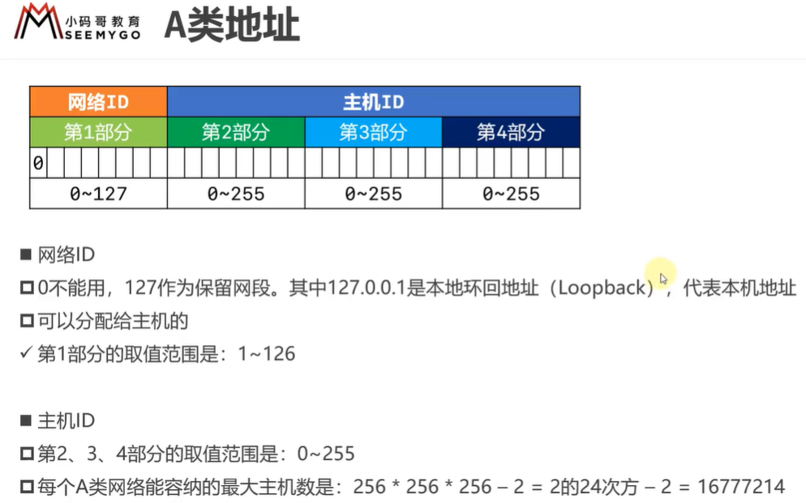


##### 子网掩码 CIDR 表示法

192.168.1.100 / 24，表示子网掩码有 24 个 1


#### 子网划分

**借用主机位作为子网位，划分出多个子网**

> 例如：现在有 500 台机器需要分配 ip，如果分配 B 类地址（共 65534）则浪费 60000 个 ip

##### 等长子网划分

> c类网段 192.168.0.0 / 24 进行等长子网划分结果为：
>
> A 子网：192.168.0.0 / 25，子网掩码为 255.255.255.128
>
> ​		ip 取值为：192.168.0.1 ~ 192.168.0.126，126 台
>
> B 子网：192.168.0.128/25，子网掩码为 255.255.255.128
>
> ​		ip 取值为： 192.168.0.129 ~ 192.168.0.254，126台
>
> 
>
> 这 126 台都在同一网段


##### 变长子网划分


#### 数据包传输

传输的数据包包括以下部分：

1. 数据
2. 源 IP，目标 IP
3. 源 MAC 与 目标 MAC 每跳都改变