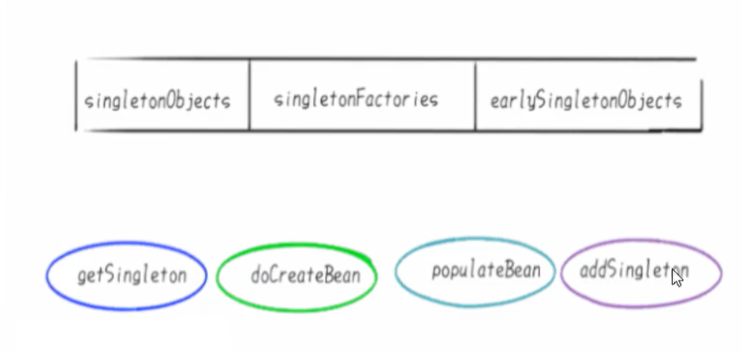

## Spring 面试

> Spring面试重点：
>
> + IOC容器
> + AOP切面编程
> + TX事务管理


### IOC


> DefaultSingletonBeanRegistry


#### 循环依赖与三级缓存



> 循环依赖：单例bean在setter注入时可解决，构造注入、prototype无法解决。
>
> 三级缓存：指3个Map（singletonObjects、singletonFactories、earlySingletonObjects）
>
> 
>
> bean初始化过程方法调用：
>
> getSingleton —> doCreateBean —> populateBean —> addSingleton
>
> 1. A实例化需要B的实例，A将自己放入三级缓存（空参构造已调用），去实例化B
> 2. B实例化需要A，B首先去一级缓存查找，然后查找二级缓存，再查找三级缓存。在三级缓存中查询到A则将A放入二级缓存并移除三级缓存中的A
> 3. B生命周期完成，将自己放入一级缓存（此时，A依然处于创建中的状态）
> 4. A继续完成生命周期，去一级缓存查询B，然后完成创建，将A自己存入一级缓存

``` java

class DefaultSingletonBeanRegistry extends ... implements ... {
  
  // 一级缓存，存放构造完成的单例bean，这就是我们所谓的单例池
  private final Map<String, Object> singletonObjects = new ConcurrentHashMap<>(256);
  
  // 三级缓存，存放构造bean的工厂
  private final Map<String, ObjectFactory<?>> singletonFactories = new HashMap<>(16);
  
  // 二级缓存，存放生命周期未完成的半成品bean
  // 实例化完成但未初始化完成（调用了空参构造，还未填充属性等操作）
  private final Map<String, Object> earlySingletonObjects = new HashMap<>(16);
  
}

```


### AOP


### TX

> 1. 事务传播属性
>
>     `Propagation.class`
>
>     1. REQUIRED
>     2. SUPPORTS
>     3. MANDATORY
>     4. REQUIRES_NEW
>     5. NOT_SUPPORTED
>     6. NEVER
>     7. NESTED
>
> 2. 事务隔离级别
>
>     `Isolation.class`
>
>     1. READ_UNCOMMITED
>     2. READ_COMMITED
>     3. REPEATABLE_READ
>     4. SERIALIZABLE


#### 1 方法内事务配置失效

> Spring事务通过JDK动态代理对象完成的，事务配置失效围绕动态代理对象解决就行了

解决：

1. 将Spring代理从JDK动态代理替换为CGLIB
2. Enable


——————————————————————————————————————————————

——————————————————————————————————————————————


### IOC接口

IOC容器 -> 对象工厂


#### Spring Bean生命周期

> 1. 实例化bean对象
> 2. 设置对象属性（依赖注入）
> 3. Aware接口
>     + BeanNameAware的setBeanName
>     + BeanFacotryAware的setBeanFactory
>     + ApplicationContextAware的setApplicationContext
> 4. BeanPostProcessor接口
>     + postProccessBeforeInitialzation（前置处理）
>     + postProccessAfterInitialzation（后置处理）
>
> **经过上述几个步骤之后，对象已经被正确构造，如果想进行一些自定义的处理，可以通过BeanPostProcessor实现**
>
> 5. InitializingBean与init-method
>
> ==当BeanPostProccessor的前置处理完成后进入本阶段，InitializingBean接口只有一个函数==
>
> `afterPropertiesSet()`
>
> 在bean正式构造完成前加入我们自定义的逻辑，这里无法传递bean对象，因此没法处理对象本身，只能增加一些额外的逻辑处理
>
> 当然Spring为了降低对客户端代码的侵入性，給bean配置了init-method属性，init-method实质上仍然使用InitializingBean接口
>
> 6. DisposableBean与destroy-method
>
> 同init-method思想


#### IOC实现

##### BeanFactory

==提供IOC容器最基本形式，是比较原始的Factory，无法支持AOP，Web应用==

内部使用，只加载配置文件不创建对象，在获取对象时创建对象

``` java
interface BeanFactory {}
interface ListableBeanFactory extends BeanFactory {}

// 具体类
class XmlBeanFactory extends DefaultListableBeanFactory {}
```


##### ApplicationContext

​	面向开发人员，加载配置文件时创建对象

``` java
interface ApplicationContext extends DefaultListableBeanFactory {}


/**
 * 具体类
 * xml
 * annotation
 */
class FileSystemXmlApplicationContext extends AbstractXmlApplicationContext {}
class ClassPathXmlApplicationContext extends AbstractXmlApplicationContext {}

class AnnotationConfigApplicationContext ... {}
```


#### Bean管理

管理对象生命周期

+ 基于Xml：（p名称空间，util名称空间）
+ Annotation

``` xml
<property name="" value="" />
<constructor-arg name / index="" value="" />

<bean id="" class="">
	<property>
        // Spring注入Array
    	<array>
        	<value>hello</value>
        </array>
        // 注入List
        <list>
        	<value>world</value>
        </list>
        // 注入map
        <map>
        	<entry key="hello" value="world" />
        </map>
    </property>
</bean>

// 用util:list提取集合
<util:list id="lists">
	<value>"hello"</value>
</util:list>
```


#### FactoryBean

工厂Bean，是一个特殊Bean，能生产或者修饰对象生成

``` java
// 为IOC容器的Bean提供了更灵活的方式，装饰模式我们可以在getObect()中灵活配置
interface FactoryBean {}

class MyFactory implements FactoryBean<T> {
    
    @Override
    T getObject() {
        
    }
}
```


### Spring事务

ACID

+ 原子性
+ 一致性
+ 隔离性
+ 持久性

``` java
// API

// 不同平台提供统一接口
interface PlatformTransactionManager {
    
}

// 抽象类
abstract class AbstractPlatformTransactionManager implements PlatformTransactionManager {
    
}

// 具体类 1
class DataSourceTransactionManager extends AbstractPlatformTransactionManager {
    // mybatis, jdbcTemplate 都使用该实现类
}

// 具体类2
class HibernateTransactionManager extends AbstractPlatformTransactionManager {
    
}

class JpaTransactionManager extends ... { }

```


``` java
// 1 编程式事务
try {
    
} catch(Exception e) {
    
}

// 2 声明式事务
// 注解 | xml
@Transactional(propagation = Propagation.REQUIRED, isolation = Isolation.DEFAULT)
```


``` java
/**
 * @Transactional属性
 * propagation
 * 		REQUIRED, REQUIRES_NEW, SUPPORTS, NOT_SUPPORTED, MANDATORY, NEVER, NESTED
 * isolation
 		READ_UNCOMMITED, READ_COMMITTED, REPEATABLE_READ, SERIALIZABLE
 * rollbackFor
 * noRollbackFor
 * timeout
 * readOnly
 */
```


### Spring 5


#### WebFlux

异步非阻塞，Reactive Streams响应式编程


> ==同步异步是对于客户端而言，调用请求等着回应为同步，调用之后继续逻辑为异步==
>
> ==阻塞非阻塞是对于服务端而言，收到请求立即给出响应为非阻塞，收到请求完成任务給出响应为阻塞==


##### 请求处理流程

+ DispacherHandler（核心控制器）
+ HandlerMapping
+ HandlerAdapter
+ HandlerResultHandler


``` java
interface WebHandler {
    Mono<Void> handle(ServerWebExchange var);
}

// 分发器处理器
class DispatcherHandler implements WebHandler {
    
    @Override
    public Mono<Void> handler(...) {
        
    }
}
```


##### Web MVC比较


+ less memeory， high throughput
+ 命令式编程  & 响应式编程（属于声明式编程范式）
+ MVC + Servlet + Tomcat & WebFlux + Reactor + Netty


##### 基于注解编程模型

``` xml
<dependency>
	<group>org.springframework.boot</group>
    <artifactId>spring-boot-starter-webflux</artifactId>
</dependency>
```

``` java
// controller
@PostMapping("/addUser")
public Mono<Void> addUser(@RequestBody User user) {
    Mono<User> userMono = Mono.just(user);
    return userService.addUser(userMono);
}

// service
Mono<Void> addUser(Mono<User> userMono) {
     userMono.doOnNext(person -> {
        list.add(new User())
    }).thenEmpty(Mono.empty());
}
```


##### 基于函数式编程模型

==需要初始化服务器（Netty | Tomcat）==

+ RouterFunction
+ HandlerFunction

ServerRequest & ServerResponse

``` java
// 路由函数
interface RouterFunction {}

// 处理函数
interface HandlerFunction {}
```

实现方式

``` java
// 创建handler

class UserHandler {
    private UserService userService;
    public UserHandler(UserService userService) {
        this.userService = userService;
    }
   
    // id查询
    public Mono<ServerResponse> queryUserById(ServerRequest request) {
        int pathId = Integer.valueOf(request.pathVariable("id"));
        Mono<User> userMono = userService.queryUserById(pathId);
        Mono<ServerResponse> notFound = ServerResponse.notFound().build();
        // 转换为流返回
        return userMono.flatMap(user -> 
             ServerResponse.ok().contentType(MediaTye.APPLICATION_JSON)
                                .body(user, User.class))
            					.switchIfEmpty(notFound);
    }
    
    // 查询所有
    public Mono<ServerResponse> queryUser(ServerRequest request) {
        Flux<User> result = userService.queryUser();
        return ServerResponse.ok().contentType(MediaType.APPLICATION_JSON)
            .body(result, User.class);
    }
    
    
    // add
    public Mono<ServerResponse> addUser(ServerRequest request) {
        Mono<User> userMono = request.bodyToMono(User.class);
        Mono<Void> result = userService.addUser(userMono);
        return ServerResponse.ok().build(result);
    }
}
```


#### 响应式编程

==响应式编程 | 反应式编程（Reactive programming）是一种面向数据流和变化传播的声明式编程范式==

考虑：excel是响应式编程的例子


+ Observer, Observable（Java8及之前）
+ Flow（Java9）
+ Reactor（Pivotal：实现Reactive规范的框架，io.projectreactor）
+ Akka
+ RxJava（NetFlix）
+ Vert.x（RetHat）

 

``` java

/**
 * Java8及之前的版本
 * Observer, Observable
 */
class Observable  {
    
}

/**
 * Java9
 * Flow
 */
final class Flow {
    // 发布
    void publish(Publiser<? super T> pub) {}
    // 订阅
    void subscribe(Subscriber<? super T> sub) {}
}

// 基于Java9，产生Reactor框架

class Flux implements Publisher {
    // 发布(0..N)个信号
}

class Mono implements Publisher{
    // 发布（0,1）个信号
}

main(Stirng[] args) {
    
    Mono.just(1);
    Mono.justOrEmpty(obj);
    Flux.fromIterable(list);
    
}

/**
 * 信号有三种：
 *	元素值
 *	错误信号
 * 	完成信号
 */
```

