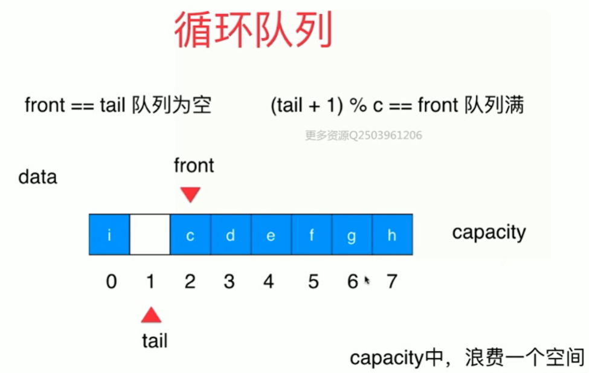

#### 数组

> Tips
>
> + 静态数据结构（连续分布）
> + 使用索引随机访问（RandomAccess）

#### 列表（动态数组）

> **均摊复杂度**
>
> 对于resize()例程，假设capacity = 8，那么9次addLast操作触发resize，9 + 复制所有元素8 = 17
>
> 即capacity = n，n + 1次操作触发resize，总共进行 n + n+1 = 2n + 1，所以时间复杂度是O(1)

#### 栈

``` java
// ADT
// interface Stack<E>
void push(E);
E pop();
E peek();
int getSize();
boolean isEmpty();
```

#### 队列

``` java
// ADT
// interface Queue<E>
void enqueue(E e);
E dequeue();
E getFront();
int getSize();
boolean isEmpty();
```



#### 链表

> Tips
>
> + 动态数据结构
> + 深入理解引用（指针）
> + 递归结构

#### 二分搜索树


#### 高级数据结构

+ 集合

``` java
// interface Set<E>
void add(E);	// 通常不添加相同元素
void remove(E);
boolean contains(E);
int size();
boolean isEmpty();
```

> 元素通常不重复

+ 映射（字典）