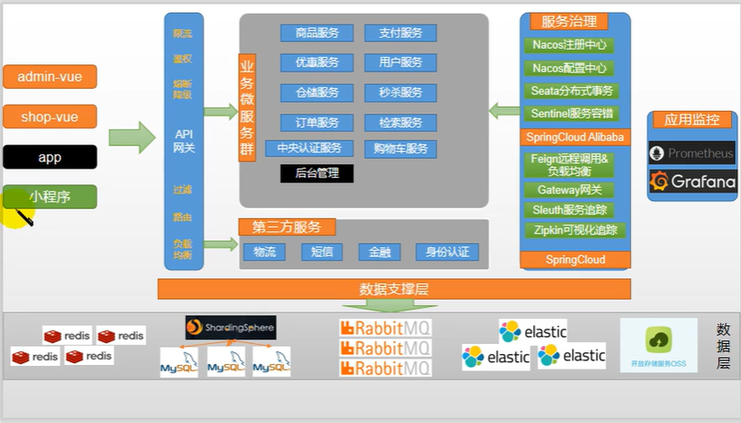
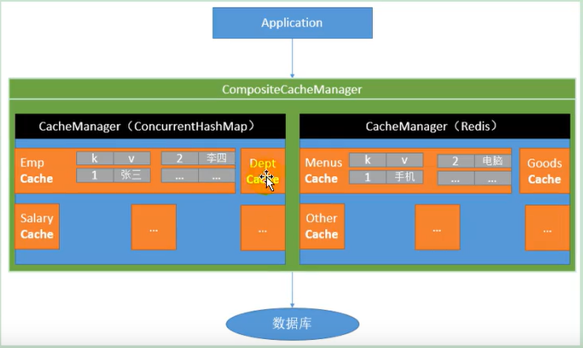

## 1 开篇


### 1.1 系统架构

> 后台管理、网关、商品、检索、订单、购物车、仓库、秒杀、物流、会员、优惠、支付
>
> 
>
> 动静分离 - Nginx
>
> 注册中心、配置中心 - nacos
>
> 认证中心（社交登录，weibo） - OAuth2.0
>
> 权限控制 - Spring Security
>
> 统一网关 - SpringCloud Gateway
>
> 客户端负载均衡 - Ribbon
>
> 服务熔断降级 - Sentinel
>
> 缓存系统 - redis
>
> 分布式事务 - Seata
>
> 远程调用 - openFeign
>
> 对象存储 - 阿里云对象存储 OSS
>
> 全文检索 - Elasticsearch
>
> 消息队列 - RabbitMQ
>
> 链路追踪 - Zipkin + Sleuth
>
> 线上监控系统 - Prometheus
>
> 日志系统 - ELK
>
> 压力测试 - Jmeter
>
> 性能优化
>
> 人人快速开发平台
>
> 支付宝API


### 1.2 服务划分




### 1.3 虚拟机网络配置

> VMnet0：使用桥接网络
>
> ​		在Bridged模式下，虚拟机同主机是相同的地位
>
> VMnet1：仅主机网络
>
> ​		虚拟机外部网络访问都通过物理主机「Host」
>
> VMnet8：NAT网络
>
> ​		源地址转换网络，最简单的组网方式，NAT和Host-Only区别在于NAT模式会多一个NAT服务

1. 虚拟机网络地址转换「NAT」 - 端口转发

   需要从主机映射端口到虚拟机端口，这样每个服务软件都需要端口转发

   windows 3306 --> vm ware linux 3306

2. 虚拟机使用桥接网络「为虚拟机配置与主机同一网段的ip，这样通过ip即可访问虚拟机」

   主机和虚拟机可互ping

> 我们需要将虚拟机设置为桥接网络


### 1.4 安装Docker

> Docker容器化技术，基于镜像，可以秒级启动容器，每个容器都是一个完整的运行环境，容器之间互相隔离
>
> `hub.docker.com`


安装docker-ce

`docs.docker.com`

``` shell
# 卸载
$ sudo yum remove docker \
                  docker-client \
                  docker-client-latest \
                  docker-common \
                  docker-latest \
                  docker-latest-logrotate \
                  docker-logrotate \
                  docker-engine
                  
# 安装依赖
$ sudo yum install -y yum-utils

# docker安装地址配置
$ sudo yum-config-manager \
    --add-repo \
    https://download.docker.com/linux/centos/docker-ce.repo
    
# 安装ce  
$ sudo yum install docker-ce docker-ce-cli containerd.io

# 启动
$ sudo systemctl start docker
 
# 运行hello-world
$ sudo docker run hello-world

# 开启自启动
$ sudo systemctl enable docker

# 配置镜像加速
# 登录阿里云，控制台，容器镜像服务
sudo mkdir -p /etc/docker
sudo tee /etc/docker/daemon.json <<-'EOF'
{
  "registry-mirrors": ["https://r6gnoa7o.mirror.aliyuncs.com"]
}
EOF
sudo systemctl daemon-reload
sudo systemctl restart docker
```


### 1.5 中间件安装

> docker安装所需中间件

#### MySQL

``` shell
docker pull mysql:8.0.23

# whereis mysql

# 端口映射与文件挂在启动
sudo docker run -p 3306:3306 --name mysql\
-v /mall/mysql/log:/var/log/mysql\
-v /mall/mysql/data:/var/lib/mysql\
-v /mall/mysql/conf:/etc/mysql\
-e MYSQL_ROOT_PASSWORD=123456\
-d mysql:8.0.23

# -p 端口映射 宿主机端口/容器端口
# -v 目录挂载 宿主机目录/容器目录
# -e MYSQL_ROOT_PASSWORD=123456，初始化root密码

docker exec -it mysql /bin/bash
docker update mysql --restart=always

# 查看启动的容器
docker ps

# 在挂载目录修改my.cnf

docker restart mysql
```


#### Redis

``` shell
docker pull redis

# 在安装docker的主机创建目录
mkdir -p /mall/redis/conf
touch /mall/redis/conf/redis.conf

# 配置端口映射与文件挂在
docker run -p 6379:6379 --name redis\
-v /mall/redis/data:/data\
-v /mall/redis/conf/redis.conf:/etc/redis/redis.conf\
-d redis redis-server /etc/redis/redis.conf # 以/etc/redis/redis.conf启动redis-server

# 开启redis持久化 vim /mall/redis/conf/redis.conf
# rdb / aof
appendonly yes

# docker版redis-cli
docker exec -it redis redis-cli
docker update mysql --restart=always
```

> 使用medis连接redis测试
>
> memory info
>
> cpu info
>
> ...


#### Nginx

nginx.conf

``` shell
http {
  include       mime.types;
  default_type  application/octet-stream;

  # zero-copy
  sendfile        on;
  #tcp_nopush     on;

  keepalive_timeout  65;

  #gzip  on;

  # http include 20210418
  include       D:/yangzl/sgg-mall/nginx-1.19.6/conf/mall.conf;
}
```


mall.conf

``` shell
# 配置网关服务器「nginx 统一访问网关」
upstream mall {
  server    192.168.0.104:88   weight=1;
  }

  server {
  listen       80;
  server_name  mall.com;

  # static 静态资源路由
  location /static {
  root    html;
  }

  # dynamic 动态请求路由
  location / {

  # nginx 转发请求时会丢失部分请求首部「Cookie、Host」
  proxy_set_header    Host    $host;
  proxy_pass      http://mall;
  }

  #error_page  404              /404.html;

  # redirect server error pages to the static page /50x.html
  #
  error_page   500 502 503 504  /50x.html;
  location = /50x.html {
  root   html;
  }

}
```


#### ElasticSearch

``` shell

```


### 1.6 其他配置


#### 1.6.1 vscode

1. 安装vscode
2. 安装插件


#### 1.6.2 git配置

``` shell
# 生成ssh免密连接使用的公钥，以github用户名为salt
ssh-keygen -t rsa -C "775698011@qq.com"

# 将密钥完整复制到码云的SSH公钥 KEY中
cat ~/.ssh/id_rsa.pub

# 测试免密设置是否成功
ssh -T git@gitee.com
```


### 1.7 CI / CD

持续集成

>  流程：
>
>  Developer - Github - Docker - Kubernetes API - Jekins Pipeline - OP运维


## 2 初级篇


### 2.1 项目搭建

#### 2.1.1 maven

1. 父项目mall

   依赖：

   `web-starter`

   `openfeign`

2. 子项目「springboot」

   包：com.yangzl.mall

   ​			.product

   ​			.order

   ​			.member

   ​			.cupon

   ​			.ware

3. gitignore配置

   ...

4. commit
5. push


#### 2.1.2 gradle

`https://github.com/Timesless/mall`


### 2.2 数据库设计

> 1. 不建立外键关联

``` sql
# 5个业务库 + 1个后台系统库
CREATE DATABASE `mall_oms` CHARACTER SET 'utf8mb4' COLLATE 'utf8mb4_0900_ai_ci';
`mall_pms`
`mall_sms`
`mall_ums`
`mall_wms`
`mall_admin`
```


### 2.3 人人快速开发平台


```shell
git clone git@gitee.com:renrenio/renren-generator.git
git clone git@gitee.com:renrenio/renren-fast.git
git clone git@gitee.com:renrenio/renren-fast-vue.git

# 删除.git

# 1. 运行renren-fast-vue
# 2.1 修改renren-generator代码生成配置文件（generator.properties）
# 2.2 修改 generator GenUtils.javva
# 3. 启动renren-generator
# 4. 逆向生成代码
```


### 2.4 Vue


### 2.5 mall 后台


## 3 高级篇


### 性能指标

QPS

TPS

90% 响应时间

吞吐量

错误率


### Jmeter 压测

1. regedit 打开注册表
2. HKEY_LOCAL_MACHINE\SYSTEM\CurrentControlSet\Services\Tcpip\Parameters下
   1. 右键 parameter，添加一个 DWORD，名为 MaxUserPort
   2. MaxUserPort 选择十进制输入数值 65534
   3. 重启电脑


#### 压测数据

> 业务实际流程：
>
> 1. 访问 nginx「动静请求分离」
> 2. nginx 统一访问 gateway
> 3. gateway 路由到具体服务

| 程序                                                       | 90%响应时间 | 99% 响应时间 | 吞吐量  |
| ---------------------------------------------------------- | ----------- | ------------ | ------- |
| nginx                                                      |             |              |         |
| gateway                                                    | 8ms         | 20ms         | 9122/s  |
|                                                            |             |              |         |
| 简单服务                                                   | 4           | 30           | 16885/s |
| gateway + 简单服务                                         | 26          | 70           | 4420/s  |
| 全链路简单服务「nginx + gateway + hello」                  | 34          | 46           | 1946/s  |
|                                                            |             |              |         |
| 一级菜单渲染「db + thymeleaf渲染」                         | 150         | 354          | 747/s   |
| 一级菜单渲染「打开tymeleaf 缓存，关闭debug日志」           | 46          | 158          | 1412/s  |
|                                                            |             |              |         |
| 三级分类数据「多次 db」                                    | 2687        | 6982         | 51/s    |
| **三级分类数据「一次 db，内存计算，关闭 debug 日志」**     | 530         | 1625         | 244/s   |
| 三级分类数据「**添加 redis 缓存**」                        | 80          | 193          | 1130/s  |
|                                                            |             |              |         |
| 首页全量数据「三级分类 + 静态资源」 + nginx 动静态请求分离 |             |              |         |


##### 配置说明

CPU：i5-8300H

RAM：24G

gateway：-Xms256m -Xmx256m

product服务：-Xms1024m -Xmx1024m


##### 其他说明

> **每个压力测试都以 50 线程，循环压测 30 s**
>
> nginx：127.0.0.1
>
> gateway：127.0.0.1:88
>
> 简单服务：127.0.0.1:7076/hello
>
> 网关 + 简单服务：127.0.0.1:88/hello
>
> 全链路简单服务：mall.com/hello
>
>  
>
> 一级菜单渲染「一次 db + thymeleaf 页面渲染」：http://127.0.0.1:7076/index
>
> gateway + 一级菜单渲染：
>
> 全链路一级菜单渲染：
>
>  
>
> 三级分类「多次 db 」：http://127.0.0.1:7076/index/catalog
>
> gateway + 三级分类：
>
> 全链路三级分类：
>
>  
>
> **首页全量数据获取「多次 db + 静态资源（css，img等）」**：jmeter 高级设置 —>下载所有资源


### 性能优化方向

1. 数据库
2. 应用程序
3. 中间件「tomcat、nginx」
4. 网络和操作系统


#### IO 密集


#### CPU 密集


### 缓存

``` java
data = cache.load();
if (null == data) {
  data = db.load();
  
  cache.put(key, data);
}
```


#### Map 本地缓存

1. 无法设置淘汰策略
2. 无法应用于分布式架构


#### 分布式缓存「中间件支撑」


##### Redis

``` java
/**
  * TODO: 压测时 Redis Lettuce 客户端导致直接内存溢出：OutOfDirectMemoryError
  *      实际原因：Lettuce 使用 Netty 做网络通信，是 Lettuce 操作 Netty 代码 bug
  *      -XX:MaxDirectMemorySize 默认等于 -Xmx
  *      
  *  解决方案：
  *			1. 使用 Jedis
  *			2. 升级 Lettuce
  *
  * @return map
  */
```


#### 缓存击穿

访问一个高频热点已失效的 key


##### 解决

1. db 查询添加互斥锁
2. bloom flter


#### 穿透

查询一个一定不存在的数据

##### 解决

1. 空值缓存一小段时间
2. db 查询加互斥锁
3. bloom filter


#### 雪崩

同一时刻，大面积缓存过期。


##### 解决

1. db 查询添加互斥锁
2. 过期时间随机


#### 缓存一致性

``` java
/** 
 * 分布式缓存一致性保障：
 *     1. 双写「修改数据后，将新数据写入缓存」
 *      node1 先修改数据后，写入缓存卡顿，耗时 2s
 *      node2 后修改数据后，写入缓存耗时 1s，则此时缓存数据依然为 node1 先写入的数据「脏数据」
 *     2. 失效「修改数据后，将缓存删除」
 *      node1 先修改数据后，删除缓存
 *      node2 后修改数据，卡顿 3s 后删除缓存
 *      node3 读取数据，在 3s 之间，此时读到 node1 修改的数据，再放入缓存「脏数据」
 *      
 *     2.1 延时双删「修改数据后，将缓存删除，延时一段时间后再删除」
 */
```

##### 双写模式

修改数据后，将新数据写入缓存

> 考虑以下例程
>
> 1. node1 先修改数据后，写入缓存卡顿，耗时 2s
>
> 2. node2 后修改数据后，写入缓存耗时 1s，则此时缓存数据依然为 node1 先写入的数据「脏数据」


##### 失效模式

修改数据后，将缓存删除

> 1. node1 先修改数据后，删除缓存，耗时 1s
>
> 2. node2 后修改数据，卡顿 3s 删除缓存
>
> 3. node3 在 1 ~ 3s 之间读取数据，此时读到 node1 修改的数据，3s 后再放入缓存「在node2 删除之后放入缓存，脏数据」


##### 延时双删

**==失效模式前提下，延时再删除一次缓存==**


##### 读写锁 

+ 修改请求添加写锁 / 分布式写锁「`Redisson.getReadWriteLock(key).writeLock()`」
+ 读取请求添加读锁 / 分布式读锁「`Redisson.getReadWriteLock(key).readLock()`」


##### 总结

1. 用户维度数据，无并发，缓存添加过期时间即可
2. 菜单，商品介绍等基础数据。使用 **Canal** 订阅 **binglog**
3. 缓存 + 过期能解决大部分业务的缓存需求
4. 读写锁
5. 频繁修改的数据不应该添加缓存，读库
6. 不应该过度设计，增加系统复杂性


##### Canal

阿里开源产品，可以做数据异构「推荐功能」


#### Spring Cahcing



统一缓存抽象

提供声明式缓存应用

##### Cache

##### CacheManager


##### 步骤

1. 导入依赖 org.springframework.boot:spring-boot-starter-cache      
2. Interface CacheManager
   1.  RedisCacheManager
   2. ConcurrentMapCacheManager

3. @EnableCaching
4. yaml 添加配置 `spring.cache.type: redis`
5. 配置 value 序列化

``` java
@Bean
    public RedisCacheConfiguration redisCacheConfiguration() {
        RedisCacheConfiguration config = RedisCacheConfiguration.defaultCacheConfig()
            .serializeValuesWith(RedisSerializationContext.SerializationPair.fromSerializer(new GenericJackson2JsonRedisSerializer()))
            .entryTtl(Duration.ofMinutes(30));
        return config;
    }
```


##### 注解

@Cachable

@CacheEvict

@Caching：组合

@CachePut

@CacheConfig：类级别配置共享


### 检索服务


### Spring Seesion

> Spring Session解决的问题：
>
> + 子域父域session共享
> + 分布式session后端统一存储
>     + redis
>     + jdbc


#### Spring Session Redis

``` xml
<dependency>
  <groupId>org.springframework.session</groupId>
  <artifactId>spring-session-data-redis</artifactId>
</dependency>
```


``` groovy
dependencyManagement {
  imports {
    mavenBom 'org.springframework.session:spring-session-bom:Corn-SR2'
  }
}
dependencies {
  compile 'org.springframework.session:spring-session-data-redis'
}
```


```
spring.session.store-type=redis # Session store type.
server.servlet.session.timeout= # Session timeout. If a duration suffix is not specified, seconds is used.
spring.session.redis.flush-mode=on_save 
spring.session.redis.namespace=spring:session 

# redis 配置
spring.redis.host=localhost 
spring.redis.password=
spring.redis.port=6379
```


``` java
@EnableRedisHttpSession 
public class Client {
  
  @Resource
  private StringRedisTemplate redisTemplate;
  
}
```


### 单点登录

> 不同系统域名不同，让三个系统同步一个用户的票据：
>
> 1. 认证服务器：ssoserver.com
> 2. 所有系统登陆取ssoserver，登陆成功跳转回来
> 3. 其中一个系统登陆其它系统不用的公路
> 4. 全局统一一个sso.sessionID


## 4 高可用篇